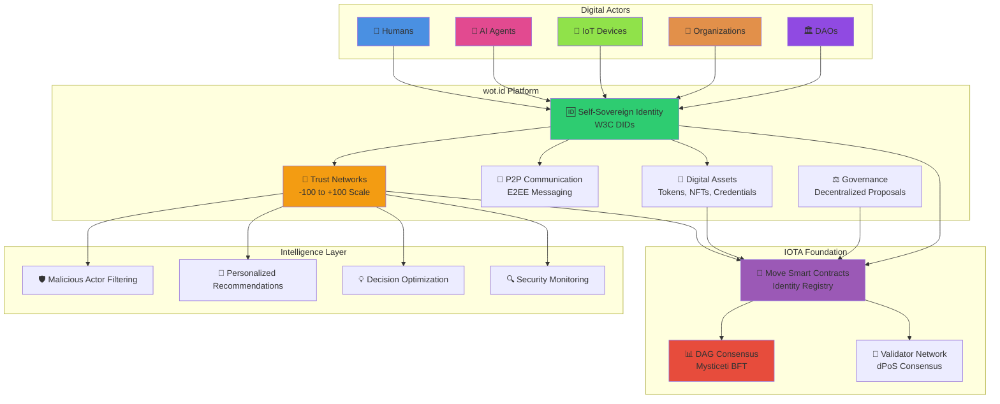
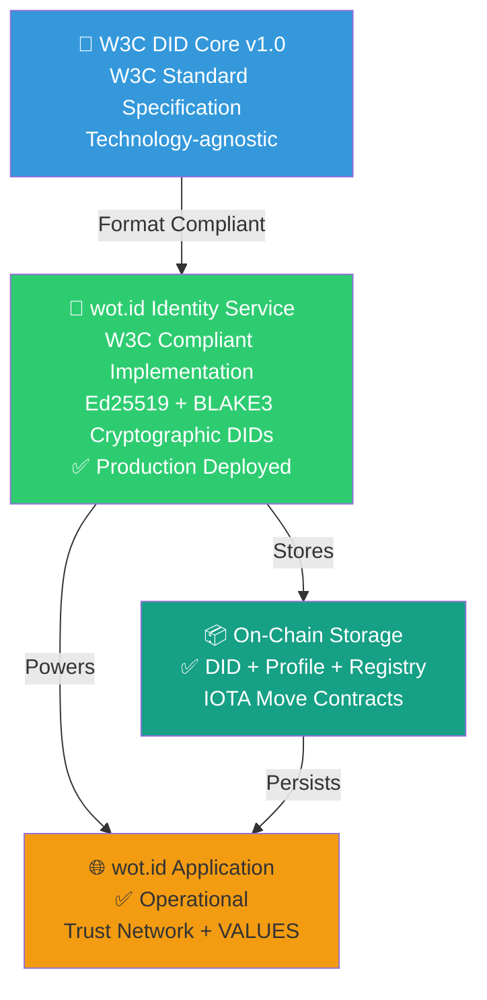
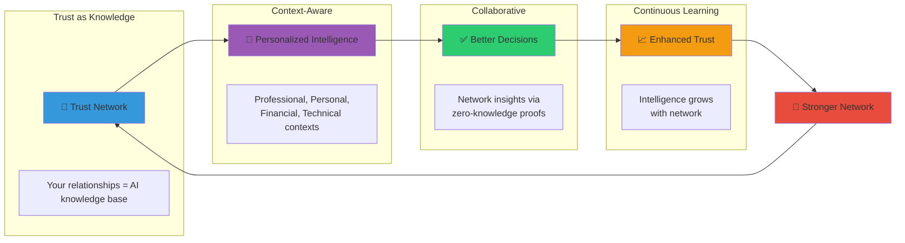
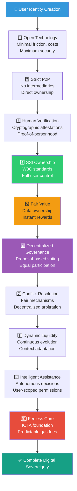

# 01: wot.id - Project Overview and Principles

## 1. Introduction: Human Identity on the Web of Trust

wot.id is an open peer-to-peer environment where any digitally connected actor – human, machine, service, or otherwise - can communicate, manage and exchange assets, and handle trust with instantaneous speed, maximum security, and minimal cost. Built upon IOTA's advanced distributed ledger technology, any datapoint is permanently available on a directed acyclic graph (the real cloud!), but can only be accessed and controlled by its owner. Any datapoint also has an inbuilt trust level ranging from -100 to +100 that enables participants to establish and manage complex and intricate trust relationships, where negative values indicate distrust, zero represents neutrality, and positive values indicate trust.

---

### Take back control

For the human actors in the loop, wot.id offers the following advantages:

1. **Clear Human Identification**: Unequivocally and verifiably identify yourself as human within the digital realm.
2. **True Data Ownership**: Own and control all digitalized aspects of your existence without any intermediaries whatsoever.
3. **Value Attribution**: Directly receive any value derived from or created with data connected to your identity.
4. **Selective Disclosure**: Reveal any aspect of your digital existence to anyone, with any desired degree of granularity and anonymity.
5. **Provenance & Attribution**: Establish a reliable, auditable source of truth for your work, content, and contributions.

---

### 🛡️ World's First Quantum-Safe Self-Sovereign Identity

**wot.id is the first digital identity platform to combine post-quantum cryptography with a fully decentralized web of trust.**

As quantum computers advance toward breaking today's encryption standards (RSA, ECDSA, X25519), billions of digital identities face an existential threat. wot.id addresses this head-on with a hybrid encryption architecture that protects user data against both current and future quantum attacks.

#### What Makes wot.id Unique

| Capability | Traditional SSI | wot.id |
|------------|-----------------|--------|
| **Encryption** | Classical (breakable by quantum) | Hybrid X25519 + ML-KEM-768 (NIST FIPS 203) |
| **Key Storage** | Platform-controlled or HSM | User-owned via BIP-39 mnemonic |
| **Trust Model** | Centralized issuers | Decentralized peer attestations |
| **Data Storage** | Off-chain or siloed | 100% on-chain (IOTA Tangle) |
| **Server Knowledge** | Sees plaintext data | Zero-knowledge (client-side encryption) |

#### The Quantum-Safe Architecture

```
┌─────────────────────────────────────────────────────────────────────────┐
│  USER'S QUANTUM-SAFE IDENTITY                                          │
│  ════════════════════════════                                          │
│                                                                         │
│  ┌─────────────────┐      ┌─────────────────────────────────────────┐  │
│  │  BIP-39 Mnemonic │ ──▶ │  Hybrid Key Derivation                   │  │
│  │  (24 words)      │      │  ├── X25519 (classical, proven)         │  │
│  │  User owns this  │      │  └── ML-KEM-768 (post-quantum, NIST)    │  │
│  └─────────────────┘      └─────────────────────────────────────────┘  │
│           │                                    │                        │
│           ▼                                    ▼                        │
│  ┌─────────────────────────────────────────────────────────────────┐   │
│  │  ENCRYPTED ON IOTA TANGLE                                        │   │
│  │  ┌─────────┐ ┌─────────┐ ┌─────────┐ ┌─────────┐ ┌─────────┐   │   │
│  │  │  Name   │ │  DOB    │ │ Address │ │ Health  │ │  Docs   │   │   │
│  │  │ ████████│ │█████████│ │█████████│ │█████████│ │█████████│   │   │
│  │  └─────────┘ └─────────┘ └─────────┘ └─────────┘ └─────────┘   │   │
│  │                                                                  │   │
│  │  Each field encrypted with unique derived key                    │   │
│  │  Attacker must break BOTH X25519 AND ML-KEM to decrypt          │   │
│  └─────────────────────────────────────────────────────────────────┘   │
│                                                                         │
│  wot.id servers NEVER see plaintext. Only the user can decrypt.        │
└─────────────────────────────────────────────────────────────────────────┘
```

#### Why This Matters Now

- **"Harvest Now, Decrypt Later"**: Adversaries are already collecting encrypted data today, waiting for quantum computers to break it tomorrow. Your identity data must be protected NOW.
- **Regulatory Alignment**: NIST finalized post-quantum standards in 2024 (FIPS 203, 204, 205). wot.id implements ML-KEM-768, the recommended key encapsulation mechanism.
- **No Migration Needed**: Users don't need to understand cryptography. The 24-word recovery phrase they already have protects them against quantum attacks.
- **Defense in Depth**: Hybrid encryption means even if one algorithm is broken, the other still protects data.

**First mainnet transaction with PQC encryption: December 23, 2025.**

See `docs/02_System_Architecture.md` section 10.2 for technical implementation details.

---

### 1.0. Core Mental Model: Data Sovereignty and Trust

**This section is critical for understanding wot.id. Read it before any other documentation.**

#### The Fundamental Concept

wot.id enables users to store **all digitalized aspects of their existence** as atomic data points on the IOTA Tangle. The primary driver is **data sovereignty**: users are not walled in or dependent on any company—including wot.id itself—to access their data.

```
┌─────────────────────────────────────────────────────────────────┐
│  ATOMIC DATA POINT (stored on IOTA Tangle)                      │
│  ┌───────────────────────────────────────────────────────────┐ │
│  │  value: "31 mg/dl"           ← The actual data            │ │
│  │  trust_value: +85            ← How reliable/verified      │ │
│  │  attestations: [...]         ← Who verified this          │ │
│  └───────────────────────────────────────────────────────────┘ │
│                                                                 │
│  The trust value IS the claim to reliability.                   │
│  There is no separate "claim" - the data itself is the claim.   │
└─────────────────────────────────────────────────────────────────┘
```

#### Key Principles

1. **Data = Claim = Trust Target**
   - Every piece of stored data is inherently a claim about reality
   - The trust score attached to each data point represents its reliability/verification status
   - There is no separate "claims system" - every data point carries its own trust value

2. **DID-Based Data Sovereignty**
   - Users own their data via their DID (Decentralized Identifier)
   - To access their data, users need ONLY their DID—not wot.id
   - wot.id is ONE interface to view/manage data, not the gatekeeper
   - The IOTA Tangle is the permanent, decentralized storage layer

3. **Trust = Reliability Measure**
   - Trust scores (-100 to +100) indicate how verified/reliable a data point is
   - Attestations from other entities increase or decrease trust scores
   - The attester's own credibility affects the weight of their attestation

4. **Domain Sections, Not Functional Sections**
   - The ME page organizes atomic data by domain (identity, health, documents, etc.)
   - Each section displays atomic data points with their trust values
   - This is presentation grouping, not architectural separation

#### What wot.id Does NOT Do

- ❌ wot.id does NOT own user data
- ❌ wot.id is NOT required to access data (only DID needed)
- ❌ Trust is NOT separate from data points
- ❌ Claims are NOT a separate concept from stored data

For this purpose, wot.id implements the principles of self-sovereign identity (SSI) in their truest sense, enabling secure, private, and fully decentralized identity management and interaction, all made possible by the underlying IOTA protocol.

### 1.1. wot.id Ecosystem Overview

This high-level diagram illustrates the core components and actors within the wot.id ecosystem:



### 1.2. Standards Foundation: W3C DID Compliance

wot.id is built on a foundation of open standards and extends them with trust network capabilities.

**Implementation Status: W3C DID Compliant (Production)**



**Current Implementation (Production - January 2026):**

🟢 **wot.id Identity Service** (W3C-Compliant DIDs)
   - Generates cryptographically secure DIDs derived from Ed25519 public keys
   - Format: `did:iota:mainnet:<blake3-hash-of-pubkey>`
   - W3C DID Core 1.0 format compliant (syntax, document structure, verification methods)
   - Cryptographically linked: DID deterministically derived from signing key
   - **Status: ✅ Production deployed and operational**

**DID Generation:**
```rust
// Identity service generates Ed25519 keypair
let signing_key = SigningKey::from_bytes(&rand::random::<[u8; 32]>());
let verifying_key = signing_key.verifying_key();

// DID derived from public key hash (cryptographically linked)
let did_hash = blake3::hash(&verifying_key.to_bytes());
let did_identifier = hex::encode(&did_hash.as_bytes()[0..16]);
let did = format!("did:iota:mainnet:{}", did_identifier);
// Same key → Same DID (verifiable relationship)
```

**W3C DID Document (Generated on request):**
```json
{
  "@context": [
    "https://www.w3.org/ns/did/v1",
    "https://w3id.org/security/suites/ed25519-2020/v1"
  ],
  "id": "did:iota:mainnet:7a8b9c0d1e2f3a4b5c6d7e8f9a0b1c2d",
  "verificationMethod": [{
    "id": "did:iota:mainnet:7a8b9c0d...#key-1",
    "type": "Ed25519VerificationKey2020",
    "controller": "did:iota:mainnet:7a8b9c0d...",
    "publicKeyMultibase": "z6MkhaXgBZDvotDkL5257faiztiGiC2QtKLGpbnnEGta2doK"
  }],
  "authentication": ["did:iota:mainnet:7a8b9c0d...#key-1"],
  "assertionMethod": ["did:iota:mainnet:7a8b9c0d...#key-1"]
}
```

**On-Chain Storage (Move Contracts):**
- ✅ DID string stored in `IdentityProfile.did` field
- ✅ DID → Profile mapping in `wot_identity_registry.move`
- ✅ Secondary identifiers (email, phone) → DID mapping
- ✅ All claims and trust data stored on-chain
- ✅ Package: `0xf8ddc1060e855f09e30e62e74b4355048b2c50c582b68cceaf6f84366cfe8eee`

**W3C Compliance Summary:**

| W3C Requirement | Status | Notes |
|-----------------|--------|-------|
| DID Syntax (§3.1) | ✅ Compliant | `did:iota:mainnet:<identifier>` |
| DID Document (§4) | ✅ Compliant | Proper @context, verificationMethod, authentication |
| Verification Methods | ✅ Compliant | Ed25519VerificationKey2020 |
| DID Controller | ✅ Compliant | Self-controlled |
| On-Chain Storage | ✅ Implemented | DID + all data in Move contracts |
| External Resolution | ❌ Not integrated | By design for SSI (see note) |

**Note on External Resolution:** wot.id DIDs are resolvable within the wot.id ecosystem but not via universal DID resolvers (e.g., resolver.identity.foundation). This is appropriate for a self-sovereign identity system where users interact via wot.id interfaces. External resolver integration is a future enhancement option, not a compliance requirement.

**wot.id Extensions** (Beyond W3C Core)
   - ✅ Trust scores on atomic data VALUES (-100 to +100)
   - ✅ On-chain attestation system (`wot_trust.move`)
   - ✅ Secondary identifier registry (email, phone → DID)
   - ✅ Post-quantum encryption (X25519 + ML-KEM-768)
   - ✅ OAuth auto-provisioning (Google, GitHub, Apple)

**Key References:**
- W3C DID Core v1.0: https://www.w3.org/TR/did-core/
- W3C Compliance Assessment: `docs/2026_Code_Work/26-01-01_W3C_Compliance.md`
- Move Contracts: `docs/05_Move_Smart_Contracts.md`

### 1.3. Identity Architecture: Primary vs Secondary Identifiers

wot.id implements a clear hierarchical identity architecture:

**Primary Identifier: W3C DID**
```
Format: did:iota:mainnet:<identifier>
Example: did:iota:mainnet:af364f192213f8d9ac1425ce2a62a051

Properties:
- Immutable (never changes)
- W3C DID Core 1.0 compliant
- Cryptographically derived from Ed25519 public keys
- Stored on-chain in wot_identity_registry.move
- The PERSON or ENTITY itself
- Used for cryptographic operations and ownership
```

**Secondary Identifiers: Access Methods**
```
Examples:
- email: user@example.com
- phone: +1-555-0123 (future)
- twitter: @username (future)

Properties:
- Mutable (user can change email address)
- Many-to-one mapping to DID (multiple ways to access ONE identity)
- Stored as mappings in identity_registry.move ((type, value) → DID generic registry)
- NOT the person, just ways to ACCESS the person's DID
- Used for login convenience (OAuth, SMS verification)
```

**User Flow Example:**
```
1. User clicks "Sign in with Google" → Frontend obtains email
2. Frontend calls Backend API with email
3. Backend queries identity_registry.move: secondary identifier → DID lookup
4. If DID found: Load existing profile
5. If DID not found: Create new DID via Identity Service, store identifier→DID mapping
6. Display ME page with data VALUES from on-chain profile
```

**Why This Matters:**
- Email is NOT the identity (it's just a login method)
- User can add multiple secondary identifiers (emails, phone, social handles) → all map to ONE DID
- DID is cryptographically linked to user's keys and assets
- Changing email doesn't change identity, just updates the mapping

### 1.4. Data Architecture: 100% On-Chain VALUES

All identity data VALUES are stored 100% on-chain on the IOTA Tangle:

**On-Chain (IOTA Move Contracts):**
- ✅ **Primary Identifiers**: W3C DIDs
- ✅ **Secondary Identifier Mappings**: Generic (type, value) → DID registry (email first, then phone, social)
- ✅ **Atomic Data VALUES**: `birth_date: "1990-01-01"`, `blood_type: "O+"`, `ldl_cholesterol: "31 mg/dl"`
- ✅ **Trust Scores per VALUE**: Each VALUE has score -100 to +100 based on attestations
- ✅ **Claims & Attestations**: Who verified which VALUE, when, with what credibility
- ✅ **Profile Metadata**: Creation timestamp, controller address, update history

**Optional Off-Chain (Supporting Files Only):**
- 📄 **Document FILES**: PDF scans (passport.pdf, lab_report.pdf), photos
- 🔐 **Verification**: On-chain SHA-256 hash proves file integrity
- ⚠️ **Not Displayed**: ME page displays on-chain VALUES, not files
- ⚠️ **Not Required**: System works without any off-chain files

**No Traditional Database:**
- ❌ No SQL, NoSQL, Redis, or any centralized database
- ❌ Backend is stateless (only queries IOTA blockchain via CLI)
- ✅ Blockchain is the single source of truth
- ✅ Fully decentralized, no single points of failure

## 2. Revolutionary Vision: Trust-Aware Intelligence for All Actors

### 2.1. Why wot.id is Unprecedented

wot.id represents a fundamental paradigm shift in how digital actors—human, artificial intelligence, IoT devices, organizations, and hybrid entities—establish identity, build trust, and make decisions in an increasingly complex and dynamic world. This is not merely an improvement upon existing identity systems; it is the foundation for an entirely new category of **trust-aware digital intelligence**.

#### The Convergence of Five Revolutionary Elements

wot.id is unprecedented because it is the first system to integrate five critical capabilities that have never been combined at scale:

1. **Multi-Actor Self-Sovereign Identity**: Unlike traditional identity systems designed exclusively for humans, wot.id provides verifiable identity infrastructure for any digital actor—humans, AI agents, IoT devices, DAOs, and services—all operating on equal footing with W3C-compliant DIDs.

2. **Decentralized Trust Networks as Computational Intelligence**: Trust relationships (-100 to +100 scale) become the foundation for decision-making, creating personalized intelligence that grows smarter through network effects while maintaining complete privacy.

3. **Privacy-Preserving Collective Intelligence**: Federated learning from trust networks enables collaborative intelligence without data sharing, allowing actors to benefit from collective wisdom while maintaining absolute data sovereignty.

4. **Economic Incentive Alignment**: Fair value distribution (#5 principle) creates economic incentives for quality trust relationships, establishing a self-reinforcing ecosystem where good actors are rewarded and malicious actors are filtered out.

5. **Intelligent Assistance for Complex Decision-Making**: The platform functions as a comprehensive digital assistant that leverages trust networks to filter malicious actors, recommend daily activities, optimize decisions, and provide proactive security monitoring.

### 2.2. Addressing the Complex and Dynamic World to Come

The world is rapidly evolving toward unprecedented complexity:

- **AI agents** are becoming autonomous economic actors requiring verifiable identities and trust relationships
- **IoT devices** need autonomous decision-making capabilities in trustless environments
- **Human-AI collaboration** requires frameworks for establishing and verifying trust between different types of actors
- **Decentralized autonomous organizations** need identity and trust infrastructure that operates without centralized control
- **Digital economies** require systems that can handle value exchange between any type of digital actor

wot.id is designed as the foundational infrastructure for this multi-actor future, where the distinction between human and artificial intelligence becomes less relevant than the ability to establish verifiable identity and trustworthy relationships.

### 2.3. The Trust-Intelligence Feedback Loop

#### How Trust Becomes Intelligence

Traditional AI systems rely on centralized training data and cloud processing. wot.id creates a fundamentally different model:



**Key Components:**

1. **Trust as Knowledge Base**: Your trust relationships become your AI's knowledge base
2. **Context-Aware Processing**: Different trust scores for different contexts (professional, personal, financial, technical)
3. **Collaborative Filtering**: Network-wide insights without privacy compromise through zero-knowledge proofs
4. **Continuous Learning**: The system becomes more intelligent as your trust network grows and evolves

#### Practical Applications

**For Humans:**
- Filter malicious communications and websites based on network trust
- Receive personalized daily activity recommendations
- Make better purchasing, professional, and personal decisions
- Proactive security monitoring and threat detection

**For AI Agents:**
- Establish verifiable identity and reputation in digital marketplaces
- Build trust relationships with humans and other AI agents
- Access collaborative intelligence networks while maintaining privacy
- Participate in economic activities with transparent trust metrics

**For Organizations:**
- Verify the authenticity and trustworthiness of partners, customers, and suppliers
- Build reputation through transparent, auditable trust relationships
- Access talent and opportunities through trust-based networks
- Implement governance through decentralized trust mechanisms

### 2.4. Beyond Current Paradigms

#### What Makes This Revolutionary

**Compared to Existing Identity Systems:**
- Most are centralized (Google, Facebook, government IDs) and human-only
- wot.id is decentralized and multi-actor

**Compared to Trust Systems:**
- Current systems (LinkedIn endorsements, eBay ratings, credit scores) are centralized and context-limited
- wot.id provides universal, context-aware, decentralized trust

**Compared to AI Assistants:**
- Existing assistants (Siri, Alexa, ChatGPT) are cloud-based, privacy-compromising, and lack personal context
- wot.id provides local, privacy-preserving, trust-network-powered intelligence

**Compared to Blockchain Identity Solutions:**
- Most focus only on credential verification or simple identity proofs
- wot.id integrates identity, trust, intelligence, and economic incentives in a comprehensive ecosystem

### 2.5. The Network Effect Advantage

wot.id creates powerful network effects that become stronger over time:

- **Trust Amplification**: Each new trusted relationship enhances the intelligence available to all connected actors
- **Security Enhancement**: Larger networks provide better collective threat detection
- **Economic Value**: Network growth increases opportunities for value creation and exchange
- **Intelligence Evolution**: The system becomes smarter as more actors participate and contribute trust data

This creates a self-reinforcing cycle where the platform becomes more valuable to each participant as the network grows, while maintaining complete privacy and user sovereignty.

### 2.6. Universal Trust Scale Visualization

The wot.id platform implements a universal trust scale that applies consistently across all contexts and relationships:

| -100 | -75 | -50 | -25 | 0 | +25 | +50 | +75 | +100 |
|:----:|:---:|:---:|:---:|:-:|:---:|:---:|:---:|:----:|
| ❌ | 🟥 | 🟧 | 🟨 | ⬜ | 🟨 | 🟩 | 🟩 | ✅ |

**Trust Scale** (values in thousands, stored on-chain as 0-200,000):

| Score | | Level | Description |
|:-----:|:---:|-------|-------------|
| -100 | ❌ | Complete Distrust | Malicious actor, verified harmful behavior |
| -75 | 🟥 | Strong Distrust | Unreliable, multiple negative attestations |
| -50 | 🟧 | Distrust | Questionable behavior observed |
| -25 | 🟨 | Mild Distrust | Skeptical, limited negative signals |
| 0 | ⬜ | Neutral | Unknown, no attestations yet |
| +25 | 🟨 | Mild Trust | Promising, initial positive signals |
| +50 | 🟩 | Trust | Reliable, consistent positive behavior |
| +75 | 🟩 | Strong Trust | Highly reliable, many positive attestations |
| +100 | ✅ | Complete Trust | Verified authority, maximum credibility |

**Context-Specific Application:**
- **Professional Context**: Trust in work quality, reliability, expertise
- **Personal Context**: Trust in friendship, emotional support, loyalty
- **Financial Context**: Trust in payment reliability, financial responsibility
- **Technical Context**: Trust in code quality, security practices, technical knowledge
- **Health Context**: Trust in medical advice, treatment recommendations

**Dynamic Evolution:**
- Trust scores evolve based on interactions and attestations
- Multiple actors' assessments contribute to overall trust score
- Negative trust actively filters out malicious actors
- Zero trust represents new actors without established reputation

## 3. Core Functionalities

`wot.id` provides a comprehensive suite of features built upon a foundation of self-sovereign identity:

*   **Self-Sovereign Identity (SSI) Management**: Users have full control over their digital identity. They can create, manage, and selectively disclose their identity attributes and credentials with unparalleled privacy and security.
*   **Secure Peer-to-Peer Communication**: Users can engage in end-to-end encrypted (E2EE) messaging directly with other users, ensuring conversations remain private and confidential.
*   **Digital Asset Management**: Users can securely store and transfer digital assets peer-to-peer, leveraging the platform's robust security and IOTA's feeless infrastructure.
*   **Decentralized Trust Management**: Users can establish, manage, and verify trust relationships and claims within the network, fostering a transparent and reliable digital ecosystem.

## 3. Guiding Principles

The development and operation of `wot.id` are guided by a set of core and technical design principles.

### 3.1. Core Principles

These 10 fundamental principles guide the `wot.id` ecosystem:



**Detailed Principles:**

1.  **Open Technological Environment**: An open ecosystem where any actor can participate with minimal friction, minimal costs, and maximal security.
2.  **Strict Peer-to-Peer Environment**: Operates on a logically peer-to-peer basis, excluding intermediaries from transactions and data ownership. While actors interact directly at the protocol level, the physical communication path naturally relies on the distributed network of IOTA nodes.
3.  **Guaranteed Human Identity**: Human actors can reliably identify themselves and be unquestionably verified by others. This is achieved through a combination of cryptographic attestations, social verification, and optional, privacy-preserving proof-of-personhood systems.
4.  **Absolute User Control & SSI Ownership**: Each human actor maintains absolute control over their digital identity. Implemented with W3C DID Core 1.0 compliant identities stored on-chain on IOTA mainnet.
5.  **Fair Value Distribution**: Actors own the value derived from their data and are instantly rewarded through microtransactions.
6.  **Decentralized Governance**: Governance processes are fully decentralized through **proposal-based voting mechanisms**, empowering all participants to propose, vote on, and execute trust profile updates and system changes equally.
7.  **Effective Conflict Resolution**: Clear, fair, and decentralized mechanisms are implemented to resolve conflicts efficiently.
8.  **Dynamic Liquidity**: The system is highly liquid and continuously evolving, adapting dynamically based on user behavior and context.
9.  **Intelligent Assistance**: An intelligent assistant capable of making autonomous decisions on behalf of users will be integrated. The assistant's autonomy will be strictly scoped by user-defined permissions and policies, ensuring user sovereignty is always maintained.
10. **Feeless Core Interactions**: Built on IOTA, core data and value transfers are feeless, while smart contract interactions require predictable gas fees. (See: [IOTA Gas Pricing](https://docs.iota.org/about-iota/tokenomics/gas-pricing) and [Gas in IOTA](https://docs.iota.org/about-iota/tokenomics/gas-in-iota))

### 3.2. Technical Design Principles

These 10 technical principles define the implementation approach for `wot.id`, rooted in the capabilities of the IOTA protocol.

1.  **DAG-Based Consensus Architecture**: Utilizes a Directed Acyclic Graph (DAG) for processing transactions in parallel. Consensus is achieved via the **Mysticeti** protocol, a Byzantine Fault Tolerant (BFT) algorithm that provides low-latency, high-throughput, and energy-efficient finality. This is a significant evolution from traditional, linear blockchains. (See: [Consensus on IOTA](https://docs.iota.org/about-iota/iota-architecture/consensus)).
2.  **Decentralized Validator Network**: The network is secured by a committee of validators operating under a **Delegated Proof-of-Stake (dPoS)** system. Token holders delegate their stake to validators, ensuring that no central authority controls the network. (See: [Consensus on IOTA](https://docs.iota.org/about-iota/iota-architecture/consensus) and [IOTA Proof of Stake](https://docs.iota.org/about-iota/tokenomics/proof-of-stake)).
3.  **Real-Time, Low-Cost Transactions**: IOTA's architecture is designed for high performance, enabling near real-time interactions. While core value transfers are feeless, smart contract execution requires gas, ensuring validators are compensated for computational effort. (See: [IOTA Gas Pricing](https://docs.iota.org/about-iota/tokenomics/gas-pricing) and [Gas in IOTA](https://docs.iota.org/about-iota/tokenomics/gas-in-iota))
4.  **Hybrid Data Storage Strategy**: **Core identity data** (DIDs, profiles, claims, trust scores) lives **100% on-chain** via the identity registry and profile objects on IOTA mainnet. **Supporting documents** (PDFs, images, files) are stored off-chain (local/cloud/IPFS) with deterministic cryptographic links (SHA-256 hashes) anchored on-chain for verification.
5.  **Security and Privacy by Design**: Security is anchored by proven cryptography for digital signatures and the robust ownership model of the **Move programming language**, which prevents many common smart contract vulnerabilities at the compiler level. (See: [Security on IOTA](https://docs.iota.org/about-iota/iota-architecture/iota-security) and [Move Concepts](https://docs.iota.org/developer/iota-101/move-overview/)).
6.  **Atomic Data Structure & Modularity**: Implements atomic and independently manageable data fragments for identity and credentials. Identity is not a monolithic profile but is composed of secure, atomic data fragments shared selectively.
7.  **Crypto-Agility & Future-Proof Security**: All sensitive identity data is protected by **quantum-resistant encryption** using hybrid X25519 + ML-KEM-768 (NIST FIPS 203). The encryption infrastructure supports all data types: identity claims (name, DOB, address), health data, documents, and P2P messages. Users own their encryption keys via BIP-39 mnemonic backup—wot.id servers never see plaintext sensitive data. (See: `docs/02_System_Architecture.md` section 10.2)
8.  **Device-to-Device Trust & P2P Flows**: Establishes and verifies identity through direct, peer-to-peer attestations and device-to-device flows.
9.  **IOTA-Native and W3C-Compliant**: All on-chain logic is built using IOTA-native technologies, primarily **Move smart contracts** deployed directly on IOTA mainnet (Protocol 17). The system uses a custom **Identity Registry** pattern (`wot_identity_registry.move`) for decentralized DID-to-Profile lookups. Identity Service generates W3C DID Core 1.0 compliant DIDs using Ed25519 + BLAKE3 cryptographic derivation. Backend executes transactions via IOTA CLI with iota-sdk v1.13.1 for type definitions. (See: [Move Concepts | IOTA Documentation](https://docs.iota.org/developer/iota-101/move-overview/))
10. **Universal TrustLevel & Selective Disclosure**: A universal TrustLevel (-100,000 to +100,000) is enforced everywhere, where negative values indicate distrust, zero represents neutrality, and positive values indicate trust. All flows reference and enforce selective disclosure and user sovereignty.

These principles must be referenced and enforced when designing and implementing any aspect of `wot.id`.

## 4. The IOTA Architecture: A Foundation for wot.id

The choice of IOTA as the foundational ledger for wot.id is deliberate and central to its mission. IOTA's unique architecture provides the necessary performance, security, and decentralization required for a global-scale identity system. The key components are detailed below, and all technical decisions must align with this official architecture.

### 4.1. The Core Ledger and Consensus

Unlike traditional blockchains that process transactions sequentially, IOTA uses a **Directed Acyclic Graph (DAG)** data structure. This allows for transactions to be processed in parallel, dramatically increasing throughput and scalability. 

Consensus on the order of transactions is achieved through **Mysticeti**, a high-performance Byzantine Fault Tolerant (BFT) protocol. Mysticeti uses the DAG to process blocks in parallel and achieves finality in just three rounds of messages, ensuring extremely low latency. The entire system is secured by a decentralized **Consensus Committee** of validators chosen through a Delegated Proof-of-Stake (dPoS) mechanism, where IOTA token holders delegate their voting power.

*Reference: [Consensus on IOTA](https://docs.iota.org/about-iota/iota-architecture/consensus)*

### 4.2. The Transaction Lifecycle

Every transaction on IOTA follows a clear lifecycle, ensuring security and consistency from creation to finality. The key stages are:

1.  **Make Transaction**: A user initiates and signs a transaction with their private key.
2.  **Process Transaction**: The transaction is sent to a full node, which distributes it to validators for initial checks.
3.  **Assemble Certificate**: The client gathers signatures from a supermajority of validators into a transaction certificate.
4.  **Sequence**: The certificate is sent to the DAG-based consensus protocol (Mysticeti), which establishes a final, total order.
5.  **Process Certificate**: Validators execute the transaction based on its final sequence order.
6.  **Assemble Effect Certificate**: After execution, the client can gather responses into an effect certificate, proving finality.
7.  **Checkpoint Certificate**: The network periodically creates checkpoints that record the finalized state of the ledger.

This process ensures that even in a distributed environment with potentially malicious actors, the ledger remains consistent and secure.

*Reference: [Transaction Life Cycle](https://docs.iota.org/about-iota/iota-architecture/transaction-lifecycle)*

### 4.3. Security by Design

IOTA's security model is multi-layered, providing robust protection for user assets and data:

*   **Cryptographic Security**: Access to assets is fundamentally controlled by cryptographic key pairs. A transaction can only be initiated by a valid digital signature.
*   **Smart Contract Security**: IOTA uses the **Move** programming language, which is designed with an object-centric ownership model. This prevents many classes of common bugs and vulnerabilities directly at the language level.
*   **Ledger Security**: The dPoS consensus mechanism, run by a decentralized set of validators, ensures the integrity of the ledger and protects against attacks.
*   **Public Auditability**: All transactions, once finalized, are recorded on the public ledger, providing transparency and the ability for anyone to audit the state of the system.

*Reference: [Security on IOTA](https://docs.iota.org/about-iota/iota-architecture/iota-security), [Move Concepts](https://docs.iota.org/developer/iota-101/move-overview/), [Consensus on IOTA](https://docs.iota.org/about-iota/iota-architecture/consensus)*

## 5. Alignment with Broader Standards: Trust over IP (ToIP)

`wot.id` demonstrates a strong philosophical and technical alignment with the Trust over IP (ToIP) Foundation's principles and architecture, aiming to be a specific instantiation of a digital trust ecosystem within the broader ToIP vision.

Key areas of alignment include:

*   **Dual Stack Model**: `wot.id` has a detailed technology stack and foundational elements for a governance stack, aligning with ToIP's dual-stack (Technology + Governance) emphasis.
*   **Layered Architecture**: The system's components naturally map to ToIP's four-layer model (Support, Spanning, Tasks, Applications).
*   **Shared Core Principles**: `wot.id` strongly resonates with ToIP's emphasis on Decentralization, Interoperability, the End-to-End Principle, and Human-Centricity.
*   **Robust Trust Mechanisms**: `wot.id`'s comprehensive Dual Trust Model and advanced context management are sophisticated implementations of ToIP concepts.

## 6. Implementation Status & Roadmap

### 6.1. Current Status (January 2026)

**Production: W3C-Compliant Decentralized Identity**

🟢 **Operational Features:**
- ✅ W3C DID Core 1.0 compliant DIDs (Ed25519 + BLAKE3 derivation)
- ✅ On-chain identity storage (`wot_identity_registry.move`, `wot_identity.move`)
- ✅ OAuth auto-provisioning (Google, GitHub, Apple)
- ✅ Email → DID secondary identifier mappings
- ✅ Gas station pattern (backend-sponsored transactions)
- ✅ QR code attestations (cross-device flow operational)
- ✅ On-chain attestation submission via `wot_trust.move`
- ✅ Post-quantum encryption (X25519 + ML-KEM-768)
- ✅ Backend microservices architecture (Rust/Axum)
- ✅ IOTA mainnet deployment (Protocol 17, iota-sdk v1.13.1)

**Architecture:**
```
User → OAuth Login → Identity Service
  ↓
  Generates: did:iota:mainnet:<blake3-hash-of-pubkey>
  ↓
  Backend → On-chain Registry → Profile Creation
  ↓
  Trust Network Features → Attestations → Trust Scores
```

**Production URLs:**
- Frontend: https://wot.id
- Backend: https://wot-id-backend.onrender.com
- Identity Service: https://wot-id.onrender.com

**Key Milestones Achieved:**
- ✅ **Post-Quantum Cryptography Stack** (Dec 30, 2025)
  - Hybrid X25519 + ML-KEM-768 encryption for all identity fields
  - Production verified: [Transaction 5se44XYL...](https://explorer.rebased.iota.org/txblock/5se44XYLAHWHMjZT4VXaYCvyh1ueq7QjGV7u36ZCJD7)
  - Client-side encryption using pqc.js (Dashlane WebAssembly implementation)
  - 24-word BIP-39 mnemonic for key backup/recovery
- ✅ **Smart Contract v6** (Dec 30, 2025)
  - Package ID: `0xf8ddc1060e855f09e30e62e74b4355048b2c50c582b68cceaf6f84366cfe8eee`
  - Registry Object: `0x334a70ee16409b749bf221a9d0aafdd8c829db22474e2363a0bdd43e9b45ad92`
- ✅ **First On-Chain Attestation** (Nov 19, 2025)
  - Transaction: `4Uz9SxQv6gMyd21wwvZhZ4ZJ5KVsAAo4ia46SbHadWDf`
- ✅ **OAuth Auto-Provisioning** (Nov 11, 2025)
  - Automatic DID creation for new OAuth users
- ✅ **Cross-Device QR Attestations** (Nov 17, 2025)
  - EdDSA-signed JWT with 1-hour expiration

### 6.2. Future Enhancements

**Optional: External DID Resolution**

The current implementation is fully functional for wot.id users. Optional future enhancements include:

- **Universal Resolver Integration**: Register with resolver.identity.foundation
- **identity.rs SDK**: IOTA Foundation's official identity SDK (when stable)
- **Cross-Platform Resolution**: Allow external systems to resolve wot.id DIDs

**Note**: These are optional enhancements, not requirements. The current system is W3C-compliant and production-ready.

**For detailed technical analysis, see:**
- `docs/2026_Code_Work/26-01-01_W3C_Compliance.md` (W3C compliance assessment)
- `docs/05_Move_Smart_Contracts.md` (On-chain implementation)

## 7. Conclusion

The `wot.id` project is committed to realizing a truly decentralized, user-centric digital future. By adhering to these foundational principles and leveraging the cutting-edge technology of the IOTA protocol, `wot.id` aims to provide a secure, private, and empowering platform for all its users.

**Current Status:** wot.id is production-ready with W3C DID Core 1.0 compliant identities, on-chain storage on IOTA mainnet, and the world's first post-quantum encryption for self-sovereign identity. The platform is ready for user onboarding and external partnerships.

## 8. References

This document is grounded in the official IOTA documentation. For further detail, please consult the following primary sources:

*   **General IOTA Information:**
    *   [IOTA Architecture Overview](https://docs.iota.org/about-iota/iota-architecture/)
    *   [IOTA Foundation GitHub](https://github.com/iotaledger)
*   **Consensus and Network:**
    *   [Consensus on IOTA (Mysticeti & dPoS)](https://docs.iota.org/about-iota/iota-architecture/consensus)
    *   [IOTA Proof of Stake](https://docs.iota.org/about-iota/tokenomics/proof-of-stake)
*   **Transactions and Smart Contracts:**
    *   [Transaction Life Cycle](https://docs.iota.org/about-iota/iota-architecture/transaction-lifecycle)
    *   [Move Concepts | IOTA Documentation](https://docs.iota.org/developer/iota-101/move-overview/)
    *   [IOTA Gas Pricing](https://docs.iota.org/about-iota/tokenomics/gas-pricing)
    *   [Gas in IOTA](https://docs.iota.org/about-iota/tokenomics/gas-in-iota)
*   **Security:**
    *   [Security on IOTA](https://docs.iota.org/about-iota/iota-architecture/iota-security)