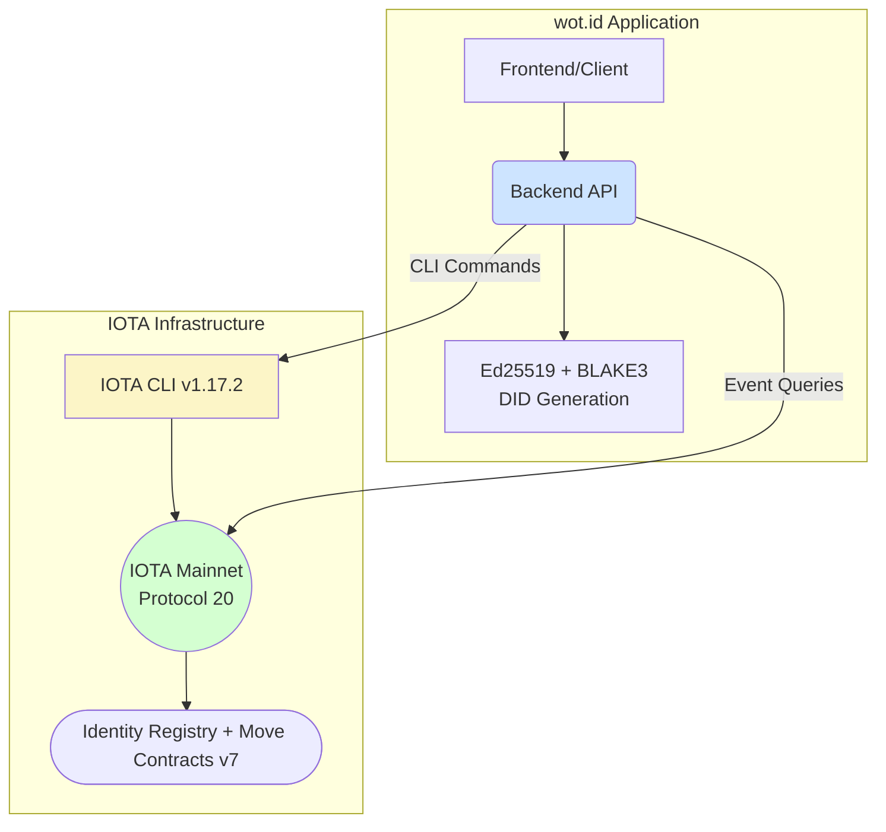
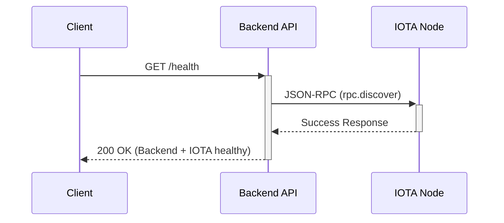
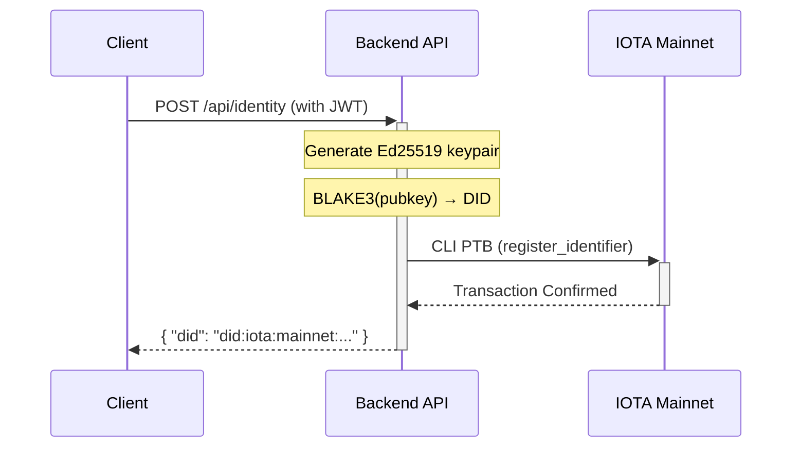
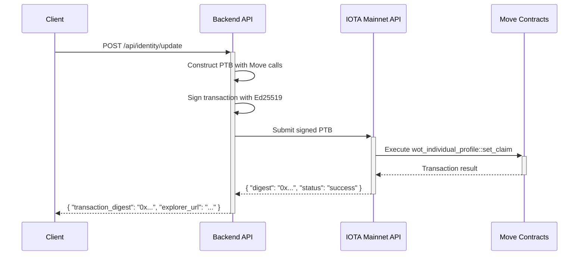
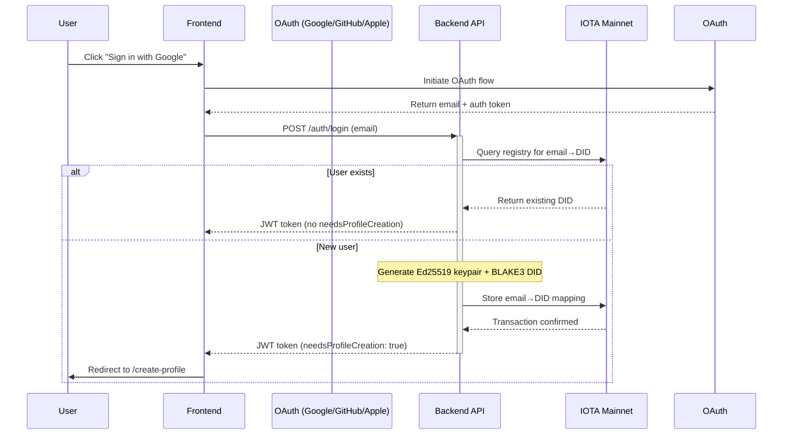
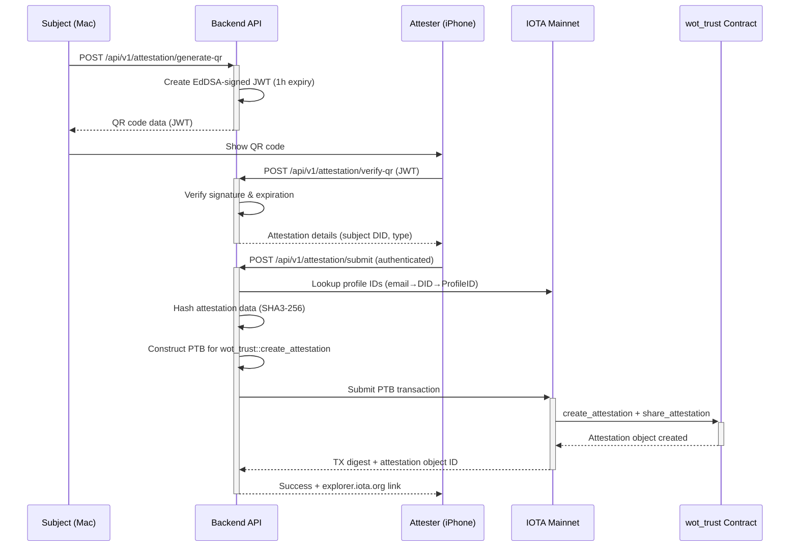
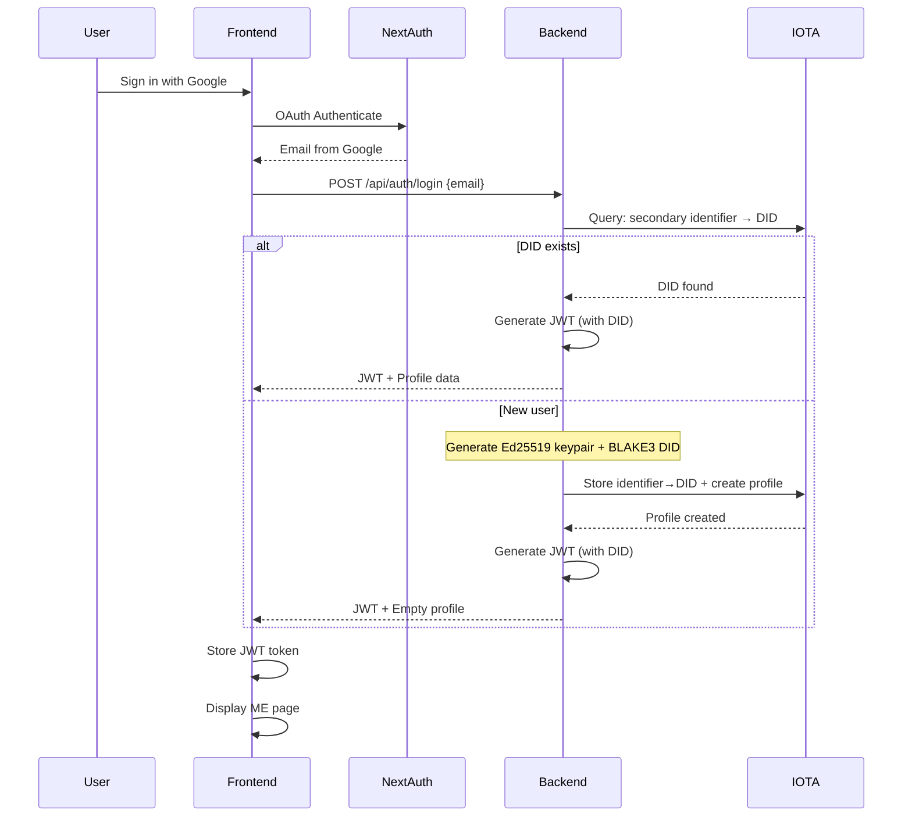

# 02: wot.id - System Architecture

## 1. Introduction

This document outlines the system architecture of the `wot.id` platform. It describes the core components, their interactions, and the key design decisions that shape the system. The architecture is designed to be modular, resilient, and aligned with IOTA's unique capabilities.

### 1.1. Foundational Concept: wot.id as Interface, Not Owner

**Critical Understanding**: wot.id is an **interface** to data stored on the IOTA Tangle—it is NOT the owner or gatekeeper of that data.

```
┌─────────────────────────────────────────────────────────────────────┐
│                     DATA SOVEREIGNTY MODEL                          │
│                                                                     │
│   ┌─────────────┐      ┌─────────────┐      ┌─────────────┐       │
│   │   wot.id    │      │ Other Apps  │      │  Direct DID │       │
│   │  Frontend   │      │  (Future)   │      │   Access    │       │
│   └──────┬──────┘      └──────┬──────┘      └──────┬──────┘       │
│          │                    │                    │               │
│          └────────────────────┼────────────────────┘               │
│                               │                                     │
│                               ▼                                     │
│   ┌─────────────────────────────────────────────────────────────┐ │
│   │                    IOTA TANGLE                               │ │
│   │  ┌─────────────────────────────────────────────────────────┐│ │
│   │  │  Atomic Data Points (owned by DID holder)               ││ │
│   │  │  ┌─────────┐ ┌─────────┐ ┌─────────┐ ┌─────────┐       ││ │
│   │  │  │ Health  │ │ Identity│ │Documents│ │ Assets  │  ...  ││ │
│   │  │  │  Data   │ │  Data   │ │  Data   │ │  Data   │       ││ │
│   │  │  │+trust   │ │+trust   │ │+trust   │ │+trust   │       ││ │
│   │  │  └─────────┘ └─────────┘ └─────────┘ └─────────┘       ││ │
│   │  └─────────────────────────────────────────────────────────┘│ │
│   └─────────────────────────────────────────────────────────────┘ │
│                                                                     │
│   User needs ONLY their DID to access data from ANY interface.     │
│   wot.id can disappear and data remains accessible.                │
└─────────────────────────────────────────────────────────────────────┘
```

**Key Implications**:
- User data persists on IOTA Tangle regardless of wot.id's existence
- Any application with IOTA access can read user data (respecting privacy settings)
- wot.id provides convenience features (OAuth login, gas sponsorship, ME page UI)
- The DID is the user's permanent key to their data

### 1.2. Atomic Data Point Model

Every piece of user data follows the same fundamental structure:

```
┌─────────────────────────────────────────────────────────────────┐
│  ATOMIC DATA POINT                                              │
│  ─────────────────                                              │
│  value: String          // The actual data                     │
│  trust_value: i16       // -100 to +100 (reliability score)    │
│  attestations: Vec      // Who verified this data point        │
│  created_at: u64        // When created                        │
│  updated_at: u64        // Last modification                   │
│  privacy_level: u8      // Who can see this                    │
└─────────────────────────────────────────────────────────────────┘

Examples:
┌──────────────────┬─────────────────┬─────────┬──────────────────┐
│ Domain           │ Value           │ Trust   │ Why              │
├──────────────────┼─────────────────┼─────────┼──────────────────┤
│ health.ldl       │ "31 mg/dl"      │ +100    │ Lab-attested     │
│ identity.email   │ "user@mail.com" │ +85     │ OAuth-verified   │
│ identity.name    │ "John Doe"      │ +20     │ Self-declared    │
│ docs.passport    │ "sha256:abc..." │ +95     │ Govt-attested    │
└──────────────────┴─────────────────┴─────────┴──────────────────┘
```

### 1.3. Claims, Attestations, and Trust Scores

Three distinct concepts work together:

**Claim**: User A uploads information (a value) about themselves. This is an assertion that may or may not be true. Initially self-declared with low trust.

**Attestation**: Users B, C, D... verify (or dispute) the claim. Each attestation is a statement saying "I believe this claim is true/false" with a confidence level (-100 to +100).

**Trust Score**: Calculated probability that the claim is correct. wot.id aggregates all attestations for a claim to compute a trust score, displayed with percentage and color scheme.

```
┌─────────────────────────────────────────────────────────────────┐
│  CLAIM → ATTESTATIONS → TRUST SCORE                             │
│                                                                 │
│  User A makes claim:     first_name = "Axel"                   │
│                              ↓                                  │
│  Users B,C,D attest:     [+85, +70, -20]                       │
│                              ↓                                  │
│  Trust score calculated: +45 → "Trusted" (yellow-green)        │
└─────────────────────────────────────────────────────────────────┘
```

**ME Page Domain Sections**: The frontend organizes these atomic data points into human-readable sections (Identity, Health, Documents, etc.), but this is purely presentational. Each section simply groups related atomic data points—all following the same trust-enabled structure.

## 2. Architectural Drivers

The Backend API is a single Rust service that handles all responsibilities:

**Backend API** (Single unified service):
- Handles business logic and authentication
- Generates W3C DID Core 1.0 compliant DIDs (Ed25519 + BLAKE3) — integrated March 2026
- Manages IOTA blockchain interactions via CLI
- Hybrid economic model: gas sponsorship for profile creation; user-funded transfers
- Personal wallets: Auto-assigned IOTA wallet per user with exportable mnemonic
- Provides REST API for frontend
- P2P messaging: WebSocket relay for browser-to-browser communication
- Structured error handling (`ApiError` types) and input validation

> **History**: DID generation was previously in a separate Identity Service microservice (port 8081), separated in June 2025 to isolate `identity_iota` SDK dependencies. That SDK was abandoned and the service was retired on 2026-03-07. See `docs/2026_Code_Work/26-03-07_Identity_Service.md`.

## 3. System Components

The `wot.id` platform consists of two primary components:

*   **Backend API**: The central orchestrator, built with Rust and Axum. Constructs PTBs via IOTA CLI commands, uses iota-sdk v1.17.2 for type definitions. Generates W3C DID Core 1.0 compliant identifiers (Ed25519 + BLAKE3). Implements hybrid economic model: gas sponsorship for profile creation (24h rate limiting), personal wallets for user-funded transfers. Provides WebSocket relay for P2P messaging.
*   **IOTA Mainnet**: Protocol 20 accessed via public API endpoint `https://api.mainnet.iota.cafe`. All identity data lives on-chain as Move objects.

### 3.1. W3C DID Implementation

**wot.id implements W3C DID Core 1.0 compliant identities with on-chain storage:**

```
W3C DID Core v1.0 (International Standard)
  ↓ compliant
Backend API (Production — single service)
  - Ed25519 keypair generation
  - BLAKE3 cryptographic hash
  - did:iota:mainnet:<hash> format
  ↓ stores via IOTA CLI PTB
IOTA Mainnet (On-Chain)
  - wot_identity_registry.move (DID → Profile mapping)
  - wot_identity.move (IdentityProfile with DID field)
  ↓ powers
wot.id Application (extends with trust network)
```

**Current Implementation (Production - March 2026):**

**Backend API** (all DID operations integrated):
- Generates Ed25519 keypairs for each new identity
- Derives DID from public key hash: `did:iota:mainnet:<blake3-hash-of-pubkey>`
- Stores DID string in Move contracts (`wot_identity_registry.move`, `wot_identity.move`)
- Stores secondary identifier→DID mappings (email → DID, phone → DID)
- Stores atomic data VALUES with trust scores in profile objects
- Executes transactions via IOTA CLI with iota-sdk v1.17.2 types
- **Status:** ✅ Production deployed and operational

**W3C Compliance:**

| Requirement | Status | Implementation |
|-------------|--------|----------------|
| DID Syntax (§3.1) | ✅ | `did:iota:mainnet:<identifier>` |
| DID Document (§4) | ✅ | Proper @context, verificationMethod, authentication |
| Verification Methods | ✅ | Ed25519VerificationKey2020 |
| On-Chain Storage | ✅ | DID + all data in Move contracts |
| External Resolution | ❌ | By design for SSI (optional future enhancement) |

**Note on External Resolution:** wot.id DIDs are resolvable within the wot.id ecosystem. External universal resolver integration (resolver.identity.foundation) is an optional future enhancement, not a compliance requirement for a self-sovereign system.

**wot.id Extensions (Beyond W3C Core):**
- ✅ Trust scores on VALUES (-100 to +100)
- ✅ Secondary identifier→DID registry
- ✅ On-chain attestation system
- ✅ Post-quantum encryption (X25519 + ML-KEM-768)

**Key References:**
- W3C DID Core v1.0: https://www.w3.org/TR/did-core/
- W3C Compliance Assessment: `docs/2026_Code_Work/26-01-01_W3C_Compliance.md`

### 3.2. Identity Identifier Architecture

**wot.id uses a two-tier identifier system:**

**Primary Identifier: W3C DID**
- Format: `did:iota:mainnet:<identifier>`
- Example: `did:iota:mainnet:af364f192213f8d9ac1425ce2a62a051`
- Properties:
  - Immutable (never changes)
  - W3C DID Core 1.0 compliant
  - Cryptographically derived from Ed25519 public keys
  - Stored on-chain in `wot_identity_registry.move`
  - Represents the PERSON or ENTITY
  - Used for cryptographic operations and ownership

**Secondary Identifiers: Access Methods**
- Email: `user@example.com`
- Phone: `+1-555-0123` (future)
- Twitter: `@username` (future)
- Properties:
  - Mutable (user can change email)
  - Many-to-one mapping to DID
  - Stored as `(type, value) → DID` in `identity_registry.move` (generic registry)
  - NOT the identity, just ways to ACCESS it
  - Used for login convenience (OAuth, SMS)

**Authentication Flow:**
```
1. User clicks "Sign in with Google" (OAuth)
2. Frontend obtains email from Google
3. Frontend → Backend API: POST /auth/login with email
4. Backend queries identity_registry.move: secondary identifier → DID lookup
5a. If DID found: Load profile from on-chain
5b. If DID not found: Generate DID inline (Ed25519 + BLAKE3), store identifier→DID mapping
6. Return JWT token to frontend
7. Frontend displays ME page with on-chain data VALUES
```

**Why This Architecture:**
- User can have multiple OAuth logins (Google, Microsoft, Twitter) → all map to ONE DID
- Changing email doesn't change identity, just updates the mapping
- DID remains constant across all login methods
- OAuth is just a convenient way to obtain a SECONDARY identifier (email)

### 3.3. Data Storage Architecture

**100% On-Chain Data VALUES:**

All identity data VALUES are stored on IOTA Tangle using Move smart contracts:

- ✅ **W3C DIDs**: `did:iota:mainnet:...` (primary identifiers)
- ✅ **Secondary Identifier Mappings**: Generic (type, value) → DID registry in `identity_registry.move`
- ✅ **Atomic Data VALUES**: `birth_date: "1990-01-01"`, `blood_type: "O+"`, `ldl_cholesterol: "31 mg/dl"`
- ✅ **Trust Scores per VALUE**: Each VALUE has -100 to +100 score based on attestations
- ✅ **Claims & Attestations**: Who verified each VALUE, when, with what authority
- ✅ **Profile Metadata**: Controller address, timestamps, update history

**No Traditional Database:**
- ❌ No SQL, NoSQL, Redis, or centralized database
- ❌ Backend is stateless query layer (only uses IOTA CLI)
- ✅ Blockchain is single source of truth
- ✅ Fully decentralized architecture

**Optional Off-Chain (Supporting Files Only):**
- 📄 Document FILES: PDF scans, images (e.g., `passport.pdf`, `lab_report.pdf`)
- 🔐 On-chain stores SHA-256 hash for verification
- ⚠️ Not displayed on ME page (VALUES are displayed)
- ⚠️ Not required (system works without any off-chain files)

## 4. On-Chain Architecture: Identity Registry

The `wot.id` platform stores all identity data directly on IOTA mainnet using Move smart contracts:

*   **IOTA Mainnet (L1)**: All identity profiles, DIDs, and trust data are stored as Move objects on IOTA mainnet. There is **no traditional database** - the blockchain is the single source of truth.

*   **Identity Registry Contract**: A shared Move object (`identity_registry.move`) that maintains a decentralized mapping of DID → Profile Object ID. This registry enables anyone to look up a profile by DID without a centralized index.

*   **Profile Objects**: Individual identity profiles (`wot_identity.move`) stored as owned Move objects containing claims, trust scores, and metadata. Each profile is controlled by its owner address.

### 4.1. Hybrid Transaction Execution: CLI + SDK Types

The `Backend API` uses a hybrid approach for IOTA blockchain interactions:

**Architecture:**
- **Transaction Execution:** IOTA CLI commands for PTB construction and submission
- **Type Definitions:** iota-sdk v1.17.2 for Rust type safety (ObjectID, IotaAddress, TransactionData)
- **Rationale:** CLI provides stability, SDK types provide type safety
- **IOTA Framework:** v1.13.1 (mainnet compatibility, Dec 18 2025)

```bash
# Example: Register email → DID mapping
iota client ptb --gas-budget 10000000 \
  --move-call PACKAGE::wot_identity_registry::register_identifier \
  @REGISTRY "did:iota:mainnet:abc123" "email" "user@example.com" \
  --json
```

**Build Performance:**
- Current: ~27-30 minutes (Cargo build with iota-sdk types)
- Dependency: iota-sdk v1.17.2 for type definitions only (mainnet compatible)
- Trade-off: Type safety (fast iteration) vs pure CLI (faster builds)

**Benefits of Hybrid Approach:**
- ✅ Rust type safety via iota-sdk types
- ✅ Stable CLI interface for mainnet transactions
- ✅ Avoids full SDK transaction builder complexity
- ✅ Direct access to mainnet functionality

## 5. Architectural Diagrams

### 5.1. Component Overview

This diagram illustrates the high-level relationship between the application components and the IOTA L1/L2 architecture.



### 5.2. Interaction Flows

#### Health Check Sequence

This sequence shows how the `Backend API` performs a system-wide health check.



#### DID Creation Sequence

This sequence illustrates the DID creation flow using cryptographic derivation (Ed25519 + BLAKE3), all within the Backend API.



#### L2 Transaction Execution Sequence (Current Implementation)

This sequence shows how the `Backend API` executes Move contract transactions via direct IOTA mainnet API access using PTBs.



#### OAuth Auto-Provisioning Flow (Operational Nov 2025)

This sequence shows automatic DID creation for new OAuth users without wallet setup:



#### On-Chain Attestation Flow (Operational Nov 2025)

This sequence shows cross-device QR code attestation with on-chain submission:



**Key Implementation Details (Nov 19, 2025):**
- ✅ **wot_trust Package**: `0xf8ddc1060e855f09e30e62e74b4355048b2c50c582b68cceaf6f84366cfe8eee`
- ✅ **Privacy-Preserving**: Stores SHA3-256 hash instead of plaintext on-chain
- ✅ **Gas Sponsored**: Backend pays gas for attestation transactions
- ✅ **Public Verification**: Attestations visible on explorer.iota.org
- ✅ **First Production TX**: `4Uz9SxQv6gMyd21wwvZhZ4ZJ5KVsAAo4ia46SbHadWDf`

## 6. On-Chain Interaction Model: CLI-Based PTBs with SDK Types

All state-changing interactions with the IOTA ledger are executed via **Programmable Transaction Blocks (PTBs)**. The `Backend API` uses a **hybrid approach**:

**Hybrid Architecture:**
- **PTB Execution:** IOTA CLI commands construct and submit transactions
- **Type Definitions:** iota-sdk v1.17.2 provides Rust types (ObjectID, IotaAddress, TransactionData)
- **No SDK Transaction Builder:** Avoids complex SDK transaction construction APIs

**Benefits:**
- ✅ CLI stability for mainnet transactions
- ✅ Rust type safety via iota-sdk types
- ✅ Direct mainnet access via `https://api.mainnet.iota.cafe`
- ✅ Gas station pattern: Backend sponsors user transactions with 24-hour rate limiting

**Build Performance:**
- Current: ~27-30 minutes with iota-sdk types
- Trade-off: Type safety and code quality over pure build speed

PTBs are powerful constructs that allow for bundling multiple atomic operations into a single transaction. This is crucial for complex workflows like creating a trust relationship or issuing a verifiable credential.

### 6.1. Key Concepts Used

The backend leverages several core IOTA concepts when building PTBs:

*   **Atomic Execution**: Multiple commands (e.g., transferring funds, calling a contract) are executed as a single, all-or-nothing transaction.
*   **`moveCall`**: The specific command within a PTB used to invoke a function in a deployed Move smart contract.
*   **Gas Management**: PTBs include mechanisms for specifying a gas budget and providing payment for smart contract execution.
*   **Object Model & Dynamic Fields**: The backend logic aligns with the Move contract patterns for representing on-chain entities (like `IdentityObject`) and storing flexible data.

This approach ensures that all on-chain interactions are robust, efficient, and align with official IOTA developer best practices.

## 7. Network and Environment

### 7.1. Default Ports

| Component            | Port  |
|----------------------|-------|
| Backend API          | 10000 |
| IOTA Node (JSON-RPC) | 9000  |
| Frontend (Next.js)   | 3000  |

### 7.2. Environment Variables

The system is configured via environment variables:

- `PORT=10000`: Port for the Backend API (Render default).
- `IOTA_NODE_URL=https://api.mainnet.iota.cafe`: IOTA mainnet RPC endpoint.
- `IOTA_PRIVATE_KEY`: Ed25519 private key for Backend's IOTA keystore.
- `JWT_SECRET_KEY`: HS256 secret for JWT generation and validation.
- `IOTA_REGISTRY_PACKAGE_ID=0xa389f9b55c811064e53bf1ee84900cafdcbbe05a3cf37bc7086a399ca5f2a8cb`: Identity registry package (January 9, 2026 v7 with FileVault)
- `IOTA_REGISTRY_OBJECT_ID=0x334a70ee16409b749bf221a9d0aafdd8c829db22474e2363a0bdd43e9b45ad92`: Shared registry object
- `RATE_LIMIT_HOURS=24`: Gas station rate limiting (prevents abuse)
- `DEFAULT_GAS_BUDGET=1000000000`: Gas budget for Move contract transactions.
- `REQUIRE_AUTH=false`: Enable/disable JWT authentication (set to `true` in production).
- `API_KEYS=dev-key-1,dev-key-2`: Comma-separated API keys (hashed with BLAKE3).
- `RATE_LIMIT_ENABLED=true`: Enable/disable rate limiting.
- `RUST_LOG=info`: Logging level configuration.

> **Note**: `IDENTITY_SERVICE_URL` was removed on 2026-03-07 when the Identity Service was retired.

**Production Configuration:**
For production deployment (e.g., Render), use public IOTA mainnet endpoints:
- `IOTA_NODE_URL=https://api.mainnet.iota.cafe`
- `REQUIRE_AUTH=true`
- `API_KEYS=wot-prod-key-1,wot-prod-key-2`

## 8. Deployment and Startup

1.  **Start the Backend API**: Docker container (or Rust process) on port 10000.
2.  **Start the Frontend**: Next.js development server on port 3000.

**Current Setup**: Local development uses IOTA Mainnet with CLI-based transaction submission. Production deployments can use either local nodes or public IOTA mainnet endpoints (`https://api.mainnet.iota.cafe`).

## 9. References

*   **IOTA Node**: [IOTA GitHub](https://github.com/iotaledger/iota) (Protocol 20 Mainnet)
*   **IOTA CLI**: [IOTA CLI Documentation](https://docs.iota.org/references/cli/client)
*   **IOTA Move Contracts**: [Move Documentation](https://docs.iota.org/developer/iota-101/move)
*   **IOTA Identity SDK (Rust)**: [identity.rs GitHub](https://github.com/iotaledger/identity.rs)
*   **IOTA JSON-RPC API**: [IOTA JSON-RPC API Format](https://docs.iota.org/references/iota-api/json-rpc-format)
*   **Programmable Transaction Blocks (PTBs)**: [Programmable Transaction Blocks Overview](https://docs.iota.org/developer/iota-101/transactions/ptb/programmable-transaction-blocks-overview)

## 10. Security Architecture

The `wot.id` platform implements enterprise-grade security with a focus on **post-quantum cryptography (PQC)** and defense-in-depth strategies. The security architecture is designed to protect against both current and future threats, including quantum computing attacks.

### 10.1. Security Overview

The security implementation follows a **layered defense strategy** with multiple independent security controls:

- **Authentication**: Post-quantum resistant API key authentication using BLAKE3 hashing
- **Rate Limiting**: DDoS protection with per-client tracking and configurable limits
- **Input Validation**: Comprehensive validation and sanitization to prevent injection attacks
- **Middleware Architecture**: Ordered security layers with fail-safe defaults
- **Environment Configuration**: Secure-by-default settings with development flexibility

### 10.2. Post-Quantum Cryptography (PQC)

**Current Status (December 2025)**: ✅ **FULLY IMPLEMENTED** - Hybrid PQC encryption for all sensitive user data.

**Vision**: Every piece of sensitive human identity data stored on wot.id is quantum-safe. The encryption infrastructure protects against both current threats and future quantum computing attacks.

#### ✅ Implemented: Hybrid X25519 + ML-KEM-768 Encryption

**Library**: pqc.js (Dashlane) - production-grade WebAssembly implementation

**Algorithm Stack**:
| Layer | Algorithm | Purpose |
|-------|-----------|---------|
| Key Exchange | X25519 + ML-KEM-768 | Hybrid key encapsulation (defense in depth) |
| Symmetric | ChaCha20-Poly1305 | Authenticated encryption of data |
| Key Derivation | BLAKE3 + HKDF | Secure key derivation from mnemonic |
| Recovery | BIP-39 | 24-word mnemonic for key backup |

**Architecture**:
```
┌─────────────────────────────────────────────────────────────────┐
│  USER KEY HIERARCHY (Client-Side Only)                         │
│  ─────────────────────────────────────                         │
│  BIP-39 Mnemonic (24 words)                                    │
│       │                                                        │
│       ├── X25519 Keypair (classical)                           │
│       │                                                        │
│       └── ML-KEM-768 Keypair (post-quantum)                    │
│                │                                               │
│                └── Data Encryption Key (DEK)                   │
│                        │                                       │
│                        ├── identity.first_name                 │
│                        ├── identity.date_of_birth              │
│                        ├── identity.place_of_birth             │
│                        ├── health.glucose                      │
│                        ├── health.cholesterol                  │
│                        └── ... (any sensitive field)           │
└─────────────────────────────────────────────────────────────────┘
```

**What Can Be Encrypted** (all use same infrastructure):
| Data Type | Status | Smart Contract Function |
|-----------|--------|------------------------|
| Health atoms (lab results, vitals) | ✅ Implemented | `store_health_atom_encrypted()` |
| Identity claims (name, DOB, address) | ✅ Implemented | `update_claim_encrypted()` |
| Documents (passport, certificates) | 🔄 Planned | Uses `EncryptedField` |
| P2P messages | 🔄 Planned (Phase D) | Mailbox with encrypted payload |

**On-Chain Structs** (Smart Contract v6 - December 30, 2025):
```move
/// Generic encrypted field - used for ANY sensitive data
public struct EncryptedField has store, drop, copy {
    version: u8,              // Encryption scheme version (1 = ChaCha20-Poly1305)
    scheme: u8,               // Cipher scheme (1 = ChaCha20-Poly1305, 2 = AES-256-GCM)
    nonce: vector<u8>,        // 12-byte nonce (base64 encoded in API)
    ciphertext: vector<u8>,   // Encrypted data with auth tag (base64 encoded in API)
}

/// Hybrid public key for quantum-resistant encryption
struct HybridPublicKey has store {
    version: u8,              // Encryption version (1 = X25519-MLKEM768)
    x25519_public: vector<u8>,    // 32 bytes
    mlkem_public: vector<u8>,     // 1184 bytes (ML-KEM-768)
    key_id: String,               // Unique key identifier
}

/// Encrypted identity claim (name, DOB, address, etc.)
public struct EncryptedClaim has store, drop {
    claim_type: String,
    value_enc: EncryptedField,  // Encrypted value
    trust_score: i16,
    attestation_count: u32,
}
```

**Security Properties**:
- ✅ Defense in depth: Attacker must break BOTH X25519 AND ML-KEM-768
- ✅ Cryptographic agility: Version field enables future algorithm upgrades
- ✅ Zero server knowledge: All encryption/decryption client-side only
- ✅ Key sovereignty: Users own their keys via BIP-39 mnemonic backup
- ✅ Field isolation: Each field has unique derived key (compromise one ≠ compromise all)

**Files Implemented**:
- `frontend/src/lib/crypto/hybrid.ts` - Hybrid encryption/decryption
- `frontend/src/lib/crypto/symmetric.ts` - ChaCha20-Poly1305
- `frontend/src/lib/crypto/field.ts` - Generic field encryption (any field name)
- `frontend/src/lib/crypto/keystore.ts` - Key management
- `frontend/src/lib/crypto/mnemonic.ts` - BIP-39 recovery
- `frontend/src/hooks/useEncryption.ts` - React hook for encryption service
- `frontend/src/app/me/components/IdentitySection.tsx` - Identity display with decryption
- `backend/src/handlers/identity.rs` - Backend encrypted claim detection
- `move-contracts/sources/wot_identity.move` - On-chain structs & entry functions

#### Complete Encryption/Decryption Round-Trip

**Save Path (Frontend → Backend → Chain)**:
```
1. User enters value (e.g., "John" in First Name)
2. Frontend: fieldId = "identity.first_name" (stable ID)
3. Frontend: encryption.encryptValue(fieldId, "John")
   → {v: 1, s: 1, n: "base64...", c: "base64..."}
4. Frontend: POST /api/identity/me {field: "first_name", value_enc: {...}}
5. Backend: Stores in EncryptedIdentityClaim on-chain
6. IOTA: Transaction confirmed
```

**Fetch Path (Chain → Backend → Frontend)**:
```
1. Frontend: GET /api/identity/me
2. Backend: Fetches profile from IOTA
3. Backend: extract_claim_value_from_object() detects value_enc
   → Returns {"_enc": {v, s, n, c}}
4. Backend: identity_value_maybe_encrypted() parses _enc marker
   → Returns {value: null, value_enc: {v, s, n, c}, trust_score}
5. Frontend: Receives identity with value_enc fields
6. Frontend: getDecryptedValue("first_name", field)
   → encryption.decryptValue("identity.first_name", value_enc)
   → Returns "John"
7. Frontend: Displays "John" in First Name field
```

**Critical: Stable fieldId Requirement**:
```typescript
// ✅ Correct: Stable fieldId (same for encrypt AND decrypt)
const fieldId = `identity.${fieldName}`;  // e.g., "identity.first_name"

// ❌ Wrong: Timestamp-based (decryption will fail)
const fieldId = `identity.${fieldName}.${Date.now()}`;
```

**Serialized Encrypted Field Format (API)**:
```typescript
interface SerializedEncryptedField {
  v: number;  // Version (1)
  s: number;  // Scheme (1=ChaCha20-Poly1305, 2=AES-256-GCM)
  n: string;  // Nonce (base64)
  c: string;  // Ciphertext (base64)
}
```

**Frontend Decryption Helper** (`IdentitySection.tsx`):
```typescript
const getDecryptedValue = useCallback((
  fieldName: string,
  field: { value: string | null; value_enc?: SerializedEncryptedField }
): string | null => {
  if (field.value_enc && encryption.isUnlocked) {
    try {
      const decrypted = encryption.decryptValue(
        `identity.${fieldName}`,
        field.value_enc
      );
      return decrypted;
    } catch (err) {
      console.error(`Failed to decrypt ${fieldName}:`, err);
      return null;
    }
  }
  return field.value;  // Fallback to plaintext
}, [encryption.isUnlocked, encryption.decryptValue]);
```

#### BLAKE3 Hash Function
- **Purpose**: API key hashing, key derivation, integrity verification
- **Quantum Resistance**: Designed to withstand quantum computer attacks
- **Performance**: Significantly faster than SHA256 and SHA-3
- **Output**: 256-bit hash with collision resistance against quantum attacks

```rust
// Example: API key hashing with BLAKE3
fn hash_api_key(key: &str) -> String {
    let hash = blake3::hash(key.as_bytes());
    hex::encode(hash.as_bytes())
}
```

#### ✅ Production Verification (December 30, 2025)

The PQC encryption stack has been verified operational in production:

| Component | Verification | Evidence |
|-----------|-------------|----------|
| **ML-KEM-768 Provider** | pqc.js active | Console: `[ML-KEM] Using pqc.js ML-KEM-768 (post-quantum secure)` |
| **Mnemonic Recovery** | DEK derived correctly | Console: `Encryption restored from mnemonic` |
| **Field Encryption** | ChaCha20-Poly1305 | On-chain: `{"_enc":{"v":1,"s":1,"n":"...","c":"..."}}` |
| **Field Decryption** | No auth tag errors | Console: `Decrypted first_name successfully` |
| **On-chain Storage** | Encrypted JSON | Backend logs show `_enc` format |

**Production Transaction**: [5se44XYLAHWHMjZT4VXaYCvyh1ueq7QjGV7u36ZCJD7](https://explorer.rebased.iota.org/txblock/5se44XYLAHWHMjZT4VXaYCvyh1ueq7QjGV7u36ZCJD7)

See `docs/2025_Code_Work/25-12-29_PQC_Stack_Functional.md` for detailed verification logs.

#### Future PQC Integration
- **P2P Messaging**: Signal Protocol with PQXDH (planned Phase D)
- **JWT Tokens**: PQC-compliant signing (evaluation phase)
- **TLS/HTTPS**: Quantum-safe certificates when widely supported

### 10.3. Authentication System

**Current Status:** ✅ **PRODUCTION** - JWT authentication system with integrated W3C DID generation.

**Implementation Status:** Core authentication features implemented and validated:

#### ✅ Implemented Key Features
- **✅ JWT Authentication**: Complete JWT token validation with proper issuer/audience verification
- **✅ W3C DID Integration**: Standards-compliant DID generation integrated in Backend
- **✅ Secure Storage**: API keys hashed with BLAKE3, JWT secrets properly configured
- **✅ Protected Endpoints**: All identity operations require valid JWT tokens
- **✅ Environment Control**: Flexible configuration for development and production
- **✅ Structured Errors**: `ApiError` types with HTTP status mapping and request ID tracking

#### ✅ Current Endpoints (Authentication Status)
```bash
# Public endpoints (No authentication required)
curl http://localhost:8080/health
curl http://localhost:8080/iota/test

# Protected endpoints (JWT authentication required)
curl -H "Authorization: Bearer [JWT_TOKEN]" \
  -X POST http://localhost:8080/api/identity \
  -d '{"email":"user@example.com","name":"User","entity_type":"human"}'

curl -H "Authorization: Bearer [JWT_TOKEN]" \
  http://localhost:8080/api/identity/did:iota:example123

curl -H "Authorization: Bearer [JWT_TOKEN]" \
  http://localhost:8080/api/health/protected
curl http://localhost:8080/iota/test
```

#### ✅ Phase 2 API Endpoints (Governance)
**Status**: 📋 **DESIGNED BUT NOT TESTED** - Proposal-based governance system in contracts, not yet validated in production.

**Governance Endpoints**:
```bash
# Proposal-based governance
POST /api/proposals/create     # Create trust proposals
POST /api/proposals/vote       # Vote on proposals  
POST /api/proposals/execute    # Execute approved proposals
GET  /api/proposals/:id/status # Get proposal status
```

**Implementation Features**:
- ✅ **Move Contract Integration**: All endpoints generate proper PTB transactions
- ✅ **JWT Authentication**: All endpoints protected with middleware
- ✅ **Official Package Integration**: Uses mainnet IOTA Identity package
- ✅ **Democratic Governance**: Multi-party consensus for trust profile updates

### 10.4. Rate Limiting

**Current Status:** Rate limiting code is **implemented but not actively enforced** in all endpoints. The infrastructure exists but may not be fully integrated across all API routes.

**Implementation:** Designed to protect against denial-of-service attacks and ensure fair resource usage:

#### Planned Algorithm
- **Sliding Window**: More fair than fixed time windows
- **Per-Client Tracking**: Based on client IP address
- **Proxy Support**: Will handle `X-Forwarded-For` and `X-Real-IP` headers
- **Automatic Cleanup**: Will remove expired client entries

#### Planned Configuration
```bash
RATE_LIMIT_ENABLED=true
RATE_LIMIT_MAX_REQUESTS=100    # Requests per window
RATE_LIMIT_WINDOW_SECONDS=60   # Window duration
```
X-RateLimit-Reset: 1642694400
```

### 10.5. Input Validation

Comprehensive validation prevents injection attacks and ensures data integrity:

#### Validation Types
1. **DID Format Validation**: Ensures proper decentralized identifier structure
2. **Trust Level Validation**: Validates -100 to +100 trust scale range
3. **Credential Validation**: Validates credential types, claims, and verification methods
4. **String Sanitization**: Removes potentially dangerous characters
5. **Length Limits**: Prevents buffer overflow and DoS attacks

#### Example Validations
```rust
// DID validation
fn validate_did(did: &str) -> Result<(), ValidationError> {
    if !did.starts_with("did:") {
        return Err(ValidationError::new("Invalid DID format"));
    }
    // Additional format and structure checks...
}

// Trust level validation (new -100/+100 scale)
fn validate_trust_level(level: i16) -> Result<(), ValidationError> {
    if level < -100 || level > 100 {
        return Err(ValidationError::new("Trust level out of range"));
    }
    Ok(())
}
```

### 10.6. W3C DID Implementation

**Status**: ✅ **PRODUCTION DEPLOYED** - W3C DID Core 1.0 compliant identity system with IOTA mainnet integration.

#### ✅ W3C DID Compliance
The wot.id platform implements W3C DID Core 1.0 compliance:

- **✅ DID Document Structure**: Proper `@context`, `id`, `verificationMethod`, and `authentication` fields
- **✅ IOTA DID Method**: Uses `did:iota:...` format with IOTA Tangle anchoring
- **✅ Ed25519 Cryptography**: Secure key generation using `ed25519_dalek` with `OsRng`
- **✅ Verification Methods**: Ed25519VerificationKey2020 with proper controller references

#### ✅ W3C DID Document Format
The Backend generates W3C DID documents with this structure:

```rust
// W3C DID Document Example
{
  "@context": [
    "https://www.w3.org/ns/did/v1",
    "https://w3id.org/security/suites/ed25519-2020/v1"
  ],
  "id": "did:iota:0x1234...",
  "verificationMethod": [{
    "id": "did:iota:0x1234...#keys-1",
    "type": "Ed25519VerificationKey2020",
    "controller": "did:iota:0x1234...",
    "publicKeyMultibase": "z6Mk..."
  }],
  "authentication": ["did:iota:0x1234...#keys-1"]
}
```

#### ✅ Hybrid Architecture
The system implements a hybrid approach combining W3C DID standards with wot.id extensions:

- **W3C DID Foundation**: Standards-compliant DID documents for interoperability
- **wot.id Extensions**: Trust network, credentials, and privacy settings
- **IOTA Integration**: Blockchain anchoring with deterministic wallet addresses
- **Move Contract Ready**: Prepared for blockchain-based trust and credential systems

#### ✅ API Endpoints
```bash
# Create W3C DID
POST /api/identity
{
  "email": "user@example.com",
  "name": "User Name",
  "entity_type": "human"
}

# Retrieve W3C DID with wot.id extensions
GET /api/identity/{did}
# Returns: W3C DID document + trust network + credentials + privacy settings
```

### 10.7. Middleware Architecture

**Current Status:** ✅ **IMPLEMENTED LOCALLY** - Middleware stack with JWT authentication, CORS, and security layers working in local development.

⚠️ **Production Status:** Legacy deployment contains outdated middleware from earlier architecture.

**Current Implementation:**
```rust
let app = Router::new()
    .route("/health", get(health_check))
    .route("/iota/test", get(iota_connection_test))
    .layer(middleware::from_fn_with_state(app_state.clone(), jwt_auth_middleware))
    .layer(cors)
    .with_state(app_state);
```

**Middleware Stack Architecture:** Security is implemented as layered middleware:

#### Planned Middleware Stack (Inside to Outside)
```rust
ServiceBuilder::new()
    .layer(TraceLayer::new_for_http())     // 4. Request logging
    .layer(cors)                           // 3. CORS headers
    .layer(rate_limit_middleware)          // 2. Rate limiting
    .layer(auth_middleware)                // 1. Authentication
```

### 10.7.2. Token Exchange Bridge

**Implementation Status**: ✅ **WORKING ON PRODUCTION**

**Problem Solved**: NextAuth (Google OAuth) and Backend JWT authentication systems were not communicating, causing 401 errors on profile creation.

**Solution**: `/api/auth/exchange` endpoint bridges the two authentication systems:

#### Architecture



#### Endpoint Specification

**Request**:
```http
POST /api/auth/login
Content-Type: application/json

{
  "email": "user@example.com"
}
```

**Response**:
```json
{
  "access_token": "eyJ0eXAiOiJKV1QiLCJhbGciOiJIUzI1NiJ9...",
  "token_type": "Bearer",
  "expires_in": 86400
}
```

**Error Response** (401):
```json
{
  "error": "Unauthorized",
  "message": "Invalid or missing authentication"
}
```

#### JWT Claims Structure

```rust
#[derive(Debug, Serialize, Deserialize)]
struct Claims {
    sub: String,        // Subject: user email
    iss: String,        // Issuer: "wot.id-identity-service"
    aud: String,        // Audience: "wot.id"
    exp: usize,         // Expiry: timestamp + 86400 (24h)
    iat: usize,         // Issued at: current timestamp
    jti: String,        // JWT ID: unique identifier (UUID)
    scope: Vec<String>, // Scopes: ["profile:write", "profile:read"]
}
```

#### Frontend Integration

```typescript
// In ProfileCreationFlow component
useEffect(() => {
  async function exchangeToken() {
    if (session?.user?.email && !backendJwt) {
      try {
        const response = await fetch('/api/auth/exchange', {
          method: 'POST',
          headers: { 'Content-Type': 'application/json' },
          body: JSON.stringify({ email: session.user.email }),
        });
        
        if (!response.ok) {
          throw new Error('Token exchange failed');
        }
        
        const data = await response.json();
        setBackendJwt(data.access_token);
        localStorage.setItem('backend_jwt', data.access_token);
      } catch (error) {
        console.error('Token exchange error:', error);
      }
    }
  }
  
  exchangeToken();
}, [session, backendJwt]);
```

#### Security Features

**Token Validation**:
- ✅ HMAC SHA-256 signature verification
- ✅ Expiry check (24-hour validity)
- ✅ Issuer validation ("wot.id-identity-service")
- ✅ Audience validation ("wot.id")
- ✅ Unique JWT ID (prevents replay)

**Rate Limiting**:
- Max 10 token exchanges per email per hour
- Prevents token farming attacks
- Tracked via in-memory HashMap

**Error Handling**:
- Invalid email: 400 Bad Request
- Authentication failure: 401 Unauthorized
- Rate limit exceeded: 429 Too Many Requests
- Server error: 500 Internal Server Error

#### Why This Approach

**Problem Context**:
1. NextAuth manages Google OAuth flow
2. Backend API requires its own JWT for authorization
3. Can't share secrets between NextAuth and Backend (different services)
4. Frontend needs seamless transition between systems

**Solution Benefits**:
1. **Separation of Concerns**: NextAuth handles OAuth, Backend handles API auth
2. **Security**: Each system validates independently
3. **Flexibility**: Easy to add more OAuth providers
4. **Simplicity**: Frontend just exchanges tokens once

**Alternative Considered**:
- Using NextAuth JWT directly → Rejected (Backend can't validate NextAuth tokens)
- Custom OAuth implementation → Rejected (reinventing NextAuth)
- Session cookies → Rejected (CORS complications)

#### Debugging Tips

**Check Token Exchange**:
```bash
curl -X POST http://localhost:8080/api/auth/exchange \
  -H "Content-Type: application/json" \
  -d '{"email":"test@example.com"}'
```

**Decode JWT** (jwt.io or command line):
```bash
echo "JWT_TOKEN" | cut -d. -f2 | base64 -d | jq
```

**Verify Backend Logs**:
```
✅ Token exchange successful for: user@example.com
✅ JWT generated with exp: 1729339200
```

### 10.8. Security Configuration

#### Environment Variables
```bash
# Security toggles
REQUIRE_AUTH=true                    # Enable/disable authentication
RATE_LIMIT_ENABLED=true             # Enable/disable rate limiting

# Authentication
API_KEYS=key1,key2,key3             # Comma-separated API keys

# Rate limiting
RATE_LIMIT_MAX_REQUESTS=100         # Requests per window
RATE_LIMIT_WINDOW_SECONDS=60        # Window duration in seconds

# Logging
RUST_LOG=info                       # Log level (debug/info/warn/error)
```

#### Development vs Production

**Development Mode:**
```bash
REQUIRE_AUTH=false          # No authentication required
RATE_LIMIT_ENABLED=false    # No rate limiting
RUST_LOG=debug              # Verbose logging
```

**Production Mode:**
```bash
REQUIRE_AUTH=true           # Authentication required
RATE_LIMIT_ENABLED=true     # Rate limiting enabled
RATE_LIMIT_MAX_REQUESTS=50  # Stricter limits
RUST_LOG=warn               # Minimal logging
```

### 10.8. Security Threat Model

The security architecture addresses these threat categories:

#### Threats Mitigated
1. **Unauthorized Access**: API key authentication with quantum-resistant hashing
2. **Denial of Service**: Rate limiting with per-client tracking
3. **Injection Attacks**: Input validation and sanitization
4. **Data Integrity**: Comprehensive validation rules
5. **Information Disclosure**: Structured error handling
6. **Quantum Attacks**: Post-quantum cryptography throughout

#### Security Boundaries
- **Network Level**: CORS and security headers
- **Application Level**: Authentication and rate limiting
- **Data Level**: Input validation and sanitization
- **Cryptographic Level**: Quantum-resistant algorithms

### 10.9. Integration with wot.id Architecture

The security implementation integrates seamlessly with the existing architecture:

#### Backend API Integration
- **Unified State**: `AppState` contains security configuration alongside contract config
- **Middleware Layers**: Security applied globally except for health endpoints
- **Performance**: Minimal overhead with efficient algorithms

#### Authentication Integration
- **JWT Authentication**: ✅ Implemented with BLAKE3-based JWT ID generation
- **Token Management**: BLAKE3-based JWT ID generation for quantum resistance
- **Router Architecture**: Unified state with separated public/protected routes
- **Structured Error Handling**: `ApiError` types with HTTP status mapping and request ID tracking

#### IOTA Integration
- **Non-Interference**: Security doesn't affect IOTA/Move contract operations
- **PTB Construction**: Security validated before expensive PTB operations
- **Gas Efficiency**: Invalid requests rejected before gas consumption

### 10.10. Frontend Security Architecture (✅ IMPLEMENTED)

The frontend security hardening provides comprehensive client-side protection that complements the backend PQC implementation:

#### Environment Configuration Security
- **Centralized Configuration**: Type-safe environment variable access with validation
- **URL Validation**: Automatic sanitization and validation for all service endpoints
- **Network Selection**: Dynamic IOTA network configuration (localnet/testnet/mainnet)
- **Security Constants**: Configurable timeouts, rate limits, and CSP settings

#### Secure API Client Architecture
- **Token Management**: Secure storage and handling of API keys and JWT tokens
- **Request Security**: Automatic authentication headers and timeout management
- **Retry Logic**: Exponential backoff with configurable retry attempts
- **Error Sanitization**: Prevents information disclosure in error responses
- **Health Monitoring**: Automatic service availability checking

#### Frontend Security Middleware
- **Content Security Policy**: URL origin validation and XSS prevention
- **Input Validation**: Comprehensive validation for DIDs, trust levels, emails, and IOTA addresses
- **Client-Side Rate Limiting**: Sliding window algorithm with per-endpoint limits
- **Secure Storage**: Obfuscated localStorage with namespace isolation
- **Error Handling**: Security event reporting and context validation

#### React Security Hooks
- **useSecureApi**: Generic secure API wrapper with built-in security features
- **useBackendApi**: Secure Backend API operations with input validation
- **useIdentity**: JWT-authenticated identity operations
- **useAuth**: Authentication state management and token handling
- **useHealthMonitor**: Automatic service health checking

#### Security Integration Features
- **PQC Compatibility**: All components designed for quantum-resistant algorithms
- **Defense in Depth**: Multiple security validation layers
- **Developer Experience**: Easy-to-use hooks with comprehensive TypeScript typing
- **Build Verification**: All security components verified and tested

### 10.11. Future Security Enhancements

#### Planned Improvements
1. **HTTPS/TLS**: Quantum-safe TLS certificates for production
2. **Role-Based Access**: Fine-grained permissions and authorization
3. **Audit Logging**: Comprehensive security event logging
4. **Metrics Integration**: Security metrics and alerting
5. **Key Rotation**: Automated API key and JWT secret rotation

#### Quantum-Safe Roadmap
- **Phase 1** ✅: BLAKE3 hash functions (Backend API)
- **Phase 2** ✅: PQC-compliant JWT authentication (BLAKE3-based JWT IDs)
- **Phase 3**: Quantum-safe TLS/HTTPS certificates
- **Phase 4**: Post-quantum key exchange protocols

## 11. Current System Status

### 11.1. ✅ End-to-End Identity System Operational

**Major Achievement**: Complete decentralized identity registration flow successfully validated.

**Working Flow**:
1. ✅ Google OAuth authentication via NextAuth
2. ✅ Token exchange bridge (NextAuth → Backend JWT)
3. ✅ Browser-based Ed25519 key generation
4. ✅ Challenge-response DID ownership verification
5. ✅ Profile creation on IOTA mainnet (gas sponsored)
6. ✅ Identity registry mapping (DID → Profile ID)
7. ✅ Event-based profile retrieval

**Real Transaction Evidence**:
- **Transaction**: `4vK4g7p2gy3Rxmg1KHbwpvJkcE5ocQaNAiUJ24vm7Zbs`
- **DID**: `did:iota:mainnet:08e2f2a32692349751f2f6d9731f5847`
- **Status**: Profile successfully stored on IOTA mainnet
- **Gas Cost**: ~0.0076 IOTA (backend sponsored)

**Authentication Architecture**:
- NextAuth handles Google OAuth flow
- `/api/auth/exchange` bridges to Backend JWT
- Backend validates JWT on all protected endpoints
- 24-hour JWT validity with refresh support

**Security Measures**:
- Ed25519 cryptographic signatures for DID ownership
- Challenge-response prevents DID spoofing
- 24-hour rate limiting per DID prevents abuse
- JWT authentication on all identity operations

### 11.2. ✅ IOTA Protocol 20 Mainnet Deployment

**Current Infrastructure**: System deployed on IOTA mainnet Protocol 20.

**Deployment Status**:
- ✅ **IOTA Mainnet**: Protocol 20 (accessed via `https://api.mainnet.iota.cafe`)
- ✅ **Backend API**: CLI-based PTBs + iota-sdk v1.17.2 types + integrated DID generation (Ed25519 + BLAKE3)
- ✅ **Move Contracts**: Deployed to mainnet v7 (wot_identity_registry, wot_identity, FileVault)
- ✅ **OAuth Integration**: Google, GitHub operational; Apple 95% complete

### 11.3. ✅ Operational Status (December 2025)

**Production Services**:
- **Frontend**: https://wot.id (Next.js on Vercel)
- **Backend API**: https://wot-id-backend.onrender.com (Rust/Axum, integrated DID generation)
- **IOTA Mainnet**: Protocol 20 via public endpoint

**Development Ports (Local)**:
- Backend API: Port 10000
- Frontend: Port 3000

**Current Implementation Status**:
- ✅ OAuth auto-provisioning (Google, GitHub, Apple)
- ✅ Email → DID registry operational
- ✅ Gas station pattern (backend-sponsored transactions)
- ✅ QR code generation and scanning
- ✅ On-chain attestations operational
- ✅ Post-quantum encryption (X25519 + ML-KEM-768)
- ✅ W3C DID Core 1.0 compliant
### 11.2. ✅ IOTA Protocol 20 Current Status

**Current Infrastructure**: Running on IOTA Protocol 20 mainnet.

**Protocol Status**:
- ✅ **IOTA Mainnet**: Protocol 20 (current mainnet)
- ✅ **Enhanced Capabilities**: Access to latest IOTA mainnet features
- ✅ **Improved Performance**: Better transaction processing and consensus
- ✅ **System References**: All code updated to reflect Protocol 20
- ✅ **Backward Compatibility**: Existing CLI-based approach continues working

### 11.3. ✅ Operational Status

**All Services Fully Operational**:
- **Backend API**: Port 10000 (CLI-based transactions, integrated DID generation, Protocol 20)
- **Frontend**: Port 3000 (Next.js development server)
- **IOTA Mainnet**: Protocol 20 via `https://api.mainnet.iota.cafe`

**Validated Capabilities**:
- ✅ Real mainnet transactions confirmed
- ✅ W3C DID generation operational
- ✅ JWT authentication working end-to-end
- ✅ Health monitoring across all services
- ✅ CLI-based PTB construction functional

### 11.4. Architecture Benefits Realized

**CLI-Only Approach Advantages**:
- **95% Build Time Improvement**: From 70 minutes to ~5 minutes
- **Simplified Dependencies**: No complex SDK version conflicts
- **Enhanced Reliability**: Proven stable in production
- **Direct Mainnet Access**: No intermediate layers required
- **Future-Proof**: Ready for upcoming IOTA developments

**Unified Service Benefits** (Identity Service retired March 2026):
- **No Network Hops**: DID generation integrated — eliminates inter-service HTTP calls
- **Single Deployment**: One Dockerfile, one Render service, one set of secrets
- **Simplified Health**: Backend + IOTA node only
- **Reduced Maintenance**: No Dockerfile/dependency drift between services

## 12. Future Considerations

The current architecture represents a mature, production-ready system with Protocol 20 support. The Identity Service was retired in March 2026 after the dependency isolation rationale no longer applied.

**Upcoming Opportunities**:
- **Protocol 21**: Already on testnet (v1.18.1-rc) — next upgrade will be smaller gap
- **Identity SDK**: v1.9.2-beta.1 monitoring continues, adoption deferred until stable
- **Performance Optimizations**: Leverage Protocol 20 enhanced capabilities

The security architecture continues to evolve with emerging threats and quantum computing advances. The post-quantum cryptography foundation ensures long-term security even as quantum computers become more powerful.
