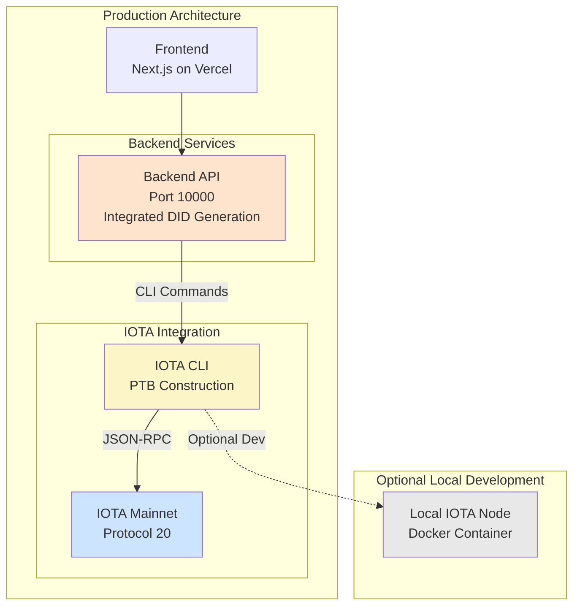

# 03: wot.id - IOTA Node and Network Setup

## 1. Introduction

**IOTA Protocol 20 Mainnet**

This document provides comprehensive guidance for IOTA mainnet connectivity for `wot.id` development and production. The current architecture uses a **hybrid CLI + SDK types approach** with emphasis on the public IOTA mainnet endpoint, with local node setup optional.

**Current Architecture (December 2025)**:
- **IOTA Mainnet**: Protocol 20 via public endpoint `https://api.mainnet.iota.cafe`
- **CLI-Based Transactions**: IOTA CLI for PTB construction and submission
- **SDK Type Definitions**: iota-sdk v1.17.2 for Rust type safety (upgraded Dec 18 2025)
- **Move Framework**: IOTA framework v1.17.2 (contracts backward compatible with Protocol 20)
- **Simplified Stack**: Direct mainnet access, no L2 Wasp complexity
- **Production Ready**: Operational with OAuth auto-provisioning, QR code attestations, on-chain attestation submission

**Local Node (Optional)**:
- Development can use local IOTA node for testing
- Production uses public mainnet endpoint
- This guide covers both approaches

**Architecture Context**:
For understanding how IOTA integration fits within the wot.id architecture:
- **Standards Foundation**: See `docs/01_Project_Overview_And_Principles.md` sections 1.2-1.4
- **System Architecture**: See `docs/02_System_Architecture.md` sections 3.1-3.3
- **Backend Integration**: See `docs/04_Backend_And_Identity_Service.md` section 1.1
- **W3C DID Implementation**: wot.id uses W3C DID Core 1.0 compliant DIDs (Ed25519 + BLAKE3). See `docs/2026_Code_Work/26-01-01_W3C_Compliance.md`

---

## 2. IOTA Mainnet Node Setup (Optional - Local Development)

**Note:** Production wot.id uses the public mainnet endpoint `https://api.mainnet.iota.cafe`. Local node setup is optional for development testing.

The IOTA node can run as a Docker container. Current mainnet is **Protocol 20**.

## 2. IOTA Mainnet Node Setup

The IOTA node runs as a Docker container using the official `iotaledger/iota-node:mainnet` image with Protocol 20 support.

### 2.1. Setup and Configuration

**Setup Directory**: `iota-fullnode-docker-setup/` (in project root)

**Docker Compose Configuration** (`docker-compose.yaml`):
```yaml
services:
  fullnode:
    image: iotaledger/iota-node:mainnet  # Latest mainnet version
    ports:
      - "8084:8084/udp" # P2P port
      - "9000:9000/tcp" # JSON-RPC port
      - "9184:9184/tcp" # Metrics port
    volumes:
      - ./data:/opt/iota/:rw
    command: [
      "/usr/local/bin/iota-node",
      "--config-path",
      "/opt/iota/config/fullnode.yaml",
    ]
```

**Execution Steps:**
1.  **Navigate to Setup Directory**: `cd iota-fullnode-docker-setup/`
2.  **Start Node**: `docker compose up -d`
3.  **Verify Version**: `docker exec <container> /usr/local/bin/iota-node --version`

### 2.2. Accessing IOTA Node Services

Once running, the IOTA node exposes the following services on `localhost`:

| Service            | URL (`localhost`)         | Description                               |
| ------------------ | ------------------------- | ----------------------------------------- |
| **JSON-RPC API**   | `http://localhost:9000`   | Primary endpoint for IOTA CLI and backend integration |
| **Metrics**        | `http://localhost:9184`   | Prometheus metrics for monitoring         |
| **P2P Port**       | `udp://<your_ip>:8084`    | Used for peering with other IOTA nodes   |

**Protocol Version**: 17 (Current mainnet)
**Network**: IOTA Mainnet
**CLI Integration**: Backend uses `iota` CLI for transaction submission (with iota-sdk v1.17.2 types)
**Framework Version**: Move contracts v1.17.2 (backward compatible with Protocol 20)

---

## 3. IOTA CLI Integration

**Current Approach**: The wot.id system uses the IOTA CLI for all Move contract interactions, eliminating the need for complex L2 Wasp node setup while maintaining full mainnet compatibility.

### 3.1. IOTA CLI Installation

The IOTA CLI is installed via Cargo and provides direct access to IOTA mainnet functionality.

**Installation**:
```bash
# Install via Cargo
cargo install --git https://github.com/iotaledger/iota.git iota

# Verify installation
iota --version
```

**Installation**: IOTA CLI is installed via Cargo to `~/.cargo/bin/iota`

### 3.2. CLI Configuration

**Environment Variables**:
```bash
export IOTA_CLI_PATH="$HOME/.cargo/bin/iota"
export IOTA_NODE_URL="http://localhost:9000"  # Local node
# Production: export IOTA_NODE_URL="https://api.mainnet.iota.cafe"
```

**Keystore Setup**:
```bash
# Import private key to keystore
iota keytool import $IOTA_PRIVATE_KEY ed25519

# Verify keystore
iota client active-address
```

### 3.3. Move Contract Interaction

**Programmable Transaction Blocks (PTB)**:
```bash
# Example: Register email → DID mapping
iota client ptb \
  --move-call PACKAGE::wot_identity_registry::register_identifier \
    @0x334a70ee16409b749bf221a9d0aafdd8c829db22474e2363a0bdd43e9b45ad92 \
    "did:iota:mainnet:abc123" \
    "email" \
    "user@example.com" \
  --gas-budget 10000000 \
  --json
```

**Current Package IDs (Protocol 20 Mainnet, January 9, 2026 v7 deployment with FileVault)**:
- **Identity Registry Package**: `0xa389f9b55c811064e53bf1ee84900cafdcbbe05a3cf37bc7086a399ca5f2a8cb`
- **Registry Shared Object**: `0x334a70ee16409b749bf221a9d0aafdd8c829db22474e2363a0bdd43e9b45ad92`

**Contract Name**: `wot_identity_registry` (not `identity_registry`)

---

## 4. System Architecture Diagram

This diagram illustrates the hybrid CLI + SDK types IOTA integration.



---

## 5. Key Operational Concepts

### 5.1. Data Persistence

All IOTA blockchain data is stored in the `data/` subdirectory within the `iota-fullnode-docker-setup/` folder. This folder is mounted directly into the container, ensuring the ledger state persists across container restarts.

### 5.2. Monitoring Node Sync Status

The IOTA node can take time to fully sync with mainnet. Monitor progress by querying the JSON-RPC API.

**Command to Check Progress:**
```bash
curl -s -X POST http://localhost:9000 \
  -H "Content-Type: application/json" \
  -d '{"jsonrpc": "2.0", "method": "iota_getLatestCheckpointSequenceNumber", "id": 1}'
```

**Expected Response Format:**
```json
{"jsonrpc":"2.0","id":1,"result":"13597323"}
```

Compare the `result` to the latest checkpoint on [IOTA Explorer](https://explorer.iota.org/).

### 5.3. Hybrid CLI + SDK Types Transaction Execution

The wot.id backend uses a hybrid approach for IOTA mainnet transactions:

**Architecture**:
- **CLI for Transactions**: IOTA CLI constructs and submits PTBs to mainnet
- **SDK for Types**: iota-sdk v1.17.2 provides Rust type definitions (ObjectID, IotaAddress, etc.)
- **No SDK Transaction Builder**: Avoids complex SDK APIs

**Benefits**:
- ✅ Direct Mainnet Access: No intermediate layers
- ✅ CLI Stability: Proven reliable interface
- ✅ Type Safety: Rust compile-time checks via SDK types
- ✅ Full PTB Support: Complete Programmable Transaction Block functionality
- ✅ Gas Efficiency: Optimized transaction costs

**Build Performance**: ~27-30 minutes (includes iota-sdk type dependencies)

### 5.4. IOTA CLI Wallet Management

The `iota` CLI manages wallets and keypairs for transaction signing.

**Current Wallet Configuration**:
- **Active Address**: `0x45745c3d1ef637cb8c920e2bbc8b05ae2f8dbeb28fd6fb601aea92a31f35408f`
- **Balance**: Sufficient IOTA for gas fees
- **Private Key**: Stored in keystore (environment variable `IOTA_PRIVATE_KEY`)

**Wallet Commands**:
```bash
# Check active address
iota client active-address

# Check balance
iota client balance

# Import new key
iota keytool import <private_key> ed25519
```

### 5.5. Viewing Logs

**IOTA Node Logs**:
```bash
# From setup directory
cd iota-fullnode-docker-setup/
docker compose logs -f

# Or by container name
docker logs iota-fullnode-docker-setup-fullnode-1 -f
```

**Backend Service Logs**:
- **Backend API**: Console output from `cargo run` in `/backend/`

### 5.6. Resetting the Node

**To Reset IOTA Node**:
```bash
cd iota-fullnode-docker-setup/

# Stop container
docker compose down

# Remove blockchain data (optional - forces full resync)
rm -rf ./data

# Restart node
docker compose up -d
```

**Note**: Removing `./data` forces a complete resync from genesis, which can take several hours.

---

## 6. Current Deployment Status

### 6.1. ✅ Production Environment (March 2026)

**Current Status**: IOTA mainnet Protocol 20 **fully operational** via public endpoint.

**IOTA Mainnet**:
- ✅ **Protocol**: Version 20 (current mainnet, upgraded Feb 25, 2026)
- ✅ **Network**: IOTA mainnet via `https://api.mainnet.iota.cafe`
- ✅ **Production URLs**:
  - Frontend: https://wot.id (Vercel)
  - Backend: https://wot-id-backend.onrender.com

**CLI + SDK Hybrid Integration**:
- ✅ **IOTA CLI**: Installed for PTB construction
- ✅ **iota-sdk v1.17.2**: Type definitions for Rust code
- ✅ **PTB Support**: Full Programmable Transaction Block functionality
- ✅ **Move Contracts**: Deployed to mainnet (backward compatible with Protocol 20)

**Backend Integration Status**:
- ✅ **Backend API**: Hybrid CLI + SDK types approach
- ✅ **Identity Registry**: `wot_identity_registry` deployed and operational
- ✅ **Gas Station**: Backend sponsors transactions with 24h rate limiting
- ✅ **OAuth Auto-Provisioning**: Google, GitHub operational; Apple 95% complete
- ✅ **W3C DID Core 1.0 Compliant**: Ed25519 + BLAKE3 cryptographic derivation
- ✅ **QR Code Attestations**: Generation and scanning operational
- ✅ **On-Chain Attestations**: wot_trust.move operational
- ✅ **Post-Quantum Encryption**: X25519 + ML-KEM-768

### 6.2. Network Performance

**Sync Performance**:
- Initial sync: ~2-4 hours (depending on network conditions)
- Startup time: ~30 seconds for full node readiness
- Current uptime: 100% operational on Protocol 20

**Resource Usage**:
- IOTA Node container: ~2GB RAM, ~50GB storage
- CLI operations: Minimal overhead, sub-second execution
- Backend services: ~500MB RAM combined

**Transaction Performance**:
- PTB construction: <100ms
- Transaction submission: 1-3 seconds
- Confirmation time: 2-5 seconds (mainnet finality)
