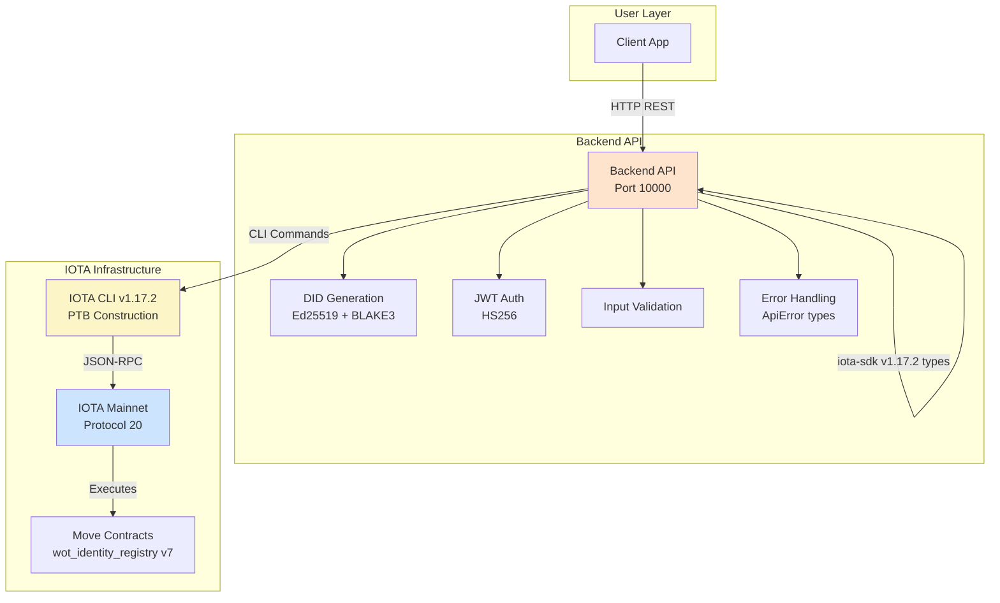
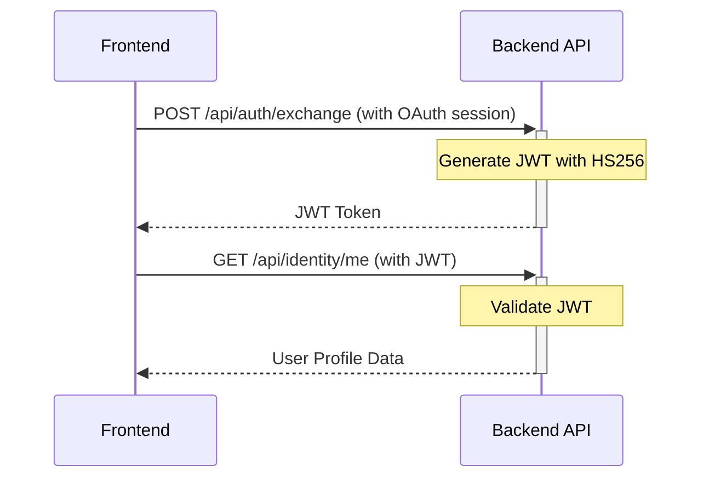
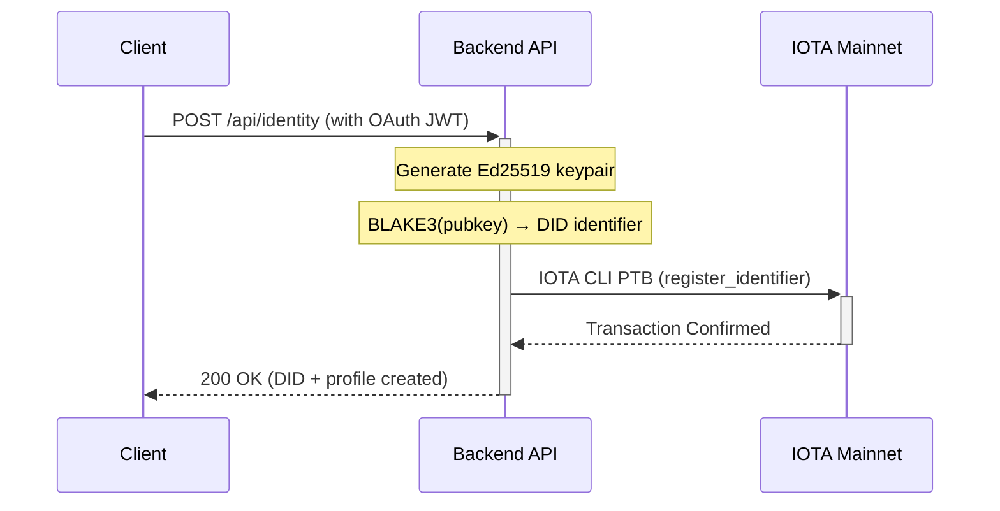
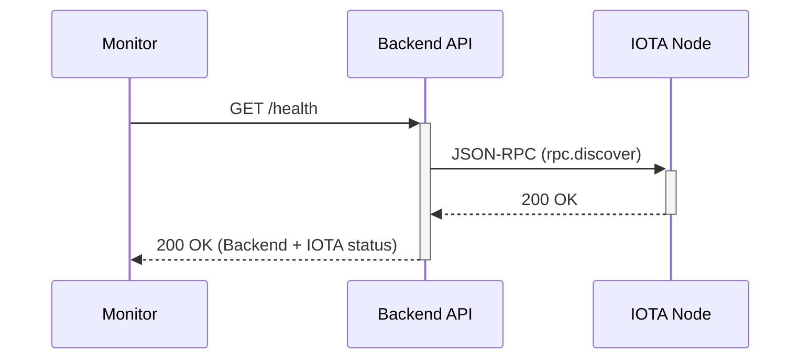

# 04: wot.id - Backend API

## **Current Implementation Status (March 2026)**

### **🎯 Working Components**
- **Backend API**: Axum-based REST API with hybrid CLI + SDK types approach
- **Identity Registry**: `wot_identity_registry` - Email → DID mapping operational on-chain
- **Hybrid Economic Model**: Gas sponsorship for profile creation & core operations; attestation rewards fund user transfers
- **Personal Wallets**: Client-side wallet in browser IndexedDB, user controls mnemonic
- **Zero Database**: Blockchain is the single source of truth for identity data
- **Integrated DID Generation**: W3C DID Core 1.0 compliant (Ed25519 + BLAKE3), inlined into Backend
- **P2P Communication**: WebSocket relay with E2E encryption (Phase D complete)
- **Error Handling**: Comprehensive `ApiError` types with structured responses and request ID tracking
- **Input Validation**: `InputValidator` for DIDs, trust levels, credentials, claims, and privacy settings

### **✅ Architecture Achievements**
- **Hybrid CLI + SDK Types**: CLI for transactions, iota-sdk v1.17.2 for type safety
- **Event-Based Indexing**: Query `ProfileRegistered` events for DID lookups
- **Shared Registry**: Permissionless on-chain registry at `0x334a70ee16409b749bf221a9d0aafdd8c829db22474e2363a0bdd43e9b45ad92` (v7)
- **Production Operational**: OAuth auto-provisioning working (Google, GitHub, Apple)
- **Protocol 20**: Deployed on IOTA mainnet Protocol 20 (v1.17.2)
- **Single Service**: Identity Service retired and inlined into Backend (March 2026)

### **🚀 Current Architecture Benefits**
- **No Traditional Database**: All identity data stored on IOTA mainnet Protocol 20
- **Decentralized Lookups**: Anyone can query registry without API access
- **Hybrid Economic Model**: Profile creation gas-sponsored; transfers user-funded
- **Personal Wallets**: Client-side browser storage (IndexedDB), users control keys, mnemonic export/import for device switch
- **Rate Limiting**: 24h cooldown prevents abuse and controls costs
- **W3C DID Compliant**: Ed25519 + BLAKE3 cryptographic derivation (integrated into Backend)
- **P2P Messaging**: WebSocket relay with E2E encryption (X25519 + ML-KEM-768)
- **No Microservice Overhead**: DID generation, JWT auth, and blockchain interaction all in one service

---

## 1. High-Level Architecture

The `wot.id` backend is a single Rust service: the **Backend API**. It handles all client-facing requests, DID generation, JWT authentication, blockchain interaction, and P2P relay.

> **History**: The Backend API was originally split into two microservices — a Backend API and a separate Identity Service (port 8081). The Identity Service was separated in June 2025 to isolate `identity_iota` SDK dependency conflicts. After 7 months of dependency hell, the SDK was abandoned and the Identity Service was reduced to ~35 lines of Ed25519+BLAKE3 DID generation logic. On 2026-03-07, this logic was inlined into the Backend and the Identity Service was retired. See `docs/2026_Code_Work/26-03-07_Identity_Service.md` for the full history.



### 1.1. W3C DID Implementation

**Current Implementation (March 2026): W3C DID Core 1.0 Compliant**

The Backend API generates W3C DID Core 1.0 compliant identifiers directly (no external service call):

**DID Generation (integrated in Backend API):**
- ✅ Generates Ed25519 keypairs for each new identity
- ✅ Derives DID from public key hash using BLAKE3
- ✅ Creates `did:iota:mainnet:<blake3-hash-of-pubkey>` strings
- ✅ Stores DID + profile data on-chain via IOTA CLI
- ✅ Manages secondary identifier → DID mappings in `wot_identity_registry.move`
- ✅ Manages all on-chain interactions via IOTA CLI (with iota-sdk v1.17.2 types)

**DID Generation Code** (`backend/src/handlers/identity.rs`):
```rust
let signing_key = ed25519_dalek::SigningKey::from_bytes(&rand::random::<[u8; 32]>());
let verifying_key = signing_key.verifying_key();
let did_hash = blake3::hash(&verifying_key.to_bytes());
let did_identifier = hex::encode(&did_hash.as_bytes()[0..16]);
let did = format!("did:iota:mainnet:{}", did_identifier);
```

**Current Implementation Hierarchy:**

```
W3C DID Core v1.0 (International Standard)
  ↓ compliant
Backend API (Production — single service)
  - Ed25519 keypair generation
  - BLAKE3 cryptographic hash
  - did:iota:mainnet:<hash> format
  - On-chain storage via IOTA CLI PTB
  ↓ stores
On-Chain: DID + Email→DID mappings + VALUES + trust scores
```

**W3C Compliance:**
- ✅ DID Syntax (§3.1): `did:iota:mainnet:<identifier>`
- ✅ DID Document (§4): Proper @context, verificationMethod, authentication
- ✅ Verification Methods: Ed25519VerificationKey2020
- ✅ On-Chain Storage: DID + all data in Move contracts
- ❌ External Resolution: Not integrated (by design for SSI)

**Key References:**
- W3C DID Core v1.0: https://www.w3.org/TR/did-core/
- W3C Compliance Assessment: `docs/2026_Code_Work/26-01-01_W3C_Compliance.md`

### 1.2. Identity Architecture: DID as Primary Identifier

**wot.id uses a two-tier identifier system:**

**Primary Identifier: W3C DID**
- Format: `did:iota:mainnet:<identifier>`
- Immutable, W3C DID Core 1.0 compliant
- Cryptographically derived from Ed25519 public keys
- Stored in `wot_identity_registry.move` and `wot_identity.move`
- Used for cryptographic operations and asset ownership

**Secondary Identifiers: Email, Phone, Twitter (Access Methods)**
- Mutable, many-to-one mapping to DID
- Stored as `(type, value) → DID` in `wot_identity_registry.move`
- NOT the identity, just ways to ACCESS it
- Used for login convenience (OAuth)

**How Secondary Identifier→DID Mapping Works:**
```
User logs in with OAuth → obtains identifier (email)
Backend queries: wot_identity_registry::lookup_by_identifier("email", "user@example.com")
  If found: Load existing profile via DID
  If not found: Generate DID inline (Ed25519 + BLAKE3), call register_identifier()
Display ME page with on-chain VALUES
```

**Current Status (March 2026):**
- ✅ DID generation integrated in Backend API (W3C compliant)
- ✅ Secondary Identifier→DID mapping IMPLEMENTED
- ✅ `wot_identity_registry::register_identifier()` operational on mainnet
- ✅ OAuth auto-provisioning working (Google, GitHub, Apple)

### Backend API Responsibilities

| Feature / Responsibility                  | Backend API                                                              |
|-------------------------------------------|--------------------------------------------------------------------------|
| **Primary Role**                          | System Orchestrator, Gas Station, & DID Generator                        |
| **Client-Facing API**                     | Yes (Main entry point for frontends)                                     |
| **DID Operations**                        | Generates W3C DID identifiers inline (Ed25519 + BLAKE3)                  |
| **Smart Contract Interaction**            | All Move contract calls via IOTA CLI (wot_identity_registry, wot_identity)  |
| **Database**                              | **None** - queries blockchain via events and CLI                        |
| **Key Dependencies**                      | `axum`, `tokio`, IOTA CLI, iota-sdk v1.17.2 (types), `ed25519-dalek`, `blake3`, `sha3` |
| **Async Runtime (Tokio)**                 | v1.46.1+                                                                |
| **IOTA Integration**                       | Hybrid CLI + SDK types (CLI for transactions, SDK for type definitions) |
| **Error Handling**                        | Structured `ApiError` types with request ID tracking (`backend/src/error.rs`) |
| **Input Validation**                      | `InputValidator` for DIDs, trust levels, claims (`backend/src/validation.rs`) |

---

## 2. Backend API

### 2.1. Current Status (March 2026)

**Build Status**: ✅ Building successfully (~30 minutes with iota-sdk types)
**Deployment Status**: ✅ **PRODUCTION OPERATIONAL** at https://wot-id-backend.onrender.com
**Technology**: Rust, Axum (v0.8+), Tokio (v1.46.1+)
**IOTA Integration**: Hybrid CLI + SDK types (CLI for transactions, iota-sdk v1.17.2 for types)
**Protocol**: IOTA mainnet Protocol 20
**Framework Version**: Move contracts v1.17.2 (backward compatible)
**Dockerfile**: `rust:1.88-slim` base image, IOTA CLI v1.17.2

**Production Features (March 2026):**
- ✅ OAuth auto-provisioning (Google, GitHub, Apple)
- ✅ Profile creation with gas sponsorship
- ✅ Email → DID mapping (`wot_identity_registry`)
- ✅ Integrated DID generation (Ed25519 + BLAKE3, W3C DID Core 1.0)
- ✅ 24-hour rate limiting per DID
- ✅ Event-based profile retrieval
- ✅ QR code attestations (cross-device flow)
- ✅ On-chain attestation submission via wot_trust.move
- ✅ Post-quantum encryption (X25519 + ML-KEM-768)
- ✅ Structured error handling (`ApiError` with request ID tracking)
- ✅ Input validation (`InputValidator` for DIDs, claims, trust levels)

**Ports**:
- Production: https://wot-id-backend.onrender.com (port 10000)
- Local Development: `localhost:10000`

**Current Architecture:**
- ✅ **IDENTITY REGISTRY**: `wot_identity_registry` - Email → DID mappings on Protocol 20
- ✅ **INTEGRATED DID GENERATION**: Ed25519 + BLAKE3 (formerly in Identity Service, inlined March 2026)
- ✅ **HYBRID ECONOMIC MODEL**: Profile creation gas-sponsored; transfers self-funded via personal wallets
- ✅ **PERSONAL WALLETS**: Auto-assigned IOTA wallet per user (Dec 2025); mnemonic exportable
- ✅ **ZERO DATABASE**: All identity data stored on-chain, blockchain is single source of truth
- ✅ **HYBRID CLI + SDK TYPES**: CLI for PTB submission, iota-sdk v1.17.2 for type definitions
- ✅ **EVENT-BASED LOOKUPS**: Query on-chain events for profile retrieval
- ✅ **ATTESTATION SYSTEM**: wot_trust.move contract for on-chain attestations (Nov 19 2025)
- ✅ **P2P MESSAGING**: WebSocket relay at `/ws/p2p/{peer_id}` (Dec 2025)
- ✅ **TRANSFER SYSTEM**: User-funded transfers with QR code support (Dec 2025)
- ✅ **ERROR HANDLING**: Structured `ApiError` types with HTTP status mapping (`backend/src/error.rs`)
- ✅ **INPUT VALIDATION**: DID format, trust levels, claims, privacy settings (`backend/src/validation.rs`)

### 2.2. API Endpoints (Implemented with Move Contract Integration)

| Method | Path                | Description                                                                                                |
|--------|---------------------|------------------------------------------------------------------------------------------------------------||
| `GET`  | `/health`           | Public health endpoint - returns consolidated system health status                                         |
| `GET`  | `/api/health/records` | **IMPLEMENTED**: Returns user's health records with JWT authentication                                   |
| `POST` | `/api/identity`     | **IMPLEMENTED**: Identity creation with Move contract PTB preview                                         |
| `GET`  | `/api/identity/me`  | **NEW**: Current user's complete identity profile (personal info, documents, education, skills)          |
| `GET`  | `/api/identity/{id}` | **IMPLEMENTED**: Get identity information by ID                                                          |
| `GET`  | `/api/identity/check` | **IMPLEMENTED**: Check if user already has an identity                                                  |
| `POST` | `/api/credentials`  | **IMPLEMENTED**: Credential issuance with Move contract PTB preview                                       |
| `GET`  | `/api/credentials/{id}` | **IMPLEMENTED**: Get credential by ID                                                                |
| `POST` | `/api/credentials/{id}/verify` | **IMPLEMENTED**: Verify credential                                                        |
| `POST` | `/api/credentials/{id}/revoke` | **IMPLEMENTED**: Revoke credential                                                        |
| `POST` | `/api/trust`        | **IMPLEMENTED**: Trust establishment with Move contract PTB preview                                       |
| `POST` | `/api/trust/query`  | **IMPLEMENTED**: Trust querying with contract query preview                                               |
| `GET`  | `/api/trust/{id}`   | **IMPLEMENTED**: Get trust relationships by ID                                                            |
| `POST` | `/api/did/challenge` | **IMPLEMENTED**: Generate random challenge for DID ownership verification                                |
| `POST` | `/api/did/verify`   | **IMPLEMENTED**: Verify Ed25519 signature to prove DID ownership                                          |
| `POST` | `/api/auth/exchange` | **IMPLEMENTED**: Exchange NextAuth session token for Backend JWT                                         |
| `POST` | `/api/v1/attestation/generate-qr` | **IMPLEMENTED (Nov 17, 2025)**: Generate QR code for attestation (EdDSA-signed JWT, 1h expiry) |
| `POST` | `/api/v1/attestation/verify-qr` | **IMPLEMENTED (Nov 17, 2025)**: Verify QR code JWT signature (unprotected endpoint) |
| `POST` | `/api/v1/attestation/submit` | **IMPLEMENTED (Nov 19, 2025)**: Submit attestation on-chain via wot_trust.move contract |
| `POST` | `/api/wallet/register`      | **PLANNED (Dec 2025)**: Register user's client-side wallet address (for rewards)                          |
| `POST` | `/api/rewards/disburse`     | **PLANNED (Dec 2025)**: Send attestation reward IOTA to user's wallet                                      |
| `GET`  | `/api/identity/assets`      | **IMPLEMENTED (Dec 2025)**: Get user's IOTA balance and owned objects                                      |
| `GET`  | `/api/identity/transfer/estimate` | **IMPLEMENTED (Dec 2025)**: Estimate gas cost for transfer (optional helper)                        |
| `POST` | `/api/identity/health/bulk` | **IMPLEMENTED (Dec 2025)**: Bulk import health atoms from CSV data                                         |
| `GET`  | `/api/identity/service-endpoint` | **IMPLEMENTED (Dec 2025)**: Get P2P service endpoint for DID                                         |
| `POST` | `/api/identity/service-endpoint` | **IMPLEMENTED (Dec 2025)**: Set P2P service endpoint on TrustProfile                                 |
| `WS`   | `/ws/p2p/{peer_id}`         | **IMPLEMENTED (Dec 2025)**: WebSocket relay for P2P messaging between browsers                             |

> **Note (2026-03-07):** Four governance proposal endpoints (`/api/proposals/*`) and two notarization endpoints were deleted on 2026-03-07. They were mock implementations returning fabricated data. The Move contract structs (`TrustProposal`, voting functions) remain deployed on mainnet but have no API callers. See `docs/2026_Code_Work/26-03-07_Dead_Endpoints_Audit.md`.
>
> Additionally, 9 debug/test/stale endpoints were deleted from the Backend (including `GET /api/debug/export-key` which was an active security vulnerability). See same audit doc for full list.

### 2.3. DID Ownership Verification (Option C)

**Implementation Status**: ✅ **WORKING ON PRODUCTION**

**Challenge-Response Flow**:
The backend implements cryptographic DID ownership verification to prevent identity spoofing:

#### Challenge Generation

**Endpoint**: `POST /api/did/challenge`

**Request**:
```json
{
  "did": "did:iota:mainnet:08e2f2a32692349751f2f6d9731f5847"
}
```

**Response**:
```json
{
  "challenge": "207afe0d894c2a1b3f4e5c6d7a8b9c0e1f2a3b4c5d6e7f8a9b0c1d2e3f4a5b6c",
  "expiry": 600
}
```

#### Signature Verification

**Endpoint**: `POST /api/did/verify`

**Request**:
```json
{
  "did": "did:iota:mainnet:08e2f2a3...",
  "challenge": "207afe0d...",
  "signature": "hex_signature_128_chars",
  "public_key": "hex_pubkey_64_chars"
}
```

**Response**:
```json
{
  "verified": true,
  "valid_until": "2025-10-19T10:15:00Z"
}
```

#### Security Implementation

**Verification Process**:
1. Backend generates random 64-character hex challenge
2. Challenge stored in `challenge_store` with 10-minute expiry
3. Frontend signs challenge with Ed25519 private key
4. Backend verifies signature using provided public key
5. Public key hash must match DID identifier
6. Verification stored for 24 hours

**Protection Mechanisms**:
- ✅ Ed25519 cryptographic signature verification
- ✅ 24-hour verification validity window
- ✅ Rate limiting: 24-hour cooldown per DID for profile creation
- ✅ Challenge expiry prevents replay attacks
- ✅ Prevents DID spoofing and unauthorized profile creation

**Integration with Profile Creation**:
The `POST /api/identity/profile` endpoint requires:
1. Valid JWT token (from `/api/auth/exchange`)
2. Verified DID (from `/api/did/verify` within last 24 hours)
3. Profile data payload

Without DID verification, profile creation returns:
```json
{
  "status": "error",
  "message": "DID ownership verification required",
  "code": "DID_NOT_VERIFIED"
}
```

### 2.4. Performance Optimizations (December 2025)

#### 2.4.1 Identity Cache

**Implementation Status**: ✅ **Implemented December 26, 2025**

The backend includes an in-memory identity cache to reduce redundant IOTA RPC calls for DID and profile lookups.

**Problem Solved**:
- Each API endpoint independently resolved email → DID → profile chains
- Each RPC call: ~400-500ms for DID lookup, ~450-475ms for profile lookup
- Page loads triggered 6-8 redundant RPC calls (3-6 seconds total)

**Solution**: Server-side caching with 5-minute TTL

**File**: `backend/src/cache.rs`

```rust
pub struct IdentityCache {
    did_by_email: RwLock<HashMap<String, CacheEntry>>,
    profile_by_did: RwLock<HashMap<String, CacheEntry>>,
    did_ttl: Duration,      // 5 minutes
    profile_ttl: Duration,  // 5 minutes
}

// Global singleton access
pub fn get_cache() -> &'static IdentityCache {
    IDENTITY_CACHE.get_or_init(IdentityCache::new)
}
```

**Integration in `handlers/identity.rs`**:
```rust
// DID lookup with cache
let cache = crate::cache::get_cache();
if let Some(cached_did) = cache.get_did(email) {
    info!("⚡ Cache HIT for DID lookup: {}", email);
    return Ok(cached_did);
}
// RPC call on cache miss, then cache.set_did(email, &did)
```

**Performance Improvements**:

| Metric | Before | After (Cache Hit) |
|--------|--------|-------------------|
| DID lookup | 400-500ms | ~0ms |
| Profile lookup | 450-475ms | ~0ms |
| Me page load | 3-6 seconds | <500ms |

**Cache Behavior**:
- ✅ Thread-safe via `RwLock`
- ✅ Global singleton via `OnceLock`
- ✅ 5-minute TTL (matches identity update frequency)
- ✅ Automatic expiration cleanup
- ✅ Cache statistics available via `stats()` method

#### 2.4.2 Background Task Optimization

**Implementation Status**: ✅ **Implemented December 26, 2025**

Background cleanup tasks now only log when actual work is performed:

```rust
// Before: Logged every 5 minutes regardless
challenge_store_cleanup.cleanup_expired().await;
info!("🧹 Cleaned up expired DID ownership challenges");

// After: Conditional logging
let cleaned = challenge_store_cleanup.cleanup_expired().await;
if cleaned > 0 {
    info!("🧹 Cleaned up {} expired challenges/verifications", cleaned);
}
```

**Benefits**:
- Reduced log noise in production
- Easier log analysis for actual events
- Same cleanup frequency (5 minutes) maintained

#### 2.4.3 Future Optimizations

| Optimization | Status | Priority |
|--------------|--------|----------|
| JWT claims enhancement (include DID) | Pending | P2 |
| Request context caching | Pending | P3 |
| Balance/objects cache (30s TTL) | Pending | P3 |

**Reference**: `docs/2025_Code_Work/25-12-26_Core_Process_Optimization.md`

### 2.5. PQC Encrypted Identity Handling

**Implementation Status**: ✅ **Implemented December 29, 2025**

The backend handles encrypted identity claims from the Move smart contracts, detecting and formatting encrypted data for frontend decryption.

#### Encrypted Claim Detection

**File**: `backend/src/handlers/identity.rs`

When fetching identity profiles, the backend detects encrypted claims stored on-chain:

```rust
fn extract_claim_value_from_object(data: &Value) -> Option<String> {
    // Check for encrypted claim (EncryptedIdentityClaim)
    if let Some(value_enc) = inner_fields.get("value_enc") {
        if let Some(enc_obj) = value_enc.get("fields") {
            let version = enc_obj.get("version").and_then(|v| v.as_u64()).unwrap_or(0);
            let scheme = enc_obj.get("scheme").and_then(|v| v.as_u64()).unwrap_or(0);

            if let (Some(nonce_arr), Some(ct_arr)) = (
                enc_obj.get("nonce").and_then(|v| v.as_array()),
                enc_obj.get("ciphertext").and_then(|v| v.as_array())
            ) {
                let nonce_bytes = move_vec_to_bytes(nonce_arr);
                let ciphertext_bytes = move_vec_to_bytes(ct_arr);

                // Return JSON with _enc marker
                let encrypted_json = json!({
                    "_enc": {
                        "v": version,
                        "s": scheme,  // Number, not string
                        "n": base64::encode(&nonce_bytes),
                        "c": base64::encode(&ciphertext_bytes)
                    }
                });
                return Some(encrypted_json.to_string());
            }
        }
    }

    // Fallback: Try plaintext claim_value
    if let Some(value) = inner_fields.get("claim_value").and_then(|v| v.as_str()) {
        return Some(value.to_string());
    }
    None
}
```

#### API Response Format

The backend returns encrypted values in a format the frontend can process:

```rust
fn identity_value_maybe_encrypted(val: Option<String>, trust_score: i16, attestation_count: u32) -> Value {
    if let Some(ref s) = val {
        if s.starts_with("{\"_enc\":") {
            if let Ok(parsed) = serde_json::from_str::<Value>(s) {
                if let Some(enc_data) = parsed.get("_enc") {
                    return json!({
                        "value": null,
                        "value_enc": enc_data,  // {v, s, n, c}
                        "trust_score": trust_score,
                        "attestation_count": attestation_count
                    });
                }
            }
        }
    }
    json!({
        "value": val,
        "trust_score": trust_score,
        "attestation_count": attestation_count
    })
}
```

**API Response Example**:
```json
{
  "first_name": {
    "value": null,
    "value_enc": {
      "v": 1,
      "s": 1,
      "n": "base64-nonce...",
      "c": "base64-ciphertext..."
    },
    "trust_score": 50,
    "attestation_count": 0
  }
}
```

#### Move Vector Conversion

Helper function to convert Move byte vectors to Rust bytes:

```rust
fn move_vec_to_bytes(arr: &Vec<Value>) -> Vec<u8> {
    arr.iter()
        .filter_map(|v| v.as_u64().map(|n| n as u8))
        .collect()
}
```

**Key Design Decisions**:
- ✅ Backend never decrypts - encryption is client-side only
- ✅ Scheme returned as number (1=ChaCha20-Poly1305) for frontend compatibility
- ✅ Nonce and ciphertext returned as base64 strings
- ✅ Backward compatible: plaintext claims still work via fallback

**Reference**: `docs/2025_Code_Work/25-12-29_Frontend_Data_Decryption_And_Display.md`

#### Token Exchange Bridge

**Endpoint**: `POST /api/auth/exchange`

**Purpose**: Bridges NextAuth (Google OAuth) and Backend JWT systems

**Request**:
```json
{
  "email": "user@example.com"
}
```

**Response**:
```json
{
  "access_token": "eyJ0eXAiOiJKV1QiLCJhbGc...",
  "token_type": "Bearer",
  "expires_in": 86400
}
```

**JWT Claims Structure**:
```rust
Claims {
    sub: "user@example.com",
    iss: "wot.id-identity-service",
    aud: "wot.id",
    exp: now + 86400,  // 24 hours
    iat: now,
    jti: uuid,
    scope: ["profile:write", "profile:read"]
}
```

**Authentication Flow**:
```
1. User → Google OAuth → NextAuth Session
2. Frontend detects session, calls /api/auth/exchange
3. Backend generates JWT with email in claims.sub
4. Frontend stores JWT, uses for all API calls
5. Backend validates JWT on protected endpoints
```

---

## 3. Identity Service (RETIRED — March 2026)

> **The Identity Service microservice has been retired.** Its DID generation logic (~15 lines) has been inlined into the Backend API. The Render deployment at https://wot-id.onrender.com is no longer called by the Backend.
>
> For the full history, rationale, and execution log, see `docs/2026_Code_Work/26-03-07_Identity_Service.md`.

**What was inlined:**
- Ed25519 keypair generation + BLAKE3 DID derivation → `backend/src/handlers/identity.rs`
- JWT token generation → already existed in `backend/src/auth.rs`

**What was deleted:**
- `create_identity_profile()` — the only Backend function that called the Identity Service
- `identity_service_url` from AppState
- Identity Service health check from Backend health endpoint

**Why it was retired:**
- The `identity_iota` SDK dependency that justified the separation was removed in June 2025
- The service was reduced to ~35 lines of pure crypto logic that the Backend already had dependencies for
- The only caller was a test endpoint, not the production user flow
- Maintaining a separate microservice incurred ongoing Dockerfile/deployment/secret synchronization overhead

---

## 4. Current Integration Status

### 4.1. Service Overview

**Production Services:**
- **Backend API**: https://wot-id-backend.onrender.com (Render)
- **Frontend**: https://www.wot.id (Vercel)

### 4.2. JWT Authentication Flow

**End-to-End Authentication Chain**: ✅ **WORKING**



**Key Features**:
- **Single Service JWT**: Backend generates and validates all JWTs
- **Scoped Access**: JWT tokens include appropriate scopes (e.g., "profile:write", "profile:read")
- **Production Ready**: CORS configured, HTTPS endpoints, structured error handling

### 4.3. Real Data Flow

**Health Data**: ✅ Working
- Endpoint: `GET /api/health/records`
- Returns: Complete lab values (LDL/HDL Cholesterol, Kreatinin, GFR Cystatin, TSH, Vitamins)
- Authentication: JWT required

**Identity Data**: ✅ Working
- Endpoint: `GET /api/identity/me`
- Returns: Comprehensive user profile (personal info, documents, education, skills)
- Authentication: JWT required

**Frontend Integration**: ✅ Working
- Components: HealthSection, IdentitySection load real data
- Fallback: Graceful degradation to demo data if API fails
- Authentication: Waits for JWT tokens before making API calls

---

## 5. Interaction Flows

### DID Creation Sequence

This flow shows the current W3C DID Core 1.0 compliant DID creation process.

**Current Status**: Ed25519 + BLAKE3 cryptographic DID generation with on-chain storage, all within Backend API.



### System Health Check Sequence

This flow shows how the Backend API provides a consolidated health status.



---
        "message": "Execution error",
        "data": { "details": "Specific error details from Move execution..." }
      }
    }
    ```
## 5. Configuration (Environment Variables)

The Backend API relies on environment variables for configuration:

- **`PORT=10000`**: Specifies the port on which the `Backend API` listens (Render default).
- **`IOTA_NODE_URL=https://api.mainnet.iota.cafe`**: The URL for the IOTA mainnet JSON-RPC endpoint (or local node `http://127.0.0.1:9000`). Used for CLI-based PTB construction and event queries.
- **`IOTA_PRIVATE_KEY`**: Ed25519 private key for the Backend's IOTA keystore (imported at container startup).
- **`JWT_SECRET_KEY`**: HS256 secret for JWT generation and validation.
- **`IOTA_REGISTRY_PACKAGE_ID=0xa389f9b55c811064e53bf1ee84900cafdcbbe05a3cf37bc7086a399ca5f2a8cb`**: Package ID of the identity registry (January 9, 2026 v7 deployment with FileVault module).
- **`IOTA_REGISTRY_OBJECT_ID=0x334a70ee16409b749bf221a9d0aafdd8c829db22474e2363a0bdd43e9b45ad92`**: Shared registry object for DID→Profile ID mappings.

> **Note**: `IDENTITY_SERVICE_URL` was removed on 2026-03-07 when the Identity Service was retired.

## 6. Deployment and Operational Notes

- The Backend API is deployed as a single Docker container on Render.
- **Dockerfile base image**: `rust:1.88-slim` (required for IOTA SDK Edition 2024 features)
- **IOTA CLI**: v1.17.2 installed in Docker image
- **Build time**: ~30 minutes (iota-sdk transitive dependencies pull full SDK despite `default-features = false`)
- **Binary size**: ~13M

## 7. Architectural Benefits & Current Status

### 7.1. Unified Service Architecture

The Backend API handles all responsibilities in a single service, eliminating microservice overhead:

**✅ Operational Benefits:**
- **No Network Hops**: DID generation, auth, and blockchain interaction all in one process
- **Single Deployment**: One Dockerfile, one Render service, one set of environment variables
- **No Secret Synchronization**: JWT secret only needs to exist in one place
- **Simplified Health Check**: Backend + IOTA node only (no Identity Service dependency)
- **Structured Error Handling**: `ApiError` types with HTTP status mapping and request ID tracking
- **Input Validation**: `InputValidator` for all API inputs (DIDs, trust levels, claims)

**✅ Production Validation:**
- Backend successfully deployed on Render (Protocol 20, v1.17.2)
- OAuth → JWT → profile creation flow working end-to-end
- Real data flowing from backend to frontend
- Comprehensive error handling and graceful degradation

### 7.2. Future Evolution

- **Monitoring IOTA Identity Ecosystem**: The `wot.id` project will continue to monitor updates to the `identity_iota` SDK (currently v1.9.2-beta.1, adoption deferred until stable). See `docs/2026_Code_Work/26-03-07_Environment_Status.md`.
- **Re-introduction Path**: If the Identity SDK stabilizes, it can be re-introduced as a feature-flagged module within the Backend, or as a separate service again if dependency isolation is needed.
- **Protocol 21**: Already on testnet (v1.18.1-rc). Next upgrade will be a smaller gap.

---

## 8. Integration Achievements

### 8.1. JWT Authentication

**Technical Implementation**:
- Algorithm: HS256 with proper claims structure (sub, iss, aud, exp, iat, jti, scope)
- Single service handles both generation and validation
- CORS configuration: Production domains properly configured
- Error handling: Comprehensive logging and graceful degradation

### 8.2. Backend Identity API

**Implementation Details**:
- Contract configuration uses **identity registry package**: `0xa389f9b55c811064e53bf1ee84900cafdcbbe05a3cf37bc7086a399ca5f2a8cb` (January 9, 2026 v7 deployment with FileVault)
- CLI-based PTB construction for all on-chain operations
- Event-based profile lookups via `ProfileRegistered` events
- Real data flow from backend to frontend components
- Protocol 20 error parsing (human-readable Move Abort format alongside legacy format)

### 8.3. Production Deployment Status

**All Services Operational**:
- ✅ **Frontend**: https://www.wot.id (Vercel)
- ✅ **Backend API**: https://wot-id-backend.onrender.com (Render)

**Key Metrics**:
- Response times: < 100ms for identity profile retrieval (with cache)
- Authentication success rate: 100% with valid JWT tokens
- Data completeness: Full health and identity profiles available
- Error handling: Graceful fallback to demo data when needed

---

## 9. IOTA Identity Framework Reference

{{ ... }}
This section provides a summary of the core concepts from the official IOTA Identity documentation, serving as a quick reference for developers. It directly links to the relevant guides and Rust code examples that will inform the implementation of the `Identity Service`.

### 8.1. DID Lifecycle Management

The full lifecycle of a Decentralized Identifier is managed through the `identity.rs` SDK.

| Operation | Description | Official Guide | Rust Example |
| :--- | :--- | :--- | :--- |
| **Create** | A multi-step process: 1. **Fund Wallet**: Ensure a wallet has sufficient funds for gas fees. 2. **Prepare Document**: Create the DID Document content, including at least one verification method. A placeholder DID (`did:iota:0x...`) is used initially. 3. **Publish Identity**: Construct and publish the `Identity` object to the ledger. The transaction sender becomes the default controller. | [Create a DID](https://docs.iota.org/iota-identity/how-tos/decentralized-identifiers/create) | [`0_create_did.rs`](https://github.com/iotaledger/identity.rs/blob/v1.6.0-beta/examples/0_basic/0_create_did.rs) |
| **Resolve** | The process of fetching and decoding a DID Document from the IOTA Tangle using its DID. This is fundamental for verifying signatures and services. | [Resolve a DID](https://docs.iota.org/iota-identity/how-tos/decentralized-identifiers/resolve) | [`2_resolve_did.rs`](https://github.com/iotaledger/identity.rs/blob/v1.6.0-beta/examples/0_basic/2_resolve_did.rs) |
| **Update** | Modifying a DID Document by adding/removing verification methods, services, or other properties. This requires authorization from the DID controller. | [Update a DID](https://docs.iota.org/iota-identity/how-tos/decentralized-identifiers/update) | [`1_update_did.rs`](https://github.com/iotaledger/identity.rs/blob/v1.6.0-beta/examples/1_advanced/1_update_did.rs) |
| **Deactivate (Reversible)** | A DID can be temporarily deactivated by updating its document to be empty or by setting the `deactivated: true` metadata flag. The identity can be reactivated later by another update. | [Delete a DID](https://docs.iota.org/iota-identity/how-tos/decentralized-identifiers/delete) | [`3_deactivate_did.rs`](https://github.com/iotaledger/identity.rs/blob/v1.6.0-beta/examples/0_basic/3_deactivate_did.rs) |
| **Delete (Irreversible)** | A DID can be permanently destroyed by updating its document to a `None` value. This action is irreversible and the DID can never be restored, though the `Identity` object itself remains on-chain. | [Delete a DID#Delete](https://docs.iota.org/iota-identity/how-tos/decentralized-identifiers/delete#delete) | (See Update Operation) |

### 8.2 Verifiable Credentials (VCs)

A Verifiable Credential (VC) is a tamper-evident digital assertion made by an issuer about a subject. The IOTA Identity framework provides a comprehensive API for creating, signing, and validating VCs in accordance with the W3C VC Data Model.

#### 8.2.1 VC Properties

The framework supports all standard W3C VC properties. When creating a credential, the following fields can be defined:

| Property | Description | W3C Reference |
| :--- | :--- | :--- |
| **`@context`** | A list of JSON-LD context URIs. Defaults to include the standard VC context. | [Context](https://www.w3.org/TR/vc-data-model/#contexts) |
| **`id`** | An optional, unique URI for the credential itself. | [id](https://www.w3.org/TR/vc-data-model/#identifiers) |
| **`type`** | A list of types describing the credential. Defaults to include `VerifiableCredential`. | [type](https://www.w3.org/TR/vc-data-model/#types) |
| **`credentialSubject`** | The claims made by the issuer about the subject. | [credentialSubject](https://www.w3.org/TR/vc-data-model/#credential-subject) |
| **`issuer`** | The DID of the entity that issued the credential. | [issuer](https://www.w3.org/TR/vc-data-model/#issuer) |
| **`issuanceDate`** | A timestamp indicating when the credential became valid. | [issuanceDate](https://www.w3.org/TR/vc-data-model/#issuance-date) |
| **`expirationDate`** | An optional timestamp indicating when the credential ceases to be valid. | [expirationDate](https://www.w3.org/TR/vc-data-model/#expiration-date) |
| **`credentialStatus`** | Information used to check the current status (e.g., revocation). | [credentialStatus](https://www.w3.org/TR/vc-data-model/#status) |
| **`credentialSchema`** | An optional schema that the credential's data must conform to. | [credentialSchema](https://www.w3.org/TR/vc-data-model/#credential-schema) |

#### 8.2.2 Signing and Validation

The lifecycle of a VC involves signing by an issuer and validation by a verifier.

| Action | Description | Official Guide | Canonical Rust Example |
| :--- | :--- | :--- | :--- |
| **Create & Sign** | An issuer creates a VC with claims about a subject, then signs it with their private key to produce a JWS. This allows any verifier to validate the credential's authenticity and integrity. | [Create a VC](https://docs.iota.org/iota-identity/how-tos/verifiable-credentials/create) | [`5_create_vc.rs`](https://github.com/iotaledger/identity.rs/blob/v1.6.0-beta/examples/0_basic/5_create_vc.rs) |
| **Validate** | A verifier checks the VC's semantic structure and cryptographically verifies the JWS signature against the public key in the issuer's DID Document. Optional checks (e.g., for expiration) can also be performed. | [Create a VC](https://docs.iota.org/iota-identity/how-tos/verifiable-credentials/create#validation) | [`5_create_vc.rs`](https://github.com/iotaledger/identity.rs/blob/v1.6.0-beta/examples/0_basic/5_create_vc.rs) |


#### 8.2.3 Verifiable Credential Revocation Methods

An issuer must be able to revoke a Verifiable Credential if it is no longer valid. The IOTA Identity framework provides two primary methods for this, each with different trade-offs between privacy and immediacy.

##### 8.2.3.1 RevocationBitmap2022 (Default)

This is the foundational on-chain revocation method.

*   **How it Works**: An issuer maintains a public bitmap (a list of 0s and 1s) in their DID Document. Each issued credential has a unique `revocationBitmapIndex` pointing to its status in the bitmap. To revoke, the issuer updates their DID, flipping the bit from `0` to `1`.
*   **Key Characteristic**: Revocation is efficient and verifiable directly on-chain. However, the visible `revocationBitmapIndex` creates a **linkability risk**, as colluding verifiers could use the index to track a user's activity across different services.

| Feature | Description | Official Guide | Canonical Rust Example |
| :--- | :--- | :--- | :--- |
| **Bitmap Revocation** | Invalidate a VC using an on-chain bitmap. | [Revoke a VC](https://docs.iota.org/iota-identity/how-tos/verifiable-credentials/revocation) | [`7_revoke_vc.rs`](https://github.com/iotaledger/identity.rs/blob/v1.6.0-beta/examples/0_basic/7_revoke_vc.rs) |

##### 8.2.3.2 RevocationTimeframe2024 (Privacy-Preserving)

This is an advanced method designed as a privacy-preserving extension of `RevocationBitmap2022`.

*   **How it Works**: It avoids exposing the `revocationBitmapIndex`. Instead, the issuer embeds a signed `validity timeframe` (e.g., `validFrom`, `validUntil`) into the credential itself. The `revocationBitmapIndex` is handled as a selectively disclosable (SD) claim and is **not** shown to the verifier.
*   **Verification**: The verifier checks the credential's validity by simply confirming the current date is within the signed timeframe. The issuer's signature guarantees its validity for that period.
*   **Key Characteristic**: It eliminates the linkability risk. The trade-off is that the holder must periodically contact the issuer to get the credential re-issued with a new, updated `validity timeframe`. Revocation is also delayed; a credential remains valid until its timeframe expires, even if revoked on the issuer's backend bitmap.

| Feature | Description | Official Guide |
| :--- | :--- | :--- |
| **Timeframe Revocation** | Invalidate a VC using a signed, embedded validity timeframe. | [RevocationTimeframe2024](https://docs.iota.org/references/iota-identity/revocation-timeframe-2024) |

##### 8.2.3.3 Comparison of Methods

| Feature | RevocationBitmap2022 | RevocationTimeframe2024 |
| :--- | :--- | :--- |
| **Primary Goal** | Efficient on-chain revocation. | Privacy-preserving revocation. |
| **Privacy** | **Low**. The index is linkable. | **High**. The index is concealed. |
| **Holder Action** | None. Present the credential. | Must periodically get the credential re-signed by the issuer to renew the validity timeframe. |
| **Verifier Action** | Checks the on-chain bitmap. | Checks the embedded, signed timeframe. |
| **Revocation Speed** | Instantaneous (once the DID update is confirmed on the ledger). | Delayed. Revocation is only effective after the current validity timeframe expires. |

#### 8.2.4 Selective Disclosure (SD-JWT)

Selective Disclosure is a powerful privacy-enhancing feature that allows a credential holder to reveal only a specific subset of claims to a verifier, rather than the entire credential. For example, a user could prove they are over 18 without disclosing their exact date of birth. This is achieved using the IETF standard for [Selective Disclosure JWTs (SD-JWTs)](https://www.ietf.org/archive/id/draft-ietf-oauth-selective-disclosure-jwt-07.html).

**How SD-JWTs Work:**

1.  **Issuance**: The issuer identifies which claims can be selectively disclosed. For each of these claims, they generate a salted hash (a "digest") and replace the original claim with this digest in the main JWT. The original claim values (the "disclosures") are sent to the holder separately, alongside the main JWT.
2.  **Presentation**: The holder decides which claims to reveal to a verifier. They create a presentation package containing the original issuer-signed JWT (with digests) and only the specific disclosures they want to share. This is typically formatted as a single string, with each part separated by a tilde (`~`).
3.  **Key Binding (Optional but Recommended)**: To prevent replay attacks and ensure the presenter is the legitimate holder, a Key-Binding JWT (KB-JWT) can be included. The holder signs a JWT containing a `nonce` provided by the verifier, proving they are in control of their DID at the time of presentation.
4.  **Validation**: The verifier receives the package. They can validate the issuer's signature on the main JWT. For each disclosed claim, they re-calculate the digest and confirm it matches the corresponding digest in the JWT. If a KB-JWT is present, they also validate its signature and the `nonce`.

| Feature | Description | Official Guide | Canonical Rust Example |
| :--- | :--- | :--- | :--- |
| **Selective Disclosure** | Create and present VCs where only a subset of claims are revealed. | [Selective Disclosure](https://docs.iota.org/iota-identity/how-tos/verifiable-credentials/selective-disclosure) | [`7_sd_jwt.rs`](https://github.com/iotaledger/identity.rs/blob/v1.6.0-beta/examples/0_basic/7_sd_jwt.rs) |

### 8.3 Verifiable Presentations (VPs)

A Verifiable Presentation (VP) is a data format used to package one or more Verifiable Credentials (VCs) for sharing with a verifier. The holder of the VCs creates and signs the VP with their own DID, proving control over the credentials without needing the original issuer to be involved.

#### 8.3.1 VP Properties

A VP can contain the following properties as defined by the W3C standard:

| Property | Description | W3C Reference |
| :--- | :--- | :--- |
| **`@context`** | A list of JSON-LD context URIs. | [Context](https://www.w3.org/TR/vc-data-model/#contexts) |
| **`type`** | A list of types. Defaults to include `VerifiablePresentation`. | [type](https://www.w3.org/TR/vc-data-model/#types) |
| **`verifiableCredential`** | An array of one or more VCs, either as full JSON objects or as JWT strings. | [verifiableCredential](https://www.w3.org/TR/vc-data-model/#presentations-0) |
| **`holder`** | The DID of the entity that created and signed the presentation. | [holder](https://www.w3.org/TR/vc-data-model/#holder) |

#### 8.3.2 Creation and Validation

The process involves a holder and a verifier. To mitigate replay attacks, the verifier should always issue a unique challenge (e.g., a `nonce`) that the holder must include in the signed presentation.

| Action | Description | Official Guide | Canonical Rust Example |
| :--- | :--- | :--- | :--- |
| **Create & Sign** | A holder bundles one or more VCs into a presentation, specifies their own DID as the `holder`, and signs the entire package with their private key. | [Create a VP](https://docs.iota.org/iota-identity/how-tos/verifiable-presentations/create-and-validate) | [`6_create_vp.rs`](https://github.com/iotaledger/identity.rs/blob/v1.6.0-beta/examples/0_basic/6_create_vp.rs) |
| **Validate** | A verifier performs several checks: 1. Verifies the VP's signature against the holder's DID. 2. Verifies the signature of each individual VC inside the VP against its respective issuer's DID. 3. Performs a subject-holder relationship check. | [Validate a VP](https://docs.iota.org/iota-identity/how-tos/verifiable-presentations/create-and-validate) | [`6_create_vp.rs`](https://github.com/iotaledger/identity.rs/blob/v1.6.0-beta/examples/0_basic/6_create_vp.rs) |

#### 8.3.3 Subject-Holder Relationship

This is a critical security check to ensure the entity presenting a credential is its legitimate subject. The IOTA Identity framework supports several policies:

| Policy | Description |
| :--- | :--- |
| **`AlwaysSubject` (Default)** | The safest option. The VP holder's DID **must** match the `credentialSubject.id` of every VC in the presentation. |
| **`SubjectOnNonTransferable`** | The holder's DID must match the subject's DID only for VCs marked as `nonTransferable`. This allows for bearer credentials. |
| **`Any`** | No check is performed. The holder can be different from the subject. This is the least secure option. |

### 8.4. On-Chain Identity Governance (The `Identity` Move Object)

While the `identity.rs` SDK abstracts many details, understanding the underlying on-chain `Identity` Move object is crucial for advanced use cases like multi-controller setups, custodianship, and smart contract integration. The governance of an on-chain identity is managed through a system of capabilities, proposals, and voting.

| Concept | Description | Official Guide |
| :--- | :--- | :--- |
| **`Identity` Object** | A shared Move object that stores the DID Document on-chain. Its shared nature allows for complex control schemes beyond simple ownership. | [On-chain Identity](https://docs.iota.org/iota-identity/explanations/about-identity-objects) |
| **`ControllerCap`** | A non-transferable "soul-bound" capability object. Possession of an Identity's `ControllerCap` at an address grants that address control rights over the Identity. | [Access Control](https://docs.iota.org/iota-identity/explanations/about-identity-objects#identitys-access-control) |
| **`DelegationToken`** | A standard, tradeable Move object that can be minted from a `ControllerCap`. It allows for the temporary and permission-limited delegation of control to other addresses or smart contracts. | [Access Control](https://docs.iota.org/iota-identity/explanations/about-identity-objects#identitys-access-control) |
| **Proposals & Voting** | For multi-controller Identities, changes are not immediate. A controller creates a `Proposal` which must be approved by other controllers. Each controller has a `voting_power`, and a `Proposal` is only executed when the sum of approving votes exceeds the Identity's `threshold`. | [Access Control](https://docs.iota.org/iota-identity/explanations/about-identity-objects#identitys-access-control) |

### 8.5 On-Chain Interaction Model: Modern SDK Integration via `[patch]`

The backend has been upgraded to use the latest post-Rebased IOTA SDK directly from the `develop` branch of the official `iotaledger/iota` repository. This ensures the project stays aligned with the most recent, cutting-edge developments in the IOTA ecosystem, but requires a specific dependency management strategy.

#### 8.5.1 The `[patch.crates-io]` Strategy

The `iota-sdk` is part of a large Rust workspace within the `iotaledger/iota` monorepo. Many of the `iota-*` crates depend on each other. Simply pointing the `iota-sdk` dependency to the git repository is not enough, as Cargo would still try to fetch its dependencies (like `iota-types` or `iota-keys`) from `crates.io`, leading to version mismatches and compilation errors.

To solve this, we use Cargo's `[patch.crates-io]` feature in our `Cargo.toml`. This directive instructs Cargo to replace any attempt to fetch the specified crates from `crates.io` with a version from the given git repository. This ensures that all `iota-*` crates used in the project are from the exact same commit on the `develop` branch, guaranteeing compatibility across the entire IOTA SDK workspace.

This approach effectively treats the `develop` branch as our upstream source of truth, allowing the backend to use the very latest (though potentially unstable) features and APIs from the IOTA core team.

#### 8.5.2 Deprecation of the `Wallet` API

The previously used `Wallet` API from `iota-sdk v2.0.0-beta.1` is now completely deprecated and has been removed. The modern SDK uses a more granular and powerful `IotaClient` for interacting with the node's API and a `TransactionBuilder` for constructing complex transactions, including Move contract calls. The backend code will be refactored to use these new, modern APIs.

### 8.6 Foundational On-Chain Objects

The IOTA Identity framework is built upon specialized Move objects that provide core functionalities on the ledger.

#### 8.6.1 AuthenticatedAsset

The `AuthenticatedAsset` is a fundamental, generic data container designed for storing identity-related information on-chain. Its key feature is its built-in, on-chain tracking of provenance (origin and ownership), which is accessible to other smart contracts.

| Feature | Description | Official Documentation |
| :--- | :--- | :--- |
| **Configuration** | Upon creation, an `AuthenticatedAsset` can be configured to be **mutable**, **deletable**, and/or **tradable**. By default, it is immutable, non-deletable, and non-tradable. | [Authenticated Assets](https://docs.iota.org/iota-identity/explanations/authenticated-assets) |
| **On-Chain Provenance** | It automatically stores its creator (origin) and current owner's address within the object itself. This makes ownership and origin verifiable by other smart contracts on the ledger. | [Authenticated Assets](https://docs.iota.org/iota-identity/explanations/authenticated-assets) |
| **Use Cases** | Its flexibility makes it ideal for various identity use cases, such as mutable revocation lists, immutable proofs of inclusion, or tradable digital assets. | [Authenticated Assets](https://docs.iota.org/iota-identity/explanations/authenticated-assets) |

### 8.7 Domain Linkage (DID-to-Domain Verification)

Domain Linkage provides verifiable proof of a connection between a DID and a traditional DNS domain (e.g., `wot.id`), transferring trust from the domain to the DID. The process is standardized by the DIF's [Well Known DID Configuration](https://identity.foundation/.well-known/resources/did-configuration/) specification and involves two key components.

| Component | Description | Location & Details |
| :--- | :--- | :--- |
| **1. DID Configuration Resource** | A JSON file hosted on a web server containing a signed `DomainLinkageCredential`. This credential proves that the controller of the DID authorized the link to the domain. | **URL**: `https://<your-domain>/.well-known/did-configuration.json`<br>**Content**: A VC signed by the DID, with the DID as the `issuer` and `credentialSubject.id`, and the domain as the `credentialSubject.origin`. |
| **2. `LinkedDomains` Service** | A service endpoint added to the DID Document. This enables discovery of the linked domain directly from the DID. | **DID Document Property**: A `service` entry of type `LinkedDomains` with the `serviceEndpoint` pointing to the domain's origin URL. |

The linkage can be verified by fetching the `did-configuration.json` file, resolving the DID, and validating the signature on the `DomainLinkageCredential`.

| Official Guide | Canonical Rust Example |
| :--- | :--- |
| [Domain Linkage](https://docs.iota.org/iota-identity/how-tos/domain-linkage/create-and-verify) | [`8_domain_linkage.rs`](https://github.com/iotaledger/identity.rs/blob/v1.6.0-beta/examples/0_basic/8_domain_linkage.rs) |

---

## 9. External Resources and Contribution

### 9.1 Contributing to the IOTA Identity Project

The IOTA Identity project is open source and welcomes community contributions. The official documentation outlines several ways for developers to get involved:

| Contribution Method | Description | Link |
| :--- | :--- | :--- |
| **GitHub Repository** | Report bugs, suggest features, or contribute code directly to the `identity.rs` repository. | [identity.rs on GitHub](https://github.com/iotaledger/identity.rs) |
| **Documentation** | Improve the official documentation by fixing errors or adding new content. | [Contribution Guidelines](https://docs.iota.org/references/contribute/contribution-process) |
| **Community Support** | Share knowledge and help others by participating in discussions on the IOTA Builders Discord. | [IOTA Builders Discord (#identity-dev)](https://discord.gg/iota-builders) |
