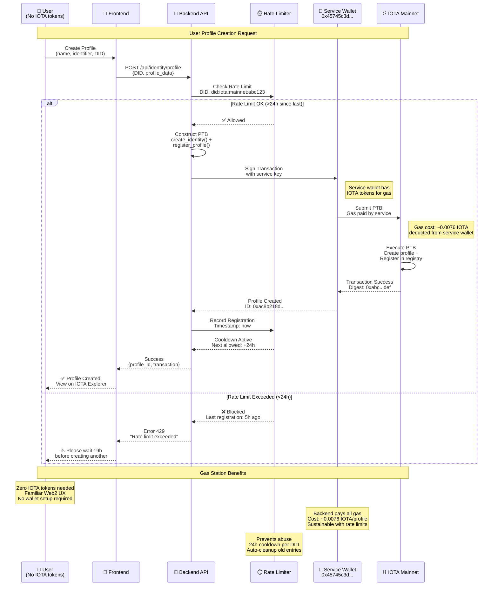
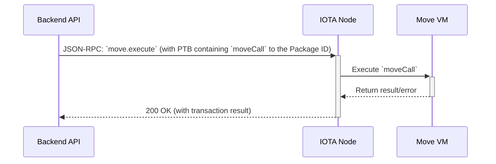

# 05: wot.id - Move Smart Contracts

## **Current Implementation Status (January 2026)**

### **✅ IDENTITY REGISTRY, ATTESTATION & FILE VAULT DEPLOYED**
- **Identity Registry**: Decentralized DID → Profile ID mapping with flexible identifiers
- **wot_id Package ID**: `0xa389f9b55c811064e53bf1ee84900cafdcbbe05a3cf37bc7086a399ca5f2a8cb` **(v7 - January 9, 2026)**
- **Registry Object ID**: `0x334a70ee16409b749bf221a9d0aafdd8c829db22474e2363a0bdd43e9b45ad92` (shared object)
- **UpgradeCap**: `0x36f57406ec2957b4d2d8309a417122e614469b65ddcfc299d8501bfc1472d7ea` (secured in cold wallet)
- **Deployment**: January 9, 2026 v7 (on-chain version 3) - Upgraded via UpgradeCap with FileVault module
- **Protocol**: IOTA mainnet Protocol 20
- **Framework**: Move contracts v1.17.2 (edition 2024)
- **Gas Station**: Backend sponsors transactions with 24-hour rate limiting

### **🎯 Deployed Modules (Operational January 2026)**
- **`wot_identity_registry`**: Shared registry for flexible identifier system (email, phone, social, etc. → DID)
- **`wot_identity`**: Identity profiles with atomic data storage (claims, health atoms, biometric atoms)
- **`wot_trust`**: ✅ **On-chain attestation system (Dec 12, 2025)** - Trust scoring with u64 trust_level, context_uri, and status lifecycle
- **`file_vault`**: ✅ **NEW (Jan 9, 2026)** - DID-portable encrypted file storage with consent-based sharing
- **`mailbox`**: Encrypted messaging between DIDs
- **Integration**: Backend uses hybrid CLI + SDK types approach (CLI for transactions, iota-sdk v1.17.2 for types)
- **Test Coverage**: ✅ 49 tests passing (October 2025)

### **🚀 Recent Milestones (January 2026)**
- ✅ **FileVault Module Deployed** (Jan 9, 2026)
  - Transaction: `4676pQEbfrXvhFizpj4xBsC9BnftHr8gRW3E6QSUXRcw`
  - DID-portable encrypted file storage on-chain
  - Consent-based file sharing via ShareOffer pattern
  - Supports local, cloud (R2/STACKIT), and IPFS storage locations

### **🚀 Previous Milestones (November 2025)**
- ✅ **First On-Chain Attestation** (Nov 19, 2025)
  - Transaction: `4Uz9SxQv6gMyd21wwvZhZ4ZJ5KVsAAo4ia46SbHadWDf`
  - Attestation Object: `0x04333edab710063e8eea74e0a173a07cf870cbc35fd43877f1102021873948bc`
  - Verified on: https://explorer.iota.org
- ✅ **Privacy-Preserving Design**: SHA3-256 data hashing instead of plaintext storage
- ✅ **Cross-Device Flow**: QR generation → scanning → on-chain submission (Mac ↔ iPhone tested)

### **🔧 Recent Updates (October 24, 2025)**
- ✅ **Removed obsolete module**: Deleted old `identity_registry.move` with hardcoded email parameter
- ✅ **Added missing function**: Implemented `store_health_atom()` in `wot_identity.move`
- ✅ **Fixed test issues**: Invalid hex addresses, `public_transfer` vs `transfer`, mutable variables
- ✅ **Fixed trust calculations**: Adjusted test trust scores to reach correct reputation levels
- ✅ **All tests passing**: Complete test suite validated (49/49 tests)

### 🚀 Production Operational (November 2025)
- **Hybrid CLI + SDK Types**: CLI for PTB submission, iota-sdk v1.17.2 for type definitions
- **Event Indexing**: Backend queries `ProfileRegistered` events for lookups
- **Gas Costs**: ~0.0076 IOTA per profile creation + registration
- **Security**: UpgradeCap secured in cold wallet `0xffc7f6eb21333ea9fb27ea707bdd5c812292b2408fcb157ad4086c5b86d1db1e`
- ✅ **Production Status**: Operational at https://wot.id, https://wot-id-backend.onrender.com
- ✅ **OAuth Auto-Provisioning**: Google, GitHub operational; Apple 95% complete
- ✅ **On-Chain Attestations**: wot_trust.move contract operational (Nov 19, 2025)

---

This document provides a comprehensive overview of the smart contracts that power the `wot.id` ecosystem. It begins with a general explanation of the IOTA Smart Contract (ISC) framework and the virtual machines it supports, then provides a detailed technical reference for the project's specific Move contracts.

## 1. IOTA Move Smart Contracts on Mainnet

IOTA supports Move smart contracts directly on mainnet, providing a secure and efficient execution environment for decentralized applications. The wot.id project deploys all contracts directly to IOTA mainnet, leveraging the Move VM's safety features and resource-oriented programming model.

### 1.1. IOTA Mainnet Architecture

All wot.id Move contracts are deployed and executed on IOTA mainnet:

*   **Direct Mainnet Deployment**: Contracts are published directly to IOTA mainnet using the Move compiler and IOTA CLI.
*   **Move VM Execution**: All contract logic executes in the Move virtual machine, benefiting from Move's ownership model and resource safety.
*   **Shared Objects**: The identity registry uses shared objects to enable permissionless, decentralized access without a single owner.
*   **Event Emission**: Contracts emit events (e.g., `ProfileRegistered`) that enable efficient off-chain indexing and queries.

### 1.2. The Anatomy of a Smart Contract

Every smart contract on an ISC chain consists of two main components:

1.  **State:** A dedicated key-value store where the contract's data is persisted. The contract has exclusive write access to its own state. It also controls its own on-chain account, allowing it to own and manage digital assets.
2.  **Entry Points:** These are the public functions that define the contract's API. They are the only way to interact with the contract and can be one of two types:
    *   **Full Entry Points:** Functions that can modify (mutate) the contract's state. Executing these requires a transaction and consumes gas.
    *   **View Entry Points:** Read-only functions that can only retrieve data from the state. They do not modify the state and can typically be called without an on-chain transaction.

Contracts interact with the underlying chain environment through a secure **Sandbox Interface**, which provides access to the state, account balances, and other chain-level utilities.

## 2. wot.id Uses the Move VM Exclusively

**Important:** wot.id uses **only the Move VM** on IOTA Layer 2. While IOTA supports multiple virtual machines including EVM, wot.id does not use or require the IOTA EVM.

### 2.1. The Move VM (wot.id's Choice)

The Move language and its VM were developed with a fundamentally different philosophy, prioritizing security and the safety of digital assets above all else. Its core features include:

*   **Resource-Oriented Programming:** In Move, digital assets are treated as first-class "resources." These resources have special properties enforced by the language itself: they must be explicitly used (moved) and cannot be accidentally copied or deleted. This prevents entire classes of common bugs, such as double-spending or re-entrancy attacks.
*   **Formal Verification:** Move is designed to be highly amenable to formal verification, allowing developers to mathematically prove that their code behaves exactly as intended.
*   **Asset Safety:** The type system and ownership model are built to provide maximum security for the assets managed by the contract.

### 2.2. Why wot.id Chose Move VM Over EVM

The decision to build `wot.id` exclusively on the Move VM was a deliberate architectural choice based on security requirements. For a decentralized identity system, the integrity, uniqueness, and security of digital identities and verifiable credentials are the most critical concerns. The security-first design of the Move language provides a much stronger foundation for this use case than general-purpose alternatives.

By using Move, `wot.id` ensures that the core on-chain components are as robust and secure as possible, leveraging a modern language specifically designed for managing high-value digital assets.

### 2.3. Technical Implementation in wot.id

The `wot.id` smart contracts implement a custom **Identity Registry** pattern deployed directly on IOTA mainnet. The backend services construct Programmable Transaction Blocks (PTBs) via IOTA CLI to interact with the registry and profile contracts.

### 2.4. Data Architecture: 100% On-Chain VALUES with Trust Scores

**⚠️ CRITICAL: Understanding "Claims" in wot.id**

In wot.id, the term "claim" in Move contracts refers to an **atomic data point with inherent trust**. This is NOT a separate concept from data storage—every stored data point IS a claim about reality, and its trust score represents how verified/reliable that claim is.

```
┌─────────────────────────────────────────────────────────────────┐
│  CONCEPTUAL CLARITY                                             │
│                                                                 │
│  Move Contract "Claim" = Atomic Data Point with Trust          │
│                                                                 │
│  ┌─────────────────────────────────────────────────────────┐   │
│  │  claim_type: "health.ldl_cholesterol"                    │   │
│  │  claim_value: "31 mg/dl"        ← The actual data       │   │
│  │  trust_score: +100              ← Reliability measure   │   │
│  │  attestations: [...]            ← Who verified this     │   │
│  └─────────────────────────────────────────────────────────┘   │
│                                                                 │
│  The data itself IS the claim.                                 │
│  The trust score IS the claim's reliability.                   │
│  There is no separation between "data" and "claim".            │
└─────────────────────────────────────────────────────────────────┘
```

**Why the naming**: W3C Verifiable Credentials use "claim" terminology. wot.id adopts this but integrates it directly with data storage—every data point is a claim with built-in trust measurement.

**⚠️ wot.id Extends W3C DID Format with Trust Network Capabilities**

wot.id uses W3C DID Core 1.0 compliant identifiers (Ed25519 + BLAKE3) as the foundation, then EXTENDS them with:

**On-Chain Storage (100% of Data VALUES):**
- ✅ **W3C DIDs**: `did:iota:mainnet:...` stored in `wot_identity_registry.move` and `wot_identity.move`
- ✅ **Secondary Identifier Mappings**: Generic `(type, value) → DID` registry in `wot_identity_registry.move` (email, phone, social, github, etc.)
- ✅ **Atomic Data VALUES**: Each piece of information stored separately with its own trust score
  - Personal: `birth_date: "1990-01-01"`, `blood_type: "O+"`
  - Health: `ldl_cholesterol: "31 mg/dl"`, `hdl_cholesterol: "60 mg/dl"`
  - Identity: `passport_number: "AB123456"`
- ✅ **Trust Score per VALUE**: Each VALUE has score -100 to +100 based on attestations
- ✅ **Claims & Attestations**: Who verified each VALUE, when, with what credibility

**Trust Score Architecture (wot.id Extension to W3C DIDs):**

```
VALUE Structure in Move:
{
  value: String,              // The actual data: "31 mg/dl"
  trust_score: i16,           // -100 to +100 (aggregate of attestations)
  attestations: Vector<Attestation>,
  created_at: u64,
  updated_at: u64
}

Attestation Structure:
{
  attester_did: String,       // Who verified this VALUE
  credibility_score: i16,     // Attester's credibility (-100 to +100)
  timestamp: u64,             // When verified
  proof_hash: Option<String>  // Optional link to evidence
}
```

**How Trust Scores Work:**

1. **Attestation Creation**: A trusted entity (doctor, lab, government) attests to a VALUE
2. **Credibility Calculation**: Attester's own credibility affects the attestation weight
3. **Trust Score Aggregation**: `trust_score = f(attestations, attester_credibility, time_decay)`
4. **Display on ME Page**: VALUES with higher trust scores shown with visual indicators

**Example: Lab Result with Trust Score**
```
ldl_cholesterol: {
  value: "31 mg/dl",
  trust_score: +100,          // Maximum trust
  attestations: [
    {
      attester_did: "did:iota:mainnet:certified_lab_xyz",
      credibility_score: +100,  // Certified lab is highly trusted
      timestamp: 1699531200,
      proof_hash: "sha256:3b9d58a7ad168222..."
    }
  ]
}
```

**What's W3C Standard vs wot.id Extension:**
- ✅ **W3C Standard**: DID syntax, DID documents, verification methods (handled by identity.rs)
- ✅ **wot.id Extension**: Trust scores, attestations, secondary identifier→DID registry, atomic VALUES with trust

**No Traditional Database:**
- ❌ No SQL, NoSQL, Redis
- ✅ All VALUES stored in Move contract dynamic fields
- ✅ Blockchain is single source of truth

### 2.5. wot.id Custom Move Contracts: Identity Registry Pattern

**Architectural Decision (October 2025)**: `wot.id` implements a custom **Identity Registry** pattern to enable decentralized DID lookups without a centralized database.

**Identity Registry Benefits**:
- ✅ **Decentralized Lookups**: Anyone can query DID → Profile ID mapping on-chain
- ✅ **Shared Object**: No single owner, permissionless access
- ✅ **Event-Based Indexing**: `ProfileRegistered` events for efficient queries
- ✅ **Multi-Directional Mapping**: Supports DID → Profile, Address → DID, and Secondary Identifier → DID (P0 priority)
- ✅ **Zero Database**: Blockchain is the single source of truth

**Identifier Mappings**:
1. **DID → Profile ID**: Primary identifier lookup (✅ implemented)
2. **Blockchain Address → DID**: Reverse lookup for wallet owners (✅ implemented)
3. **Secondary Identifier → DID**: Generic registry for any access method (📋 P0 priority)
   - **Architecture**: `(identifier_type: String, identifier_value: String) → DID`
   - **Email → DID**: First implementation (OAuth login)
   - **Phone → DID**: Future addition (SMS login)
   - **Twitter → DID**: Future addition (social login)
   - **GitHub → DID**: Future addition (dev login)
   - Generic structure supports ANY identifier type without contract changes

**Package ID**: `0xa389f9b55c811064e53bf1ee84900cafdcbbe05a3cf37bc7086a399ca5f2a8cb` (v7 - January 9, 2026)
**Registry Object ID**: `0x334a70ee16409b749bf221a9d0aafdd8c829db22474e2363a0bdd43e9b45ad92`

### 2.5.1. Identity Registry Structure Visualization

The complete architecture of the Identity Registry showing shared object, dynamic fields, and event emission:

```mermaid
graph TB
    subgraph "IOTA Mainnet"
        REGISTRY[🗂️ IdentityRegistry Object<br/>Shared Object<br/>ID: 0x334a70ee1640...]
    end
    
    subgraph "Registry Internal State"
        COUNT[📊 profile_count: u64<br/>Total registered profiles]
        DF_ROOT[📋 Dynamic Fields Root<br/>Key-Value Storage]
    end
    
    subgraph "DID → Profile Mappings"
        MAP1[🔑 Key: "did:iota:mainnet:abc123"<br/>Value: ProfileMapping]
        MAP2[🔑 Key: "did:iota:mainnet:def456"<br/>Value: ProfileMapping]
        MAP3[🔑 Key: "did:iota:mainnet:ghi789"<br/>Value: ProfileMapping]
    end
    
    subgraph "Address → DID Mappings"
        ADDR1[📍 Key: 0x45745c3d1ef637cb8c9...<br/>Value: "did:iota:mainnet:abc123"]
        ADDR2[📍 Key: 0x9ec2868547a129b4cf8...<br/>Value: "did:iota:mainnet:def456"]
    end
    
    subgraph "ProfileMapping Structure"
        PM_STRUCT[profile_id: ID<br/>controller: address<br/>registered_at: u64]
    end
    
    subgraph "Profile Objects (Owned)"
        PROFILE1[👤 IdentityProfile<br/>ID: 0xac8b218d...<br/>Owner: 0x45745c3d...]
        PROFILE2[👤 IdentityProfile<br/>ID: 0x7f3e912a...<br/>Owner: 0x9ec28685...]
    end
    
    subgraph "Event Emission"
        EVENT[⚡ ProfileRegistered Event<br/>did, profile_id,<br/>controller, timestamp]
    end
    
    REGISTRY --> COUNT
    REGISTRY --> DF_ROOT
    
    DF_ROOT --> MAP1
    DF_ROOT --> MAP2
    DF_ROOT --> MAP3
    
    DF_ROOT --> ADDR1
    DF_ROOT --> ADDR2
    
    MAP1 --> PM_STRUCT
    MAP2 --> PM_STRUCT
    MAP3 --> PM_STRUCT
    
    PM_STRUCT -."Points to".-> PROFILE1
    PM_STRUCT -."Points to".-> PROFILE2
    
    REGISTRY -."Emits".-> EVENT
    
    style REGISTRY fill:#2ecc71,color:#fff
    style COUNT fill:#3498db,color:#fff
    style DF_ROOT fill:#f39c12
    style PM_STRUCT fill:#9b59b6,color:#fff
    style PROFILE1 fill:#e74c3c,color:#fff
    style EVENT fill:#16a085,color:#fff
```

**Key Features:**

**Shared Object Benefits:**
- ✅ **Permissionless Access**: Anyone can read registry data
- ✅ **No Single Owner**: Decentralized by design
- ✅ **Concurrent Access**: Multiple transactions can query simultaneously
- ✅ **Immutable History**: All registrations permanently recorded

**Dynamic Fields Pattern:**
- 🔑 **DID Lookups**: String DID → ProfileMapping structure
- 📍 **Reverse Lookups**: Address → DID string
- 📊 **Efficient Storage**: O(1) lookup time for both directions
- ♻️ **Scalable**: No size limits on number of registrations

**Event-Based Indexing:**
- ⚡ Backend queries `ProfileRegistered` events via `iotax_queryEvents` RPC
- 📊 Events provide complete registration history
- 🔍 Efficient filtering by DID, address, or timestamp
- ⛓️ Events immutably recorded on IOTA Tangle

## 3. Smart Contract Interaction Flow (Step-by-Step)

### 3.1. Architecture Overview

```
┌─────────────────────────────────────────────────────────────┐
│                wot_identity_registry.move                    │
│  Shared Object: DID ↔ Profile ↔ Identifiers Mappings       │
└─────────────────────────────────────────────────────────────┘
                           ↓ stores profile_id
┌─────────────────────────────────────────────────────────────┐
│                    wot_identity.move                         │
│  Owned Object: Atomic Data Storage (claims, health, etc.)   │
│  Can optionally link to →                                    │
└─────────────────────────────────────────────────────────────┘
                           ↓ trust_profile_id
┌─────────────────────────────────────────────────────────────┐
│                      wot_trust.move                          │
│  Owned Object: Trust Scores, Attestations, Reputation       │
└─────────────────────────────────────────────────────────────┘
```

### 3.2. Contract Responsibilities

| Contract | Responsibility | Object Type | Key Functions |
|----------|---------------|-------------|---------------|
| **wot_identity_registry** | Global discovery | Shared | `register_profile`, `lookup_by_*` |
| **wot_identity** | Data storage | Owned | `create_identity`, `add_claim`, `store_*_atom` |
| **wot_trust** | Trust scoring | Owned | `create_trust_profile`, `create_attestation`, `aggregate_claim_trust` |

### 3.3. Complete Interaction Flow

#### **Step 1: Create Identity Profile**

**Contract**: `wot_identity.move`  
**Function**: `create_identity(did, clock, ctx)`

```move
// Creates NEW IdentityProfile object
let profile = IdentityProfile {
    id: UID,
    controller: sender_address,
    did: "did:iota:mainnet:alice",
    trust_profile_id: None,  // Not linked yet
    atom_count: 0,
    total_claims: 0
}
```

**Returns**: Owned `IdentityProfile` object transferred to user's address

**State**:
- ✅ User owns `IdentityProfile` object
- ❌ NOT registered in registry yet
- ❌ NO trust profile yet

#### **Step 2: Register in Global Registry**

**Contract**: `wot_identity_registry.move`  
**Function**: `register_profile(registry, did, profile_id, identifier_type, identifier_value, ctx)`

```move
// Creates 3 mappings in shared registry using dynamic fields:

// 1. DID → Profile
df::add(&mut registry.id, "did:iota:mainnet:alice", ProfileRegistration {
    profile_id: 0xABC...123,
    controller: 0x...alice,
    registered_at: timestamp
});

// 2. Identifier → DID (flexible: email, phone, social, etc.)
df::add(&mut registry.id, "id:email:alice@example.com", "did:iota:mainnet:alice");

// 3. Address → DID
df::add(&mut registry.id, "addr:0x...alice", "did:iota:mainnet:alice");
```

**Result**: Profile discoverable by DID, email/phone/social, or address

#### **Step 3: Create Trust Profile (Optional)**

**Contract**: `wot_trust.move`  
**Function**: `create_trust_profile(identity_object_id, ctx)`

```move
let trust_profile = TrustProfile {
    id: UID,
    identity_object_id: object::id_to_address(&profile_id),
    trust_score: 100000,  // Neutral (0 on -100/+100 scale)
    attestation_count: 0,
    reputation_level: 1
}
```

**Result**: User owns BOTH `IdentityProfile` AND `TrustProfile`

#### **Step 4: Link Trust Profile to Identity**

**Contract**: `wot_identity.move`  
**Function**: `link_trust_profile(profile, trust_profile_id, ctx)`

```move
profile.trust_profile_id = option::some(trust_profile_id);
```

**Result**: Bi-directional reference established

#### **Step 5: Add Atomic Data**

**Contract**: `wot_identity.move`  
**Functions**: `add_claim()`, `store_health_atom()`, `store_biometric_atom()`, etc.

```move
// Health data stored as dynamic fields
df::add(&mut profile.id, "atom:health:cholesterol_ldl:1234567890", HealthAtom {
    data_type: "cholesterol_ldl",
    value: "95 mg/dL",
    provider: Some("LabCorp"),
    privacy_level: 3  // PRIVATE
});
```

**Result**: Each claim/atom has independent privacy control

#### **Step 6: Create Attestations**

**Contract**: `wot_trust.move`
**Function**: `create_attestation(target_id, attester_id, type, data_hash, trust_level, context_uri, ctx)`

```move
// Attestation struct (December 12, 2025 deployment)
let attestation = Attestation {
    target_identity_id: 0x...alice,
    attester_identity_id: 0x...bob,
    attestation_type: "health_data_verification",
    trust_level: 195000,         // u64: 0-200000 (maps to -100 to +100)
    context_uri: "urn:wot.id:context:professional:medical",  // Domain-specific trust context
    status: 0                    // 0=Active, 1=Suspended, 2=Revoked
}
```

**Trust Level Scale:**
- 0-99999: Distrust (-100 to -1)
- 100000: Neutral (0)
- 100001-200000: Trust (+1 to +100)

**Result**: Attestation recorded on-chain, links attester → target with full trust metadata

#### **Step 7: Aggregate Trust Scores**

**Contract**: `wot_trust.move`  
**Function**: `aggregate_claim_trust(profile, claim_trust_scores, claim_weights, ctx)`

```move
// Weighted average: (168000*3 + 150000*2) / 5 = 160800
profile.trust_score = 160800;  // TRUSTED level (≥160000)
profile.reputation_level = 4;   // Level 4: Trusted

// Reputation levels:
// 1: 0-119999 (Minimal)
// 2: 120000-139999 (Basic)
// 3: 140000-159999 (Verified)
// 4: 160000-179999 (Trusted)
// 5: 180000-200000 (Highly Trusted)
```

**Result**: Trust score and reputation level updated

### 3.4. Lookup Flows

#### **By Identifier (Email/Phone/Social)**
```move
// 1. Identifier → DID
let did = wot_identity_registry::lookup_by_identifier(
    registry, "email", "alice@example.com"
);

// 2. DID → Profile ID
let profile_id = wot_identity_registry::lookup_by_did(registry, did);

// 3. Fetch profile object
let profile = get_object<IdentityProfile>(profile_id);
```

### 3.5. Critical Design Points

1. **Registry is SHARED** - One global object, permissionless access
2. **Profiles are OWNED** - Each user owns their identity and trust objects
3. **Flexible Identifiers** - Email, phone, social, github, etc. all map to one DID
4. **Atomic Data** - Each claim/atom stored separately with privacy controls
5. **Optional Trust** - Trust profiles optional, identity works without them
6. **Bi-directional Links** - Identity knows its trust profile ID

---

## 4. wot_identity_registry Module (Detailed)

### 4.1. Identity Registry Module (`wot_identity_registry.move`)

**Purpose**: Decentralized registry mapping DIDs to Profile Object IDs with flexible identifier support.

**Core Registry Struct**:
```move
public struct IdentityRegistry has key {
    id: UID,
    profile_count: u64,
    // Dynamic fields store:
    // - DID (String) → ProfileMapping
    // - Address → DID (String)
}

public struct ProfileMapping has store, drop {
    profile_id: ID,
    controller: address,
    registered_at: u64
}
```

**Registry Functions**:
- `init(ctx)`: Initialize shared registry object (one-time setup, called on module publish)
- `register_profile(registry, did, profile_id, identifier_type, identifier_value, ctx)`: Register DID → Profile with initial identifier
- `register_identifier(registry, did, identifier_type, identifier_value, ctx)`: Add additional identifier to existing DID
- `update_identifier(registry, did, identifier_type, old_value, new_value, ctx)`: Update identifier mapping
- `remove_identifier(registry, did, identifier_type, identifier_value, ctx)`: Remove identifier mapping
- `update_profile(registry, did, new_profile_id, ctx)`: Update profile ID for DID
- `lookup_by_did(registry, did)`: Query profile ID by DID
- `lookup_by_identifier(registry, identifier_type, identifier_value)`: Query DID by any identifier (email, phone, etc.)
- `lookup_by_address(registry, controller)`: Query DID by controller address
- `is_did_registered(registry, did)`: Check if DID exists
- `is_identifier_registered(registry, identifier_type, identifier_value)`: Check if identifier exists
- `get_registration(registry, did)`: Get full registration details (profile_id, controller, timestamp)
- `total_profiles(registry)`: Get total registered profiles

**Events**:
```move
public struct ProfileRegistered has copy, drop {
    did: String,
    profile_id: ID,
    controller: address,
    timestamp: u64
}
```

## 3. wot.id Move Contract Architecture

### 3.1. Core Identity Management (`wot_identity` module)

**IdentityProfile Structure**:
```move
public struct IdentityProfile has key, store {
    id: UID,
    controller: address,
    did: String,  // W3C DID identifier
    created_at: u64,
    updated_at: u64,
    total_claims: u64,
    atom_count: u64,
    trust_algorithm_version: u8,
    trust_config: TrustAlgorithmConfig
}
```

**Atomic Data Types**:
```move
// Health data atoms
public struct HealthAtom has store, drop {
    data_type: String,
    timestamp: u64,
    value: String,
    unit: String,
    metadata: String
}

// PQC Encrypted identity claim (December 2025)
public struct EncryptedIdentityClaim has store, drop {
    claim_type: String,
    value_enc: EncryptedField,  // Encrypted value
    trust_score: i16,           // -100 to +100
    attestation_count: u32,
    privacy_level: u8,
    attested_by: vector<address>,
    created_at: u64,
    updated_at: u64,
}

// Generic encrypted field for any sensitive data
public struct EncryptedField has store, drop, copy {
    version: u8,            // Encryption version (1)
    scheme: u8,             // 1=ChaCha20-Poly1305, 2=AES-256-GCM
    nonce: vector<u8>,      // 12-byte nonce
    ciphertext: vector<u8>, // Encrypted data with auth tag
}

// Document atoms
public struct DocumentAtom has store, drop {
    doc_type: String,
    doc_hash: String,
    issuer: String,
    issue_date: u64,
    expiry_date: Option<u64>,
    metadata: String
}

// Asset atoms
public struct AssetAtom has store, drop {
    asset_type: String,
    asset_id: String,
    value: u64,
    currency: String,
    metadata: String
}
```

**Entry Functions** (Callable via CLI):
- ✅ `add_claim`: Add individual claims to identity
- ✅ `batch_add_claims`: Add multiple claims efficiently
- ✅ `update_claim_encrypted`: Add/update PQC encrypted claims (December 2025)
- `create_identity`: Create new identity profiles (via PTB)

### 3.1.2. PQC Encrypted Identity Claims (December 2025)

**Implementation Status**: ✅ **Deployed - Smart Contract v6 (December 30, 2025)**

All sensitive identity fields are stored encrypted on-chain using post-quantum resistant encryption. The frontend encrypts before sending, and the chain stores only ciphertext.

**Entry Function**:
```move
public entry fun update_claim_encrypted(
    profile: &mut IdentityProfile,
    claim_type: String,
    version: u8,
    scheme: u8,
    nonce: vector<u8>,
    ciphertext: vector<u8>,
    privacy_level: u8,
    clock: &Clock,
    ctx: &mut TxContext
) {
    let encrypted_field = EncryptedField {
        version,
        scheme,
        nonce,
        ciphertext,
    };

    let claim = EncryptedIdentityClaim {
        claim_type,
        value_enc: encrypted_field,
        trust_score: 50,  // Default: slightly trusted
        attestation_count: 0,
        privacy_level,
        attested_by: vector::empty(),
        created_at: clock::timestamp_ms(clock),
        updated_at: clock::timestamp_ms(clock),
    };

    // Store in dynamic field keyed by claim_type
    if (df::exists_(&profile.id, claim_type)) {
        df::remove<String, EncryptedIdentityClaim>(&mut profile.id, claim_type);
    }
    df::add(&mut profile.id, claim_type, claim);
}
```

**Encryption Scheme Values**:
| Scheme | Algorithm | Description |
|--------|-----------|-------------|
| 1 | ChaCha20-Poly1305 | Primary (default) - quantum-resistant symmetric |
| 2 | AES-256-GCM | Alternative symmetric encryption |

**Complete Round-Trip Flow**:
```
┌─────────────────────────────────────────────────────────────┐
│  SAVE: Frontend → Backend → Chain                           │
│                                                             │
│  1. User enters "John" in First Name field                  │
│  2. Frontend: encrypt("identity.first_name", "John")        │
│     → {v:1, s:1, n:"base64...", c:"base64..."}             │
│  3. Frontend: POST /api/identity/me {field, value_enc}     │
│  4. Backend: Constructs PTB with update_claim_encrypted()   │
│  5. Chain: Stores EncryptedIdentityClaim in dynamic field   │
└─────────────────────────────────────────────────────────────┘

┌─────────────────────────────────────────────────────────────┐
│  FETCH: Chain → Backend → Frontend                          │
│                                                             │
│  1. Frontend: GET /api/identity/me                         │
│  2. Backend: Reads EncryptedIdentityClaim from chain       │
│  3. Backend: Returns {value_enc: {v,s,n,c}, trust_score}   │
│  4. Frontend: decrypt("identity.first_name", value_enc)    │
│     → "John"                                                │
│  5. Frontend: Displays "John" in UI                        │
└─────────────────────────────────────────────────────────────┘
```

**Security Properties**:
- ✅ Zero-knowledge storage: Chain never sees plaintext
- ✅ Defense in depth: X25519 + ML-KEM-768 hybrid key encapsulation
- ✅ Field isolation: Each field has unique derived key
- ✅ Stable fieldId: `identity.{fieldName}` for encrypt/decrypt consistency

**Reference**: `docs/2025_Code_Work/25-12-29_Frontend_Data_Decryption_And_Display.md`

### 3.1.1. Profile Object Lifecycle Visualization

The complete lifecycle of an IdentityProfile from creation through attestations to trust score updates:

```mermaid
stateDiagram-v2
    [*] --> Creation: User requests identity
    
    Creation --> Initialized: create_identity()
    Note right of Creation: PTB constructs profile<br/>Assigns UID<br/>Sets controller address
    
    Initialized --> Registered: register_profile()
    Note right of Initialized: Profile added to<br/>Identity Registry<br/>ProfileRegistered event
    
    Registered --> ClaimAddition: add_claim()
    Registered --> BatchClaims: batch_add_claims()
    Note right of Registered: Profile ready for<br/>claim management
    
    ClaimAddition --> ClaimAddition: More claims added
    BatchClaims --> ClaimAddition: Continue adding
    Note right of ClaimAddition: Claims stored in<br/>dynamic fields<br/>total_claims increments
    
    ClaimAddition --> Attestation: Receive attestation
    Note right of ClaimAddition: Other users verify<br/>claims via QR code
    
    Attestation --> TrustUpdate: update_trust_score()
    Note right of Attestation: Attestation recorded<br/>in wot_trust module
    
    TrustUpdate --> ReputationLevel: Calculate reputation
    Note right of TrustUpdate: Trust score: 0-200000<br/>(100000 = neutral)
    
    ReputationLevel --> Active: Profile operational
    Note right of ReputationLevel: Reputation levels 1-5<br/>Based on attestations
    
    Active --> ClaimAddition: Add more claims
    Active --> Attestation: Receive attestations
    Active --> PrivacyUpdate: Update privacy settings
    Active --> AssetManagement: Manage digital assets
    
    PrivacyUpdate --> Active: Settings updated
    AssetManagement --> Active: Assets managed
    
    Active --> [*]: Profile remains on-chain
    
    style Creation fill:#3498db,color:#fff
    style Initialized fill:#2ecc71,color:#fff
    style Registered fill:#f39c12
    style ClaimAddition fill:#9b59b6,color:#fff
    style Attestation fill:#e74c3c,color:#fff
    style TrustUpdate fill:#16a085,color:#fff
    style Active fill:#27ae60,color:#fff
```

**Lifecycle Stages:**

**1. Creation** (📝 Initial State):
- Backend constructs PTB with `create_identity()` call
- Profile object created with unique UID
- Controller address set (user's IOTA address or backend-managed)
- Initial values: `created_at` timestamp, `total_claims = 0`, `atom_count = 0`

**2. Registration** (🗂️ Registry Entry):
- `register_profile()` adds DID → Profile mapping to shared registry
- Bi-directional mapping: DID → Profile ID and Address → DID
- `ProfileRegistered` event emitted for off-chain indexing
- Profile now discoverable by anyone querying registry

**3. Claim Addition** (📊 Data Building):
- `add_claim()` or `batch_add_claims()` stores data in dynamic fields
- Each claim has unique ID, stored as separate dynamic field entry
- Atomic data structures: HealthAtom, DocumentAtom, AssetAtom, etc.
- `total_claims` and `atom_count` increment with each addition

**4. Attestation** (✅ Verification):
- Other users scan QR code and verify claims
- Attestation created in `wot_trust` module
- Links attester address, claim_id, trust_value, confidence
- Context-specific trust (professional, personal, medical, etc.)

**5. Trust Update** (📊 Score Calculation):
- `update_trust_score()` recalculates based on attestations
- Trust score: 0-200000 scale (100000 = neutral, 0 = -100, 200000 = +100)
- Multiple attestations weighted by attester reputation
- Temporal decay for old attestations (optional)

**6. Active Profile** (🚀 Ongoing Usage):
- Profile used for governance participation (voting)
- Privacy settings updated as needed (PRIVACY_PUBLIC to PRIVACY_PRIVATE)
- Digital assets managed through profile (tokens, NFTs, credentials)
- Continuous attestation reception and trust score evolution

**Dynamic Field Storage Pattern**:
```move
// Claims storage
df::add(&mut profile.id, claim_id, claim)

// Atomic data storage
df::add(&mut profile.id, "health:bloodtest:2024", health_atom)
df::add(&mut profile.id, "document:passport:2024", document_atom)

// Privacy configurations
df::add(&mut profile.id, "privacy:health", privacy_config)
```

### 3.2. File Vault (`file_vault` module) - NEW January 2026

**Purpose**: DID-portable encrypted file storage with consent-based sharing. Enables users to store encrypted file metadata on-chain for recovery across devices.

**Deployment**: January 9, 2026 (Package v7)

**FileVault Structure**:
```move
public struct FileVault has key {
    id: UID,
    owner: address,           // Vault owner
    file_count: u64,          // Owned files (max 500)
    shared_file_count: u64,   // Received shares (max 100)
    created_at: u64,
}
```

**OwnedFile Structure** (stored as dynamic field):
```move
public struct OwnedFile has store, drop {
    file_hash: vector<u8>,      // SHA256 of original (32 bytes)
    encrypted_dek: vector<u8>,  // Hybrid-encrypted DEK (~1600 bytes)
    nonce: vector<u8>,          // ChaCha20-Poly1305 nonce (12 bytes)
    name: String,               // File name
    mime_type: String,          // MIME type
    size: u64,                  // Original size in bytes
    category: String,           // identity, medical, legal, etc.
    storage_location: u8,       // 0=local, 1=cloud, 2=ipfs
    storage_ref: Option<String>,// Cloud URL or IPFS CID
    is_compressed: bool,        // Compression flag
    created_at: u64,
    updated_at: u64,
}
```

**ShareOffer Structure** (consent-based sharing):
```move
public struct ShareOffer has key, store {
    id: UID,
    file_id: String,
    file_hash: vector<u8>,
    encrypted_dek: vector<u8>,  // Re-encrypted for recipient
    nonce: vector<u8>,
    name: String,
    mime_type: String,
    size: u64,
    storage_ref: String,        // Cloud URL (required for sharing)
    shared_by: address,
    created_at: u64,
}
```

**Entry Functions**:
- `create_vault(clock, ctx)`: Create personal file vault (one per user)
- `store_file(vault, file_id, file_hash, encrypted_dek, nonce, name, mime_type, size, category, storage_location, storage_ref, is_compressed, clock, ctx)`: Store file metadata
- `update_storage_location(vault, file_id, new_location, new_ref, clock, ctx)`: Update storage location (e.g., local → cloud)
- `remove_file(vault, file_id, clock, ctx)`: Remove file from vault
- `create_share_offer(recipient, file_id, file_hash, encrypted_dek, nonce, name, mime_type, size, storage_ref, clock, ctx)`: Create share offer
- `accept_share(vault, offer, clock, ctx)`: Accept share offer into vault
- `reject_share(offer, clock, ctx)`: Reject and destroy share offer
- `remove_shared_file(vault, file_id, clock, ctx)`: Remove shared file

**Events**:
- `VaultCreated`: When vault is created
- `FileStored`: When file is stored
- `FileUpdated`: When file is updated
- `FileRemoved`: When file is removed
- `ShareOfferCreated`: When share offer is created
- `ShareAccepted`: When share is accepted
- `ShareRejected`: When share is rejected

**Constants**:
| Constant | Value | Description |
|----------|-------|-------------|
| `MAX_OWNED_FILES` | 500 | Maximum owned files per vault |
| `MAX_SHARED_FILES` | 100 | Maximum shared files per vault |
| `MAX_DEK_SIZE` | 2048 | Maximum DEK size (bytes) |
| `FILE_HASH_SIZE` | 32 | SHA256 hash size |
| `NONCE_SIZE` | 12 | ChaCha20-Poly1305 nonce |
| `STORAGE_LOCAL` | 0 | Local IndexedDB storage |
| `STORAGE_CLOUD` | 1 | Cloud (R2/STACKIT) storage |
| `STORAGE_IPFS` | 2 | IPFS storage |

**Detailed Documentation**: See `/docs/2026_Code_Work/26-01-09_WOT_Files_Move.md`

### 3.3. Trust Management (`wot_trust` module)

**TrustProfile Structure**:
```move
public struct TrustProfile has key, store {
    id: UID,
    identity_object_id: address,  // Links to IdentityProfile
    trust_score: u64,             // 0-200000 scale (100000 = neutral)
    attestation_count: u64,
    reputation_level: u8,         // 1-5 levels
    privacy_settings: PrivacySettings,
    created_at: u64,
    updated_at: u64
}
```

**Trust Scale System**:
```move
// Trust scale: 0-200000 representing -100 to +100
const TRUST_SCALE_OFFSET: u64 = 100000;      // Neutral point
const MIN_TRUST_LEVEL: u64 = 0;              // -100 (absolute distrust)
const MAX_TRUST_LEVEL: u64 = 200000;         // +100 (absolute trust)
const NEUTRAL_TRUST_LEVEL: u64 = 100000;     // 0 (neutral)
```

**Attestation System**:
```move
public struct Attestation has store, drop {
    attester: address,
    claim_id: Option<String>,  // Links to claims in wot_identity
    trust_value: u64,
    confidence: u64,
    context: String,
    timestamp: u64
}
```

**Entry Functions** (Callable via CLI):
- ✅ `update_trust_score`: Update trust scores
- `create_trust_profile`: Create trust profiles (via PTB)

### 3.3. Privacy Levels
```move
const PRIVACY_PUBLIC: u8 = 0;              // Anyone can view
const PRIVACY_TRUSTED_CONTACTS: u8 = 1;    // Only trusted contacts
const PRIVACY_SPECIFIC_ENTITIES: u8 = 2;   // Specific addresses only
const PRIVACY_PRIVATE: u8 = 3;             // Owner only
const PRIVACY_TEMPORARY_ACCESS: u8 = 4;    // Time-limited access
```

### 3.4. Trust Algorithm Integration
```move
// Imports trust functions from wot_trust
use wot_id::wot_trust::{
    Self as wot_trust, 
    create_claim_attestation, 
    compute_trust_impact
};

// Trust algorithm versions
const TRUST_ALGORITHM_BASIC: u8 = 1;
const TRUST_ALGORITHM_WEIGHTED: u8 = 2;
const TRUST_ALGORITHM_TEMPORAL: u8 = 3;
const TRUST_ALGORITHM_REPUTATION: u8 = 4;
```

### 3.3. Gas Station Pattern Implementation

**Backend Sponsorship (October 2025)**:
- Backend sponsors all user transactions (users don't need IOTA tokens)
- Service account: `0x45745c3d1ef637cb8c920e2bbc8b05ae2f8dbeb28fd6fb601aea92a31f35408f`
- Rate limiting: 24-hour cooldown per user DID prevents abuse
- Cost: ~0.0076 IOTA per profile (creation + registry registration)

**Rate Limiter** (`/backend/src/rate_limiter.rs`):
```rust
pub struct RateLimiter {
    // Tracks last registration timestamp per DID
    registrations: Arc<RwLock<HashMap<String, DateTime<Utc>>>>,
    cooldown_period: Duration,
}
```

**Security Measures**:
- UpgradeCap secured in cold wallet (offline storage)
- Per-user rate limiting prevents gas exhaustion attacks
- Automatic cleanup of expired rate limit entries
- Monitoring endpoint: `/api/admin/rate-limiter/stats`

### 3.3.1. Gas Station Pattern Flow with Rate Limiting

The complete flow showing how backend sponsors user transactions while preventing abuse:



**Gas Station Pattern Benefits:**

**User Experience:**
- ✅ **Zero Friction**: No IOTA tokens required for onboarding
- ✅ **Familiar UX**: Traditional signup flow (email, Google OAuth)
- ✅ **No Wallet Setup**: Backend manages keys initially
- ✅ **Instant Onboarding**: Profile creation in <5 minutes
- ✅ **Progressive Web3**: Can transition to self-custody later

**Backend Operations:**
- 👛 **Service Wallet**: Pre-funded with IOTA tokens for gas
- 📊 **Cost Management**: ~0.0076 IOTA per profile creation
- 🔐 **Security**: Private key secured with KMS/environment variables
- 📊 **Monitoring**: Track gas consumption via `/api/admin/rate-limiter/stats`

**Rate Limiting Protection:**
- ⏱️ **24-Hour Cooldown**: One profile creation per DID per day
- 🛡️ **Sybil Resistance**: Prevents mass account creation
- 📊 **Cost Control**: Limits maximum gas expenditure
- 🧹 **Auto-Cleanup**: Expired rate limit entries purged daily
- 🚨 **Abuse Detection**: Alerts if rate limit hit repeatedly

**Security Measures:**
- 🔒 **UpgradeCap**: Secured in cold wallet `0xffc7f6eb...` (offline)
- 🔑 **Service Key**: Rotated regularly, stored in secure environment
- 📊 **Transaction Limits**: Maximum gas budget per PTB
- 📈 **Monitoring**: Real-time gas consumption tracking
- ⚡ **Alerts**: Notifications for unusual activity patterns

**Cost Analysis:**
- **Per Profile**: 0.0076 IOTA (ⅈ0.0076 IOTA creation + 0.0076 IOTA registration)
- **100 Users/Day**: 0.76 IOTA/day = ↄ23 IOTA/month
- **1000 Users/Day**: 7.6 IOTA/day = ↄ228 IOTA/month
- **Sustainability**: Rate limiting ensures predictable costs

## 4. Contract Deployment and Interaction

The `wot.id` Move smart contracts have been successfully deployed to the IOTA network. All interactions with the on-chain logic are performed by executing functions on this deployed package.

### 4.1. Deployed Package and Registry IDs

**wot_id Package**: `0xa389f9b55c811064e53bf1ee84900cafdcbbe05a3cf37bc7086a399ca5f2a8cb` (v7 - January 9, 2026)

**Deployment Details (January 9, 2026 - v7)**:
- **Registry Object**: `0x334a70ee16409b749bf221a9d0aafdd8c829db22474e2363a0bdd43e9b45ad92` (shared, preserved from v5)
- **UpgradeCap**: `0x36f57406ec2957b4d2d8309a417122e614469b65ddcfc299d8501bfc1472d7ea` (secured in cold wallet)
- **On-Chain Version**: 3 (upgraded via UpgradeCap)
- **Status**: Live and operational on IOTA mainnet Protocol 20
- **Changes**: FileVault module added, Move 2024 edition compatibility

**Successful Profile Creation Evidence**:
- **Test DID**: `did:iota:mainnet:29030e7e57afe87055fee0da563444a3`
- **Profile Object**: `0xac8b218dd26fc988303f5e05882217ce988444debb1e28939af42a7f01c0755b`
- **Registry Version**: Updated to 240350057 after registration
- **Event Emitted**: `ProfileRegistered` with DID, profile_id, controller, timestamp

**Environment Variables**:
```bash
# January 9, 2026 v7 deployment (FileVault module added)
IOTA_PACKAGE_ID=0xa389f9b55c811064e53bf1ee84900cafdcbbe05a3cf37bc7086a399ca5f2a8cb
IOTA_REGISTRY_OBJECT_ID=0x334a70ee16409b749bf221a9d0aafdd8c829db22474e2363a0bdd43e9b45ad92
IOTA_UPGRADE_CAP_ID=0x36f57406ec2957b4d2d8309a417122e614469b65ddcfc299d8501bfc1472d7ea
RATE_LIMIT_HOURS=24
```

### 4.2. Executing Functions (`moveCall` in PTB)

All contract functions are executed by including a `moveCall` command within a Programmable Transaction Block (PTB). The `Backend API` is responsible for constructing and submitting these PTBs to the IOTA node.



**Example `moveCall`**: Creating a new identity involves a PTB with a `moveCall` targeting the `wot_identity::create_identity` function within the deployed package.

**Profile Creation CLI Command**:
```bash
# Step 1: Create identity profile
iota client ptb \
  --move-call iota::tx_context::sender --assign sender \
  --move-call PACKAGE::wot_identity::create_identity "did:iota:mainnet:abc123" @0x6 \
  --assign profile \
  --transfer-objects '[profile]' sender \
  --gas-budget 10000000

# Step 2: Register in identity registry
iota client ptb \
  --move-call PACKAGE::identity_registry::register_profile \
    @0xca0566a2c5b0a060ae9c5bb95ff440224d314af74fb46f2ba3b380f03727b4c6 \
    "did:iota:mainnet:abc123" \
    @PROFILE_ID \
  --gas-budget 10000000
```

**Profile Retrieval via Events**:
```bash
# Query events for ProfileRegistered
curl -X POST https://api.mainnet.iota.cafe \
  -H "Content-Type: application/json" \
  -d '{
    "jsonrpc": "2.0",
    "id": 1,
    "method": "iotax_queryEvents",
    "params": [{
      "MoveEventType": "0x114f...::identity_registry::ProfileRegistered"
    }, null, 50, false]
  }'

# Fetch profile object once ID found
iota client object PROFILE_ID --json
```

## 4.3. Integration Patterns

### Identity Creation Flow
```
User → Backend API (generate Ed25519+BLAKE3 DID)
    → IOTA CLI (PTB construction)
    → IOTA Mainnet → wot_identity::create_identity
    → Event Emission → IdentityCreated
```

### Claim Addition with Trust Impact
```move
// In wot_identity.move
public entry fun add_claim_with_trust(
    profile: &mut IdentityProfile,
    claim_type: String,
    claim_value: String,
    ctx: &mut TxContext
) {
    // Add claim to identity
    let claim = IdentityClaim { ... };
    df::add(&mut profile.id, claim_id, claim);
    
    // Create attestation in trust system
    wot_trust::create_claim_attestation(
        profile.controller,
        claim_id,
        trust_value,
        confidence,
        ctx
    );
}
```

### Privacy-Aware Data Access
```move
// Check privacy settings from both systems
fun can_access_claim(
    identity_profile: &IdentityProfile,
    trust_profile: &TrustProfile,
    requester: address,
    claim_type: &String
): bool {
    // Check identity-level privacy
    let privacy_config = df::borrow(&identity_profile.id, 
                                   privacy_key(claim_type));
    
    // Check trust-level privacy
    let privacy_settings = &trust_profile.privacy_settings;
    
    // Evaluate access based on both
    evaluate_access(privacy_config, privacy_settings, requester)
}
```

---

## 5. Developer Workflow

The end-to-end workflow for a developer modifying or testing the `wot.id` smart contracts is as follows:

1.  **Write Code**: Implement logic in `.move` files within the contract package directory.
2.  **Write Unit Tests**: Add tests directly in the Move modules using the `#[test]` attribute to verify functions in isolation.
3.  **Compile Package**: Use the Move compiler to build the package from the source files. This checks for syntax and type errors.
    ```bash
    # From the move-contracts directory
    move build
    ```
4.  **Run Unit Tests**: Execute the in-contract unit tests to ensure correctness.
    ```bash
    # From the move-contracts directory
    move test
    ```
5.  **Run Integration Tests**: Execute off-chain tests that construct and submit PTBs to the deployed contracts on mainnet to verify end-to-end functionality.
6.  **Local CLI Testing**: Use IOTA CLI with local backend services for rapid testing:
    ```bash
    # Start backend with real submission enabled
    cd backend && ENABLE_REAL_SUBMISSION=true \
    IOTA_PRIVATE_KEY=$IOTA_PRIVATE_KEY \
    IOTA_CLI_PATH=$HOME/.cargo/bin/iota \
    cargo run
    ```
7.  **(Re-deployment)**: If contract changes are made, the package must be re-published to the network. This will result in a **new Package ID** that must be updated in all environment configurations.

## 6. Current Status and Next Steps

### ✅ Proven Capabilities
- **Move contracts deployed correctly** on IOTA mainnet
- **Contract functions execute as designed** with proper event emission
- **Object creation and ownership transfer** working correctly
- **Gas calculations reasonable** (0.0035 IOTA total for identity creation)
- **Full end-to-end Smart Contract interaction** operational
- **Local development environment** ready for rapid SC iteration

### 📚 Evolution of Atomic Data Storage

**Initial Deployment**: Atomic data storage proof-of-concept deployed  
**Current Status**: Enhanced with identity registry, same atomic data capabilities retained

#### **🧬 Atomic Data Types in Current Package**:

**Current Package**: `0xa389f9b55c811064e53bf1ee84900cafdcbbe05a3cf37bc7086a399ca5f2a8cb` (v7 - January 9, 2026)
**Previous Package**: `0xf8ddc1060e855f09e30e62e74b4355048b2c50c582b68cceaf6f84366cfe8eee` (v6 - December 30, 2025)
**Event Query Package**: `0x7638a51d1954d304f2ded3c5c8790ca83f655e646b95e63e4ebae532c419d83d` (v5 - permanent for event types)

1. **16 Atomic Data Types**: Complete human existence data coverage
   - HealthAtom, DocumentAtom, AssetAtom, ContactAtom, AccountAtom
   - EducationAtom, WorkAtom, BiometricAtom, BehavioralAtom, CreativeAtom
   - LegalAtom, TravelAtom, ConsumptionAtom, SpiritualAtom, EmotionalAtom, CommunicationAtom

2. **Advanced Privacy System**: Field-level controls, selective disclosure, temporary grants
3. **Cross-Module Trust Integration**: Attestation linking, reputation system, trust calculations  
4. **Batch Operations**: Bulk data storage, mass privacy configuration, access management
5. **Hierarchical Storage**: Efficient indexing, temporal analytics, optimized queries
6. **Time-Series Architecture**: Multi-year health data with temporal indexing

#### **🌍 Real-World Implementation Validated**:

- ✅ **Real Health Data**: 9 critical health parameters from actual 2023 lab results stored on blockchain
- ✅ **Personal Data Sovereignty**: Complete individual ownership of medical data established
- ✅ **Global Portability**: Health records accessible worldwide without intermediaries
- ✅ **Cryptographic Integrity**: All health data secured with blockchain immutability
- ✅ **Privacy Architecture**: Field-level controls and selective disclosure operational

#### **📊 Health Data Successfully Stored on IOTA Mainnet**:
1. CK (Creatine Kinase): 77 U/l
2. Troponin T: 9.0 ng/ml  
3. HbA1c: 5.2%
4. LDL Cholesterol: 31 mg/dl
5. HDL Cholesterol: 60 mg/dl
6. CRP (Inflammation): <0.6 mg/l
7. TSH (Thyroid): 2.43 mU/l
8. Hemoglobin: 14.6 g/dl
9. White Blood Cells: 4.2 g/l

#### **🚀 Production System Capabilities**:

1. **Create Identity Objects**: Real `IdentityProfile` objects with comprehensive atomic data storage
2. **Execute Complex Operations**: Batch operations, privacy controls, trust integration
3. **Emit Structured Events**: Complete event system with health data tracking
4. **Handle Large Datasets**: Efficient gas usage for 189+ health parameters
5. **Integrate with Backend**: Full PTB construction and real transaction execution

#### **🔮 Revolutionary Capabilities Enabled**:

- **Medical Tourism**: Carry verified health records anywhere in the world
- **Emergency Care**: Instant access to critical health data in any hospital  
- **Research Participation**: Contribute to medical studies while maintaining privacy
- **Preventive Healthcare**: AI analysis of longitudinal health trends
- **Insurance Transparency**: Prove health metrics without revealing everything
- **Doctor Consultations**: Generate QR codes with specific lab values

**Smart Contract Status**: ✅ **VALIDATED ON MAINNET** - Atomic data storage (including health data) proven in September 2025, enhanced with identity registry in October 2025. Current package maintains all capabilities.
