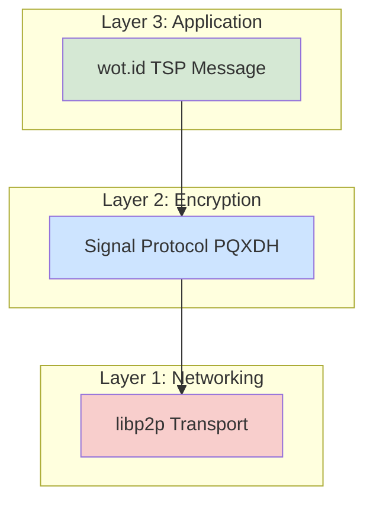
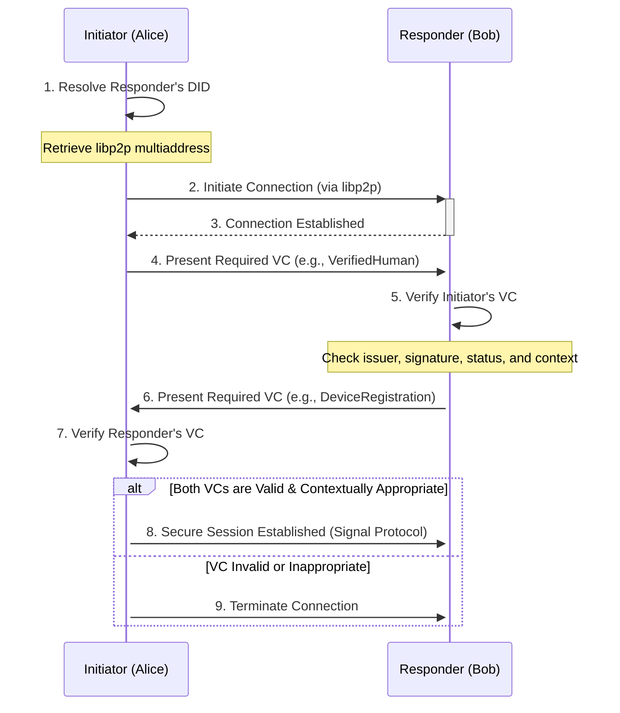
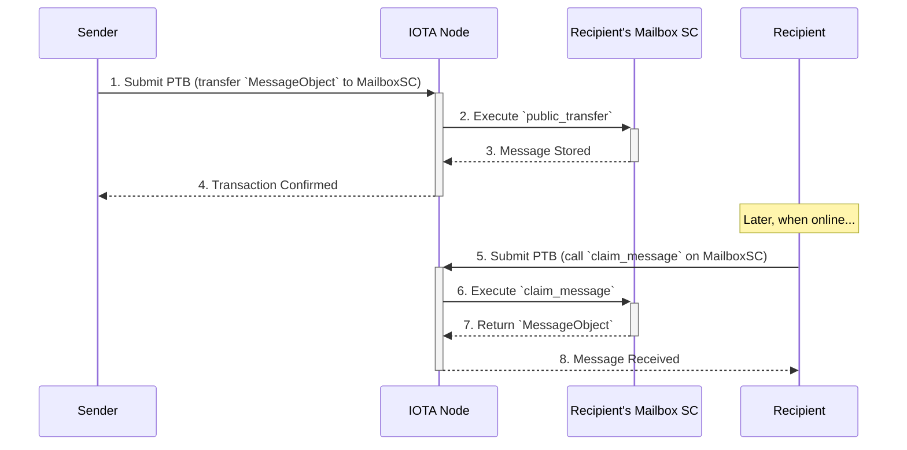

# 06: wot.id - Secure Peer-to-Peer (P2P) Communication

## **Current Implementation Status (December 2025)**

> **Implementation Progress**: Basic P2P messaging is operational via WebSocket relay. End-to-end encryption and on-chain mailbox are planned for future phases.

### **✅ Phase A: On-Chain Peer Discovery (December 3, 2025)**
- ✅ Move contract: `service_endpoint` dynamic field added to TrustProfile
- ✅ Backend: `POST/GET/DELETE /api/identity/service-endpoint` endpoints
- ✅ Backend: libp2p integration with QUIC transport
- ✅ Email→DID→profile lookup chain for peer discovery
- ⚠️ Known bug: `lookup_profile_by_did` returns WotIdentity, not TrustProfile

### **✅ Phase B: Browser Support & WebSocket Relay (December 4, 2025)**
- ✅ Backend: WebSocket relay endpoint `/ws/p2p/{peer_id}`
- ✅ Backend: NAT traversal modules (AutoNAT, DCUTR, Circuit Relay v2)
- ✅ Frontend: P2P service layer with WebSocket transport
- ✅ Frontend: `/talk` page with conversation list
- ✅ Frontend: `/talk/[did]` chat page with real-time messaging
- ✅ Frontend: Message persistence in localStorage
- ✅ Browser detection for Safari/iOS compatibility

### **⏳ Phase C: On-Chain Mailbox (Planned)**
- Mailbox.move smart contract for offline delivery
- Message deposit/claim flows

### **⏳ Phase D: Production Hardening (Planned)**
- End-to-end encryption (Signal Protocol or PQC)
- Security audit, multi-device support, group messaging

### **Current Architecture (Working)**
```
Browser A → WebSocket → Backend Relay → WebSocket → Browser B
           /ws/p2p/{peer_id}        /ws/p2p/{peer_id}
```

### **Key Limitations (Current Phase)**
- **No E2E Encryption**: Messages pass through backend relay; transport-level encryption only (WSS)
- **No Offline Delivery**: Recipient must be connected to receive
- **localStorage**: 5MB limit, no cross-device sync (production should use IndexedDB)

### **Files Implemented**
| File | Description |
|------|-------------|
| `backend/src/handlers/ws_relay.rs` | WebSocket relay handler |
| `backend/src/p2p/nat.rs` | AutoNAT configuration |
| `backend/src/p2p/relay.rs` | Circuit relay v2 client |
| `frontend/src/lib/p2p/p2pService.ts` | P2P service singleton |
| `frontend/src/lib/p2p/websocketFallback.ts` | WebSocket client |
| `frontend/src/lib/p2p/messageStore.ts` | localStorage persistence |
| `frontend/src/hooks/useP2P.ts` | React hooks |
| `frontend/src/app/talk/page.tsx` | Conversation list |
| `frontend/src/app/talk/[did]/page.tsx` | Chat interface |

---

## 1. Overview and Architectural Rationale

This document outlines the architecture for `wot.id`'s secure P2P communication service. It is designed for **verified peer-to-peer interaction between any digital actor—including humans, IoT devices, and autonomous services**—emphasizing privacy, cryptographic trust, and self-sovereign identity. The core principles are direct device-to-device communication, mandatory end-to-end encryption, and actor control over all data and keys.

### 1.1. Why a Separate P2P Stack?

A core architectural decision for `wot.id` is the creation of its own application-level P2P network rather than attempting to use the IOTA nodes' underlying P2P layer. This decision is based on the official IOTA documentation and a clear separation of concerns:

*   **IOTA Node P2P is for Consensus:** The IOTA network uses a [gossip-like P2P protocol](https://docs.iota.org/operator/data-management) for internal operations, specifically for nodes to synchronize their state and maintain the integrity of the ledger. This network is highly specialized and not designed for general-purpose dApp messaging.
*   **No Public dApp Messaging Layer:** The IOTA framework does not currently expose a public API for dApps to send peer-to-peer messages through the node infrastructure. The standard interaction model is client-server, where a dApp communicates with a node via its [JSON-RPC API](https://docs.iota.org/iota-api-ref).

Therefore, `wot.id` implements its own P2P stack using industry-standard tools to enable direct, secure, and private communication between end-user devices.

**Architecture Context**:
P2P communication in wot.id operates within the broader identity architecture:
- **Identity Foundation**: See `docs/01_Project_Overview_And_Principles.md` sections 1.2-1.3
- **DID-Based Authentication**: P2P connections authenticate using W3C DIDs (via identity.rs)
- **Trust Integration**: See `docs/07_Trust_Architecture_And_Management.md` for trust scores in messaging
- **Data Architecture**: Messages may reference on-chain VALUES, see `docs/05_Move_Smart_Contracts.md` section 2.4

**Key Principle**: P2P messages are ephemeral (off-chain), but participants are authenticated via on-chain W3C DIDs.

### 1.2. The `wot.id` P2P Communication Stack

The architecture is layered to separate concerns, from the underlying network transport to the application-level messaging protocol.



*   **Layer 1: Networking ([`libp2p`](https://libp2p.io/))**: Provides the foundational P2P transport, handling NAT traversal, peer discovery, and secure channel establishment. The choice of `libp2p` is consistent with the technology used by IOTA nodes themselves, which use [`libp2p`-style multiaddresses](https://docs.iota.org/operator/full-node/source) for peering.
*   **Layer 2: Encryption ([Signal Protocol](https://signal.org/docs/))**: Runs on top of `libp2p` to provide state-of-the-art, post-quantum end-to-end encryption for all message content.
*   **Layer 3: Application (`wot.id` TSP)**: Defines the message structure and business logic for `wot.id` interactions, such as exchanging VCs or chat messages.

---

## 2. Unified Identity for All Actors: Humans, Devices, and Services

A foundational principle of `wot.id` is that all participants in the network—whether they are humans, IoT sensors, or automated services—are first-class citizens with their own self-sovereign identity. This is made possible by leveraging the **official IOTA Identity Move package (v1.6.0-beta.3)**, which is explicitly designed to serve more than just people.

As stated in the [official IOTA Identity documentation](https://docs.iota.org/iota-identity), the framework provides a "unifying layer of trust" for **People, Organizations, and Things**. This allows `wot.id` to create a truly peer-to-peer environment where:

*   An **IoT device** can have its own DID, issue verifiable data streams, and be controlled by an authorized owner.
*   A **human user** can securely communicate with another human, or directly with a trusted device.
*   An **autonomous service** can be identified, authenticated, and interact with other actors based on verifiable credentials.

This unified identity model is the bedrock upon which our context-aware communication protocol is built.

### 2.1. A Note on Legacy IOTA Streams
Users familiar with the legacy IOTA network may recall **IOTA Streams**, a framework for M2M data exchange. It is important to note that Streams is not part of the current IOTA 2.0 / Shimmer architecture. The modern IOTA stack provides the core identity and ledger layers, leaving the communication protocol to the application layer. The `wot.id` P2P stack is designed to fill this role, providing a flexible and secure messaging solution for all actors.

---

## 3. Communication Modes

`wot.id` supports two modes of communication to balance real-time interaction with the need for asynchronous messaging.

| Mode                  | Primary Use Case                                | Mechanism                                                               | Latency | Persistence                                     |
|-----------------------|-------------------------------------------------|-------------------------------------------------------------------------|---------|-------------------------------------------------|
| **Off-Chain (P2P)**   | Real-time chat, file transfer, device control   | Direct device-to-device via `libp2p`                                    | Low     | None (messages only exist on peer devices)      |
| **On-Chain (Mailbox)**| Asynchronous messages, offline delivery         | `Move` smart contract on IOTA L2, interacted with via PTBs                | High    | On-chain (messages stored until claimed/deleted) |

---

## 4. Layer 1: `libp2p` Networking & Peer Discovery

The foundation of the P2P stack is `libp2p`, a modular network stack that handles the complexities of peer-to-peer connections.

### 4.1. Peer Discovery via DID Documents

Before communication can begin, peers must discover each other's network address. `wot.id` leverages the W3C DID specification for this purpose, creating a direct link between a user's on-chain identity and their off-chain P2P address.

1.  **Publishing:** When a user initializes the `wot.id` client, it generates a stable `libp2p` Peer ID and determines its network multiaddress (e.g., `/ip4/203.0.113.1/tcp/4001/p2p/QmPeerId...`). The user then adds this address to their `IotaDID` document as a `serviceEndpoint` with a specific type (e.g., `wot-id-p2p-messaging`). This update uses the **official IOTA Identity package's proposal-based governance system** for multi-controller identities or direct updates for single-controller identities, then is published on-chain.
2.  **Resolving:** To contact Bob, Alice first resolves Bob's `IotaDID`. She parses the resulting DID document, finds the `serviceEndpoint` for P2P messaging, and retrieves Bob's multiaddress.
3.  **Connecting:** Alice uses this multiaddress to establish a direct connection to Bob using `libp2p`.

This mechanism ensures that the P2P address is anchored to the user's self-sovereign identity, making it discoverable and verifiable.

### 4.2. NAT Traversal

`wot.id` will leverage `libp2p`'s native support for NAT traversal, including techniques like **Hole Punching** and using **Relay Servers**, to ensure connectivity even when both peers are behind restrictive firewalls.

---

## 5. Layer 3: The `wot.id` Trust & Security Protocol (TSP)

The TSP defines the structure of the messages exchanged between peers *after* a secure channel has been established. These messages are serialized (e.g., as JSON) and then encrypted by the Signal Protocol.

### 5.1. Message Envelope

All TSP messages share a common envelope:

```json
{
  "id": "unique-message-id",
  "type": "message-type", // e.g., 'chat.text', 'vc.offer'
  "timestamp": "ISO-8601-timestamp",
  "payload": { ... } // Type-specific payload
}
```

### 5.2. Message Types and Payloads

| Type              | Description                               | Payload Schema                                                               |
|-------------------|-------------------------------------------|------------------------------------------------------------------------------|
| `chat.text`       | A standard text message.                  | `{ "content": "Hello, world!" }`                                          |
| `vc.offer`        | Offer to share a VC.                      | `{ "credential_summary": { "type": ["VerifiableCredential", "VerifiedHuman"] } }` |
| `vc.request`      | Request a specific type of VC.            | `{ "credential_type": "VerifiedHuman" }`                                  |
| `vc.share`        | The full, signed Verifiable Credential.   | `{ "credential": { ...W3C VC Data Model... } }`                             |
| `trust.assertion` | Assert a trust relationship.              | `{ "target_did": "did:iota:...", "trust_level": 95, "context": "professional" }` |
| `device.command`  | A command sent to a device.               | `{ "command": "unlock", "params": { ... } }`                                  |

---

## 6. Core Interaction Flows

### 6.1. Flow 1: Context-Aware Handshake (Off-Chain)

Before any meaningful communication can occur, peers must perform a handshake to establish a trusted session. This handshake is **context-aware**, meaning the specific authorization required depends on the nature of the interaction. It is not limited to human verification.

The core mechanism is the exchange of **Verifiable Credentials (VCs)**. The initiator presents a VC, and the responder verifies it before potentially presenting its own.



The verification step (5 & 7) is crucial. It involves resolving the VC issuer's DID, checking the signature, ensuring the credential is not revoked, and **confirming the VC type is appropriate for the requested interaction.**

#### Handshake Examples:

*   **Human-to-Human Chat:** Alice presents her `VerifiedHuman` VC to Bob. Bob verifies it and presents his own `VerifiedHuman` VC back.
*   **IoT Device Data Stream:** A weather sensor (the Initiator) presents its `DeviceRegistration` VC (issued by the manufacturer) to a data aggregator service (the Responder). The service verifies the device is authentic before accepting data.
*   **Human Controlling a Smart Lock:** Alice (Initiator) wants to unlock her front door (Responder). She presents a `DoorOwnerCap` VC to the lock. The lock verifies she is the authorized owner and opens, without needing to present a VC back.

### 6.2. Flow 2: Asynchronous Messaging (On-Chain Mailbox)

This flow is used when a recipient is offline. The sender leaves a message in the recipient's on-chain `Mailbox` smart contract.



---

## 7. On-Chain Mailbox: Technical Deep Dive

The optional on-chain mailbox provides a mechanism for asynchronous communication. It is implemented as a dedicated `Mailbox` Move smart contract.

### 7.1. Core `Mailbox.move` Contract Definition

#### Core Structs

```move
/// The user's mailbox, a shared object that can receive messages.
public struct Mailbox has key {
    id: UID,
    owner: address,
    owner_cap: MailboxOwnerCap, // Capability granting ownership rights
    message_count: u64,
}

/// A single encrypted message, a shared object owned by the Mailbox.
public struct Message has key {
    id: UID,
    from: address, // Sender's address
    timestamp: u64,
    encrypted_payload: vector<u8>, // TSP message, encrypted with Signal
}

/// Capability object that grants owner-only permissions.
public struct MailboxOwnerCap has key, store {
    mailbox_id: ID,
}
```

#### Public Entry Functions

| Function | Description | Parameters | Authorization |
| :--- | :--- | :--- | :--- |
| `deposit_message` | Encrypts a message and transfers it to the recipient's mailbox. | `mailbox: &mut Mailbox`, `encrypted_payload: vector<u8>`, `ctx: &mut TxContext` | Any | 
| `claim_messages` | The owner claims all pending messages from their mailbox. | `cap: &MailboxOwnerCap`, `mailbox: &mut Mailbox`, `ctx: &mut TxContext` | Caller must present the `MailboxOwnerCap`. |
| `delete_message` | The owner deletes a specific message. | `cap: &MailboxOwnerCap`, `mailbox: &mut Mailbox`, `message_id: ID`, `ctx: &mut TxContext` | Caller must present the `MailboxOwnerCap`. |

### 7.4. Integration with Official IOTA Identity Package

**Future Enhancement**: The Mailbox contract architecture aligns with the **official IOTA Identity Move package (v1.6.0-beta.3)** patterns:

- **ControllerCap Integration**: Mailbox ownership could leverage ControllerCap from official Identity objects
- **Proposal-Based Updates**: Multi-controller identities could use governance proposals for mailbox configuration changes
- **Standardized Patterns**: Following official package conventions for capability-based access control

This ensures consistency with the broader `wot.id` architecture and official IOTA Identity standards.

### 5.2. IOTA Move Patterns Used

The contract relies on several key patterns from the IOTA Move environment:

*   **Transfer to Object**: A sender transfers ownership of a `Message` object directly to the recipient's `Mailbox` object.
*   **Capabilities Pattern**: Access to sensitive functions like `claim_messages` is controlled by the `MailboxOwnerCap`, ensuring only the true owner can manage the mailbox.

### 7.3. Privacy and Cost Trade-Offs

While powerful, the on-chain mailbox has important trade-offs:

*   **Public Metadata:** Although the message *payload* is end-to-end encrypted, the transaction metadata (sender, recipient mailbox, timestamp) is public on the L2 ledger.
*   **Gas Fees:** Storing messages on-chain incurs gas fees. The mailbox is intended for essential asynchronous communication, not as a permanent, high-volume message store.

---

## 8. Post-Quantum Cryptography (PQC) Strategy

To ensure long-term security against quantum adversaries, `wot.id` adopts a comprehensive PQC strategy:

*   **Key Exchange (E2EE)**: **CRYSTALS-Kyber** is integrated into the Signal Protocol's key exchange mechanism (PQXDH) for quantum-resistant key establishment.
*   **Digital Signatures**: **CRYSTALS-Dilithium** or **Falcon** will be used for signing Verifiable Credentials and `wot.id` TSP messages. Verification of signatures using these PQC algorithms will primarily occur off-chain. If on-chain smart contracts need to ascertain the validity or status of such VCs or messages, it will be based on associated data verifiable with classic cryptography (e.g., commitments, or co-signatures if applicable) until direct on-chain PQC verification is supported by the IOTA Move VM.
*   **DID Authentication**: `VerificationMethod` entries in DID documents will support PQC keys and signature schemes. It is important to note that, currently, the IOTA Move VM supports classical signature schemes (e.g., Ed25519, Secp256k1) for on-chain verification. Therefore, any on-chain operations requiring DID authentication by a smart contract (such as authorizing updates to a DID document managed by the `Identity` contract) must utilize these supported classical schemes. PQC-based DID authentication will be verified off-chain or through mechanisms like oracles until broader PQC algorithm support is available on-chain.

This hybrid approach, combining classical algorithms for on-chain smart contract interactions and post-quantum algorithms for off-chain communication and data integrity, provides robust security during the transition period and acknowledges current on-chain limitations.
