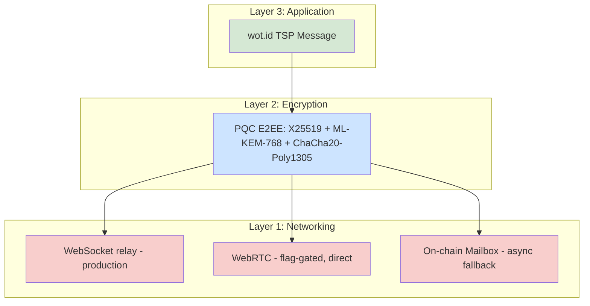
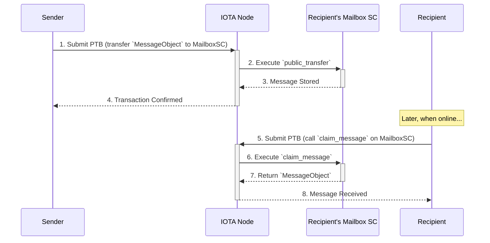

# 06: wot.id - Secure Peer-to-Peer (P2P) Communication

## **Current Implementation Status (May 2026)**

> **Implementation Progress**: Talk is alpha-quality but functional for two simultaneously-online peers. End-to-end PQC encryption is on by default, IndexedDB persistence has shipped, on-chain mailbox UI is wired, and WebRTC is implemented behind a feature flag. Multi-device sync, offline-by-default, and trust-aware verification are still open. See `docs/2026_Code_Work/26-04-28_Communication_Functionality_Status.md` and `docs/2026_Code_Work/26-04-28_Talk_Functionality_Work.md` for the current pillar-by-pillar status.

> **Framing note**: P2P messages follow the same wot.id-stores-VALUES-not-files principle (`docs/01_Project_Overview_And_Principles.md` Principle #4 + `docs/Claude_Primer.md` §17). Talk encrypts the message *content* client-side with the recipient's hybrid PQC public key; the mailbox PTB stores the encrypted payload as an on-chain VALUE. Any attachments / source documents being referenced in a conversation stay on the participants' own devices or cloud — wot.id does not transmit or host file blobs on behalf of users.

### **✅ Phase A: On-Chain Peer Discovery (December 3, 2025) — partly retained**
- ✅ Move contract: `service_endpoint` dynamic field on `TrustProfile` (preserved). The `TrustProfile` write path is operational as of 2026-05-26 via the backend's `ensure_trust_profile_gas_station` lazy-provisioning orchestration (Open-Issues #8 closed — see `docs/2026_Code_Work/26-05-26_Default_Privacy_Orchestration.md`); previously a fresh `IdentityProfile` without a linked `TrustProfile` could not have a `service_endpoint` written.
- ✅ Backend: `POST/GET/DELETE /api/identity/service-endpoint` endpoints (preserved; not currently called from the frontend)
- ⚠️ Backend libp2p integration with QUIC transport — **removed in May 2026**, see [Update 2 doc](2026_Code_Work/26-05-07_2026_Q2_Plan_Update2.md). The on-chain `service_endpoint` field is retained as a generic, transport-agnostic registry slot.
- ✅ Email→DID→profile lookup chain for peer discovery
- ⚠️ Known bug: `lookup_profile_by_did` returns `WotIdentity`, not `TrustProfile`

### **✅ Phase B: Browser Support & WebSocket Relay (December 4, 2025)**
- ✅ Backend: WebSocket relay endpoint `/ws/p2p/{peer_id}` — **this is the production transport**
- ⚠️ Backend NAT-traversal modules (AutoNAT, DCUTR, Circuit Relay v2) — **removed** with the libp2p stack. WebSocket relay covers traversal in production; WebRTC (Phase C) covers direct browser-to-browser when both peers are online.
- ✅ Frontend: P2P service layer with WebSocket transport (raw WebSocket, not libp2p-js)
- ✅ Frontend: `/talk` page with conversation list
- ✅ Frontend: `/talk/[did]` chat page with real-time messaging
- ✅ Browser detection for Safari/iOS compatibility

### **✅ Phase C: Encryption-by-default + Mailbox UI + IndexedDB (April 28, 2026)**
- ✅ Frontend: PQC encryption (X25519 + ML-KEM-768 + ChaCha20-Poly1305) is mandatory for all `text` messages — plaintext fallback removed; new typed exceptions surface "encryption locked" / "recipient has no published key" cases inline.
- ✅ Frontend: on-chain mailbox UI hook wired (`MailboxAPI.depositMessage` on WS-send failure; `checkMailbox` polled on app start). One small follow-up on a counter API.
- ✅ Storage upgrade: `localStorage` → IndexedDB via `idb` (5 MB cap removed); export/import flow available.
- 🟡 WebRTC P2P: implemented behind `NEXT_PUBLIC_TALK_WEBRTC=1` (off by default; not browser-verified).
- 🟡 Trust-aware messaging: Phase 1 (badge + VC styling) shipped; Phase 2 (verification, gating, dedicated backend endpoint) deferred.

### **⏳ Phase D: Production Hardening (Planned)**
- Security audit, multi-device sync, group messaging
- "Encryption on by default" UX (auto-unlock prompt at app start vs. current opt-in unlock)
- Note: Phase D **does not** assume libp2p reactivation. If a future direction needs libp2p (e.g., direct IoT-to-IoT, federation between wot.id instances), it goes back through a fresh design and explicit decision.

### **Current Architecture (Working)**

```
Browser A → WebSocket → Backend Relay → WebSocket → Browser B
           /ws/p2p/{peer_id}        /ws/p2p/{peer_id}
                            ↓ on send-failure
                  Mailbox PTB on IOTA mainnet (offline drop-box)

Optional (Phase C, flag-gated): direct Browser ↔ Browser via WebRTC.
```

### **Key Limitations (Current Phase)**
- **No multi-device sync**: IndexedDB is per-device; no native sync layer yet (export/import is the manual workaround).
- **WebRTC unactivated**: All traffic still relays through the backend in normal operation.
- **No group messaging / no VC verification**: Phase D items.
- **No federation / no direct IoT-to-IoT**: would require a new transport layer (not on the 2026 roadmap).

### **Files Implemented**
| File | Description |
|------|-------------|
| `backend/src/handlers/ws_relay.rs` | WebSocket relay handler (production transport) |
| `backend/src/handlers/p2p.rs` | REST handlers for the on-chain `service_endpoint` field |
| `frontend/src/lib/p2p/p2pService.ts` | P2P service singleton |
| `frontend/src/lib/p2p/websocketFallback.ts` | WebSocket client |
| `frontend/src/lib/p2p/messageStore.ts` | IndexedDB persistence (`idb`) |
| `frontend/src/hooks/useP2P.ts` | React hooks |
| `frontend/src/app/talk/page.tsx` | Conversation list |
| `frontend/src/app/talk/[did]/page.tsx` | Chat interface |

**Removed** (May 2026): `backend/src/p2p/` (libp2p swarm, NAT traversal, relay client) and `backend/src/bin/wot-p2p.rs`. See Update 2 doc for the rationale.

---

## 1. Overview and Architectural Rationale

This document outlines the architecture for `wot.id`'s secure P2P communication service. It is designed for **verified peer-to-peer interaction between any digital actor—including humans, IoT devices, and autonomous services**—emphasizing privacy, cryptographic trust, and self-sovereign identity. The core principles are direct device-to-device communication, mandatory end-to-end encryption, and actor control over all data and keys.

### 1.1. Why a Separate P2P Stack?

A core architectural decision for `wot.id` is the creation of its own application-level P2P network rather than attempting to use the IOTA nodes' underlying P2P layer. This decision is based on the official IOTA documentation and a clear separation of concerns:

*   **IOTA Node P2P is for Consensus:** The IOTA network uses a [gossip-like P2P protocol](https://docs.iota.org/operator/data-management) for internal operations, specifically for nodes to synchronize their state and maintain the integrity of the ledger. This network is highly specialized and not designed for general-purpose dApp messaging.
*   **No Public dApp Messaging Layer:** The IOTA framework does not currently expose a public API for dApps to send peer-to-peer messages through the node infrastructure. The standard interaction model is client-server, where a dApp communicates with a node via its [JSON-RPC API](https://docs.iota.org/iota-api-ref).

Therefore, `wot.id` implements its own application-level transport for direct, secure, private communication between end-user devices.

### 1.2. Why WebSocket relay + WebRTC (and not libp2p)

The original Phase A/B design used `libp2p` as the Layer-1 transport. That direction was reversed in May 2026 (see [Update 2 doc](2026_Code_Work/26-05-07_2026_Q2_Plan_Update2.md)). The actual stack used in production is:

* **WebSocket relay** (`/ws/p2p/{peer_id}`) — the default transport. Browser-native, no shim layer, traverses every NAT and corporate proxy that allows HTTPS.
* **WebRTC** (flagged) — direct browser-to-browser when both peers are online and the flag is enabled. Provides exactly the property libp2p was meant to provide (no relay in the data path) without the libp2p-js bundle weight.
* **On-chain mailbox** — asynchronous fallback when the recipient is offline.

The libp2p stack required either a libp2p-js shim in the browser (heavy) or the WebSocket relay path anyway (and then libp2p adds nothing). The roadmap items that would actually justify libp2p — direct IoT-device-to-device, federated wot.id-to-wot.id messaging — are not on the 2026 plan. If they re-enter scope, libp2p (or another transport) is reconsidered then.

**Architecture Context**:
P2P communication in wot.id operates within the broader identity architecture:
- **Identity Foundation**: See `docs/01_Project_Overview_And_Principles.md` sections 1.2-1.3
- **DID-Based Authentication**: P2P connections authenticate using W3C DIDs (Ed25519 + BLAKE3, generated inline by the Backend API; the IOTA Identity SDK is not used)
- **Trust Integration**: See `docs/07_Trust_Architecture_And_Management.md` for trust scores in messaging
- **Data Architecture**: Messages may reference on-chain VALUES, see `docs/05_Move_Smart_Contracts.md` section 2.4

**Key Principle**: P2P messages are ephemeral (off-chain), but participants are authenticated via on-chain W3C DIDs.

### 1.3. The `wot.id` P2P Communication Stack

The architecture is layered to separate concerns, from the underlying network transport to the application-level messaging protocol.


```mermaid
graph TD
    subgraph "Layer 3: Application"
        A[wot.id TSP Message]
    end
    subgraph "Layer 2: Encryption"
        B[PQC E2EE: X25519 + ML-KEM-768 + ChaCha20-Poly1305]
    end
    subgraph "Layer 1: Networking"
        C[WebSocket relay - production]
        D[WebRTC - flag-gated, direct]
        E[On-chain Mailbox - async fallback]
    end

    A --> B
    B --> C
    B --> D
    B --> E

    style A fill:#d5e8d4
    style B fill:#cde4ff
    style C fill:#f8cecc
    style D fill:#f8cecc
    style E fill:#f8cecc
```

*   **Layer 1: Networking** — three transports, used together:
    * **WebSocket relay**, a backend-mediated full-duplex channel (`/ws/p2p/{peer_id}`). This is the default and the only transport guaranteed to work across browsers and networks today.
    * **WebRTC** (flagged: `NEXT_PUBLIC_TALK_WEBRTC`), direct browser-to-browser when both peers are online.
    * **On-chain mailbox**, a Move-contract drop-box that stores encrypted payloads when the recipient is offline.
*   **Layer 2: Encryption** — PQC end-to-end encryption is mandatory for all `text` messages (X25519 + ML-KEM-768 hybrid KEM, ChaCha20-Poly1305 AEAD). See `frontend/src/lib/crypto/`. The plaintext fallback was removed in Phase C.
*   **Layer 3: Application (`wot.id` TSP)**: Defines the message structure and business logic for `wot.id` interactions, such as exchanging VCs or chat messages.

---

## 2. Unified Identity for All Actors: Humans, Devices, and Services

A foundational principle of `wot.id` is that all participants in the network—whether they are humans, IoT sensors, or automated services—are first-class citizens with their own self-sovereign identity. This is made possible by leveraging the **official IOTA Identity Move package (v1.6.0-beta.3)**, which is explicitly designed to serve more than just people.

As stated in the [official IOTA Identity documentation](https://docs.iota.org/iota-identity), the framework provides a "unifying layer of trust" for **People, Organizations, and Things**. This allows `wot.id` to create a truly peer-to-peer environment where:

*   An **IoT device** can have its own DID, issue verifiable data streams, and be controlled by an authorized owner.
*   A **human user** can securely communicate with another human, or directly with a trusted device.
*   An **autonomous service** can be identified, authenticated, and interact with other actors based on verifiable credentials.

This unified identity model is the bedrock upon which our context-aware communication protocol is built.

### 2.1. A Note on Legacy IOTA Streams
Users familiar with the legacy IOTA network may recall **IOTA Streams**, a framework for M2M data exchange. It is important to note that Streams is not part of the current IOTA 2.0 / Shimmer architecture. The modern IOTA stack provides the core identity and ledger layers, leaving the communication protocol to the application layer. The `wot.id` P2P stack is designed to fill this role, providing a flexible and secure messaging solution for all actors.

---

## 3. Communication Modes

`wot.id` supports two modes of communication to balance real-time interaction with the need for asynchronous messaging.

| Mode                  | Primary Use Case                                | Mechanism                                                               | Latency | Persistence                                     |
|-----------------------|-------------------------------------------------|-------------------------------------------------------------------------|---------|-------------------------------------------------|
| **Off-Chain (P2P)**   | Real-time chat, file transfer, device control   | WebSocket relay (default) or WebRTC (flagged, direct browser-to-browser) | Low     | None (messages only exist on peer devices)      |
| **On-Chain (Mailbox)**| Asynchronous messages, offline delivery         | `Move` smart contract on IOTA L2, interacted with via PTBs                | High    | On-chain (messages stored until claimed/deleted) |

---

## 4. Layer 1: Transport & Peer Discovery

The Layer-1 transport in production is the **WebSocket relay** (`backend/src/handlers/ws_relay.rs`), with **WebRTC** as a flag-gated direct path and the **on-chain mailbox** as the asynchronous fallback. The libp2p design originally documented in this section was abandoned in May 2026 (see [Update 2 doc](2026_Code_Work/26-05-07_2026_Q2_Plan_Update2.md)).

### 4.1. Peer Discovery via DID

Peer discovery is by DID, not by IP. The flow:

1.  **Identify the recipient by DID** (resolved from email, contact list, or QR code).
2.  **Open a WebSocket session to the relay**, keyed by the local DID's PeerID.
3.  **The relay routes** envelopes addressed to other connected DIDs in real time, and falls back to the on-chain mailbox when the recipient isn't connected.

The on-chain `service_endpoint` field on `TrustProfile` (and the `POST/GET/DELETE /api/identity/service-endpoint` REST handlers) is preserved for forward compatibility — a future direct-transport (e.g., a libp2p re-introduction or QUIC-direct) could use it to publish a DID-resolvable network address. It is currently unused on the read side.

### 4.2. NAT Traversal

The WebSocket relay traverses NATs by virtue of being a normal HTTPS connection (every NAT and corporate proxy that allows web traffic allows WebSocket). When `NEXT_PUBLIC_TALK_WEBRTC=1`, WebRTC negotiates a direct path with STUN/TURN; if that fails, traffic falls back to the relay.

---

## 5. Layer 3: The `wot.id` Trust & Security Protocol (TSP)

The TSP defines the structure of the messages exchanged between peers *after* a secure channel has been established. These messages are serialized (e.g., as JSON) and then encrypted by the Signal Protocol.

### 5.1. Message Envelope

All TSP messages share a common envelope:

```json
{
  "id": "unique-message-id",
  "type": "message-type", // e.g., 'chat.text', 'vc.offer'
  "timestamp": "ISO-8601-timestamp",
  "payload": { ... } // Type-specific payload
}
```

### 5.2. Message Types and Payloads

| Type              | Description                               | Payload Schema                                                               |
|-------------------|-------------------------------------------|------------------------------------------------------------------------------|
| `chat.text`       | A standard text message.                  | `{ "content": "Hello, world!" }`                                          |
| `vc.offer`        | Offer to share a VC.                      | `{ "credential_summary": { "type": ["VerifiableCredential", "VerifiedHuman"] } }` |
| `vc.request`      | Request a specific type of VC.            | `{ "credential_type": "VerifiedHuman" }`                                  |
| `vc.share`        | The full, signed Verifiable Credential.   | `{ "credential": { ...W3C VC Data Model... } }`                             |
| `trust.assertion` | Assert a trust relationship.              | `{ "target_did": "did:iota:...", "trust_level": 95, "context": "professional" }` |
| `device.command`  | A command sent to a device.               | `{ "command": "unlock", "params": { ... } }`                                  |

---

## 6. Core Interaction Flows

### 6.1. Flow 1: Context-Aware Handshake (Off-Chain)

Before any meaningful communication can occur, peers must perform a handshake to establish a trusted session. This handshake is **context-aware**, meaning the specific authorization required depends on the nature of the interaction. It is not limited to human verification.

The core mechanism is the exchange of **Verifiable Credentials (VCs)**. The initiator presents a VC, and the responder verifies it before potentially presenting its own.

```mermaid
sequenceDiagram
    participant Initiator (Alice)
    participant Responder (Bob)

    Initiator (Alice)->>Initiator (Alice): 1. Resolve Responder's DID
    Note over Initiator (Alice): Look up recipient via DID directory
    Initiator (Alice)->>+Responder (Bob): 2. Initiate Connection (WebSocket relay; or WebRTC if both online)
    Responder (Bob)-->>-Initiator (Alice): 3. Connection Established

    Initiator (Alice)->>+Responder (Bob): 4. Present Required VC (e.g., VerifiedHuman)
    Responder (Bob)->>Responder (Bob): 5. Verify Initiator's VC
    Note over Responder (Bob): Check issuer, signature, status, and context
    Responder (Bob)->>+Initiator (Alice): 6. Present Required VC (e.g., DeviceRegistration)
    Initiator (Alice)->>Initiator (Alice): 7. Verify Responder's VC

    alt Both VCs are Valid & Contextually Appropriate
        Initiator (Alice)->>Responder (Bob): 8. Secure Session Established (Signal Protocol)
    else VC Invalid or Inappropriate
        Initiator (Alice)->>Responder (Bob): 9. Terminate Connection
    end
```

The verification step (5 & 7) is crucial. It involves resolving the VC issuer's DID, checking the signature, ensuring the credential is not revoked, and **confirming the VC type is appropriate for the requested interaction.**

#### Handshake Examples:

*   **Human-to-Human Chat:** Alice presents her `VerifiedHuman` VC to Bob. Bob verifies it and presents his own `VerifiedHuman` VC back.
*   **IoT Device Data Stream:** A weather sensor (the Initiator) presents its `DeviceRegistration` VC (issued by the manufacturer) to a data aggregator service (the Responder). The service verifies the device is authentic before accepting data.
*   **Human Controlling a Smart Lock:** Alice (Initiator) wants to unlock her front door (Responder). She presents a `DoorOwnerCap` VC to the lock. The lock verifies she is the authorized owner and opens, without needing to present a VC back.

### 6.2. Flow 2: Asynchronous Messaging (On-Chain Mailbox)

This flow is used when a recipient is offline. The sender leaves a message in the recipient's on-chain `Mailbox` smart contract.


```mermaid
sequenceDiagram
    participant Sender
    participant IOTANode as IOTA Node
    participant MailboxSC as Recipient's Mailbox SC
    participant Recipient

    Sender->>+IOTANode: 1. Submit PTB (transfer `MessageObject` to MailboxSC)
    IOTANode->>+MailboxSC: 2. Execute `public_transfer`
    MailboxSC-->>-IOTANode: 3. Message Stored
    IOTANode-->>-Sender: 4. Transaction Confirmed

    Note over Recipient: Later, when online...

    Recipient->>+IOTANode: 5. Submit PTB (call `claim_message` on MailboxSC)
    IOTANode->>+MailboxSC: 6. Execute `claim_message`
    MailboxSC-->>-IOTANode: 7. Return `MessageObject`
    IOTANode-->>-Recipient: 8. Message Received
```

---

## 7. On-Chain Mailbox: Technical Deep Dive

The optional on-chain mailbox provides a mechanism for asynchronous communication. It is implemented as a dedicated `Mailbox` Move smart contract.

### 7.1. Core `Mailbox.move` Contract Definition

#### Core Structs

```move
/// The user's mailbox, a shared object that can receive messages.
public struct Mailbox has key {
    id: UID,
    owner: address,
    owner_cap: MailboxOwnerCap, // Capability granting ownership rights
    message_count: u64,
}

/// A single encrypted message, a shared object owned by the Mailbox.
public struct Message has key {
    id: UID,
    from: address, // Sender's address
    timestamp: u64,
    encrypted_payload: vector<u8>, // TSP message, encrypted with Signal
}

/// Capability object that grants owner-only permissions.
public struct MailboxOwnerCap has key, store {
    mailbox_id: ID,
}
```

#### Public Entry Functions

| Function | Description | Parameters | Authorization |
| :--- | :--- | :--- | :--- |
| `deposit_message` | Encrypts a message and transfers it to the recipient's mailbox. | `mailbox: &mut Mailbox`, `encrypted_payload: vector<u8>`, `ctx: &mut TxContext` | Any | 
| `claim_messages` | The owner claims all pending messages from their mailbox. | `cap: &MailboxOwnerCap`, `mailbox: &mut Mailbox`, `ctx: &mut TxContext` | Caller must present the `MailboxOwnerCap`. |
| `delete_message` | The owner deletes a specific message. | `cap: &MailboxOwnerCap`, `mailbox: &mut Mailbox`, `message_id: ID`, `ctx: &mut TxContext` | Caller must present the `MailboxOwnerCap`. |

### 7.4. Integration with Official IOTA Identity Package

**Future Enhancement**: The Mailbox contract architecture aligns with the **official IOTA Identity Move package (v1.6.0-beta.3)** patterns:

- **ControllerCap Integration**: Mailbox ownership could leverage ControllerCap from official Identity objects
- **Proposal-Based Updates**: Multi-controller identities could use governance proposals for mailbox configuration changes
- **Standardized Patterns**: Following official package conventions for capability-based access control

This ensures consistency with the broader `wot.id` architecture and official IOTA Identity standards.

### 5.2. IOTA Move Patterns Used

The contract relies on several key patterns from the IOTA Move environment:

*   **Transfer to Object**: A sender transfers ownership of a `Message` object directly to the recipient's `Mailbox` object.
*   **Capabilities Pattern**: Access to sensitive functions like `claim_messages` is controlled by the `MailboxOwnerCap`, ensuring only the true owner can manage the mailbox.

### 7.3. Privacy and Cost Trade-Offs

While powerful, the on-chain mailbox has important trade-offs:

*   **Public Metadata:** Although the message *payload* is end-to-end encrypted, the transaction metadata (sender, recipient mailbox, timestamp) is public on the L2 ledger.
*   **Gas Fees:** Storing messages on-chain incurs gas fees. The mailbox is intended for essential asynchronous communication, not as a permanent, high-volume message store.

---

## 8. Post-Quantum Cryptography (PQC) Strategy

To ensure long-term security against quantum adversaries, `wot.id` adopts a comprehensive PQC strategy:

*   **Key Exchange (E2EE)**: **CRYSTALS-Kyber** is integrated into the Signal Protocol's key exchange mechanism (PQXDH) for quantum-resistant key establishment.
*   **Digital Signatures**: **CRYSTALS-Dilithium** or **Falcon** will be used for signing Verifiable Credentials and `wot.id` TSP messages. Verification of signatures using these PQC algorithms will primarily occur off-chain. If on-chain smart contracts need to ascertain the validity or status of such VCs or messages, it will be based on associated data verifiable with classic cryptography (e.g., commitments, or co-signatures if applicable) until direct on-chain PQC verification is supported by the IOTA Move VM.
*   **DID Authentication**: `VerificationMethod` entries in DID documents will support PQC keys and signature schemes. It is important to note that, currently, the IOTA Move VM supports classical signature schemes (e.g., Ed25519, Secp256k1) for on-chain verification. Therefore, any on-chain operations requiring DID authentication by a smart contract (such as authorizing updates to a DID document managed by the `Identity` contract) must utilize these supported classical schemes. PQC-based DID authentication will be verified off-chain or through mechanisms like oracles until broader PQC algorithm support is available on-chain.

This hybrid approach, combining classical algorithms for on-chain smart contract interactions and post-quantum algorithms for off-chain communication and data integrity, provides robust security during the transition period and acknowledges current on-chain limitations.
