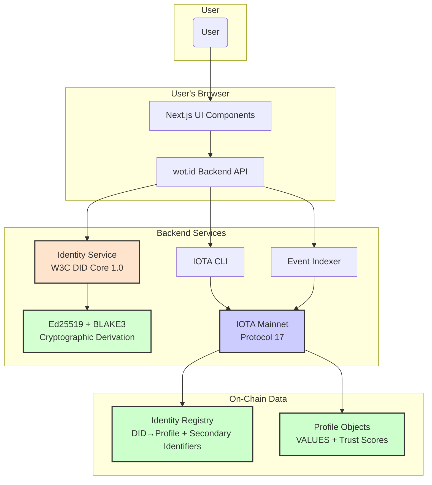
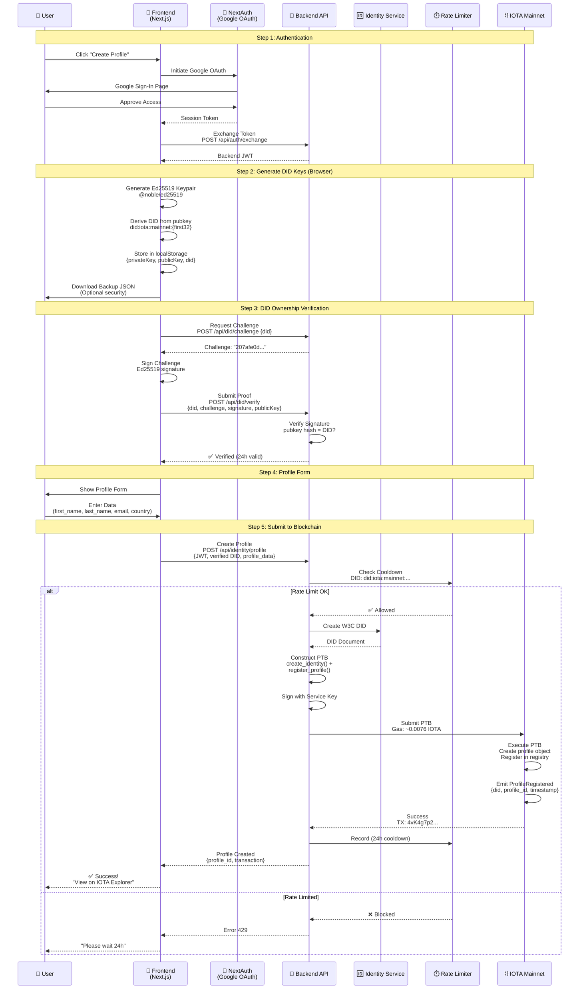

# 08: Frontend, UX, and Client Applications

## 1. UX Philosophy and Core Principles

The user experience of wot.id is shaped by its core commitments to user empowerment, security, and accessibility.

*   **Absolute User Control & SSI**: The UX is designed to give users uncompromising ownership over their digital identity.
*   **Guaranteed Human Identity**: The interface makes identity verification clear and trustworthy.
*   **Open and Accessible**: The UX strives for minimal friction and intuitive participation.
*   **Seamless, Zero-Fee Interactions**: Leveraging IOTA enables fluid, unencumbered engagement.
*   **Clarity & Simplicity**: Trust scores and their derivations are presented in an easily digestible format.
*   **Transparency & Optional Complexity**: While the default view is simple, users can always drill down into the details and evidence behind a trust assessment.
*   **Privacy by Design**: All interactions are handled with the utmost respect for privacy.

---


## 2. Frontend Architecture and Technology Stack

### 2.1. Current Status (December 2025)

**Deployment Status**: ✅ **PRODUCTION OPERATIONAL** at https://wot.id (Vercel)
**Backend Integration**: ✅ **CLI-BASED** - Backend uses IOTA CLI for all blockchain interactions
**Protocol**: IOTA mainnet Protocol 17 with iota-sdk v1.13.1 type definitions
**Technology Stack**: Next.js 14+ (App Router), React 18, TypeScript, Tailwind CSS

**December 2025 Production Features**:
- ✅ **OAuth Auto-Provisioning**: Google, GitHub operational; Apple 95% complete
- ✅ **Profile Creation**: Gas-sponsored profile creation on IOTA mainnet
- ✅ **Personal Wallets**: Auto-assigned IOTA wallet per user with exportable mnemonic
- ✅ **Transfer Page**: Send/receive IOTA and objects with QR code support
- ✅ **Health Section**: CSV bulk import with wide format support (lab reports)
- ✅ **Trust Section**: QR-based attestation flow (generate, scan, submit on-chain)
- ✅ **P2P Talk Page**: WebSocket-based real-time messaging between users
- ✅ **Event-Based Lookups**: Backend queries `ProfileRegistered` events for DID→Profile ID mapping
- ✅ **Zero Mock Data**: Identity data comes from IOTA mainnet, not hardcoded responses
- ✅ **Hybrid Economic Model**: Gas-sponsored profile creation; user-funded transfers
- ✅ **PQC Health Encryption**: Client-side hybrid X25519 + ML-KEM-768 encryption for health data
- ✅ **Encryption Key Backup**: BIP-39 mnemonic backup/recovery for encryption keys
- ✅ **Wallet Persistence**: On-chain wallet address storage with mnemonic recovery
- ✅ **Performance Optimization**: JWT caching prevents regeneration on navigation

**Key Pages Implemented**:
| Page | Path | Description |
|------|------|-------------|
| ME Page | `/me` | User profile with Identity, Trust, Health, Accounts, Contacts sections |
| Transfer Page | `/transfer` | Send/receive IOTA with QR codes, user pays gas |
| Trust Page | `/trust` | Generate/scan QR for attestations, submit on-chain |
| Talk Page | `/talk` | P2P messaging via WebSocket relay |
| Chat Page | `/talk/[did]` | Real-time chat with specific contact |

**Encryption UI Components** (December 2025):
| Component | Description |
|-----------|-------------|
| `EncryptionSetupModal` | First-time encryption key setup with password |
| `UnlockPrompt` | Session unlock for viewing encrypted data |
| `LockToggle` | Quick lock/unlock encrypted data view |
| `EncryptionStatusBadge` | Shows encryption state (locked/unlocked/setup) |
| `KeyBackupModal` | 4-step wizard for backing up encryption keys |
| `KeyRecoveryModal` | 5-step recovery from BIP-39 mnemonic |
| `ImportMnemonicModal` | Wallet recovery after server redeploy |

**PQC Identity Encryption** (December 2025):
| Component/Hook | File | Description |
|----------------|------|-------------|
| `useEncryption` | `hooks/useEncryption.ts` | React hook providing `encryptValue`, `decryptValue`, `isUnlocked` |
| `getDecryptedValue` | `IdentitySection.tsx` | Helper for transparent decryption on display |
| `SerializedEncryptedFieldFromBackend` | `useCurrentIdentity.ts` | Interface for `{v, s, n, c}` encrypted fields |

**Known Issues**:
- ⚠️ Health Section bulk import: API version mismatch after ~20 transactions (backend needs IOTA client update)
- ⚠️ P2P: No end-to-end encryption yet (transport-level only)

**Recent Milestones**:
- Nov 8, 2025: OAuth auto-provisioning operational
- Nov 17, 2025: QR code attestation flow complete
- Nov 19, 2025: First on-chain attestation submitted
- Dec 4, 2025: P2P WebSocket relay operational
- Dec 9, 2025: Personal wallet architecture implemented
- Dec 15, 2025: Transfer page with QR codes complete
- Dec 16, 2025: Health Section CSV bulk import implemented
- Dec 23, 2025: PQC encryption fully implemented (Phases 1-4)
- Dec 23, 2025: First mainnet PQC transaction successful
- Dec 24, 2025: Wallet persistence and recovery implemented
- Dec 24, 2025: Backend batch RPC optimization (60x faster health queries)
- Dec 29, 2025: PQC identity encryption fully operational (DEK derivation fix)
- Dec 30, 2025: Smart Contract v6 upgrade via UpgradeCap (delete_encrypted_claim)
- Dec 30, 2025: PQC stack production verification complete

### 2.2. Architecture Principles: Frontend as Display Layer

**⚠️ CRITICAL: Frontend Displays On-Chain Data, Does NOT Store Data**

The wot.id frontend architecture follows strict principles:

**Frontend Role:**
- ✅ **Display Layer Only**: Shows data VALUES from IOTA blockchain via Backend API
- ✅ **OAuth Authentication**: Obtains email via Google/Microsoft OAuth
- ✅ **JWT Token Management**: Stores backend-issued JWT tokens for API calls
- ✅ **No Data Storage**: Does NOT store identity data (not in localStorage, not in state beyond current session)
- ✅ **Query Backend**: All data fetched from Backend API, which queries blockchain

**Data Flow:**
```
1. User clicks "Sign in with Google" → NextAuth obtains email
2. Frontend → Backend: POST /api/auth/login {email}
3. Backend queries identity_registry.move: secondary identifier → DID lookup
4. If DID found: Backend returns JWT token + profile data
5. Frontend displays ME page with VALUES from backend response
6. User edits VALUE → Frontend sends to backend → Backend updates on-chain
7. Frontend re-fetches from backend to show updated VALUE
```

**What Frontend Does NOT Do:**
- ❌ Does NOT create DIDs (Identity Service does)
- ❌ Does NOT store DIDs in browser (queries backend each time)
- ❌ Does NOT interact with IOTA blockchain directly (backend does)
- ❌ Does NOT maintain a local database
- ❌ Does NOT cache identity data beyond current session

**Why This Matters:**
- Single source of truth is blockchain (via backend)
- Frontend is stateless display layer
- No data synchronization issues
- Privacy: no sensitive data persisted in browser

**Standards Foundation:**
- W3C DIDs created by Identity Service (via identity.rs)
- Backend stores DID + secondary identifier→DID mappings on-chain (generic registry)
- Frontend displays VALUES with trust scores from blockchain

### 2.3. High-Level Architecture (December 2025)

The `wot.id` frontend is a Next.js application that integrates with the backend API to access on-chain identity data from IOTA mainnet.



*   **Next.js Application**: Renders the UI and manages application state.
*   **wot.id Backend API**: Orchestrates profile creation, sponsors gas, queries events, constructs PTBs via CLI.
*   **Identity Service**: Microservice that creates W3C DID Core 1.0 compliant DIDs (Ed25519 + BLAKE3).
*   **Ed25519 + BLAKE3**: Cryptographic DID derivation - generates keypair, derives DID from public key hash.
*   **IOTA CLI**: Backend executes CLI commands to interact with mainnet (no SDK transaction builder).
*   **Event Indexer**: Backend queries `ProfileRegistered` events to find profile IDs by DID.
*   **IOTA Mainnet**: All identity data stored on-chain as Move objects in registry and profiles (Protocol 17).
*   **Identity Registry**: Shared object storing DID→Profile mappings and secondary identifier→DID registry (generic for email/phone/social) at `0x334a70ee16409b749bf221a9d0aafdd8c829db22474e2363a0bdd43e9b45ad92` (December 29, 2025 v6).

### 2.2. Technology Stack

| Technology / Library | Role & Purpose |
| :--- | :--- |
| **Next.js** | Primary frontend framework for building the React application. |
| **React** | Core UI library for building components. |
| **TypeScript** | Provides static typing for improved code quality and maintainability. |
| **Backend API Integration** | Frontend calls REST endpoints to interact with on-chain data. Backend handles all blockchain interactions via IOTA CLI. |
| **No Direct Blockchain Access** | Frontend does not use IOTA SDK or dApp Kit. All on-chain operations go through backend API with gas station pattern. |
| **Mermaid.js** | Used for rendering diagrams within the documentation. |
| **CSS Modules / Tailwind CSS** | For styling components and ensuring design consistency. |

### 2.2.1. Frontend Component Architecture

The Next.js application structure showing component hierarchy and data flow:

```mermaid
graph TB
    subgraph "Next.js App Router"
        ROOT[/ app/layout.tsx<br/>Root Layout]
        PROVIDERS[NextAuth Session<br/>OAuth Provider]
    end
    
    subgraph "Core Pages"
        HOME[/ (Home)<br/>Landing Page]
        LOGIN[/auth/signin<br/>OAuth Login Flow]
        ME[/me<br/>User Dashboard]
        MESSAGE[/message<br/>P2P Messaging]
        TRANSFER[/transfer<br/>Asset Transfers]
        TRUST[/trust<br/>Trust Network]
    end
    
    subgraph "Authentication Components"
        FLOW[AuthFlow<br/>Main Container]
        OAUTH[OAuthHandler<br/>Step 1: Google/Microsoft]
        EMAIL_SEND[EmailToBackend<br/>Step 2: Send Email]
        JWT_STORE[JWTStorage<br/>Step 3: Store Token]
        REDIRECT[RedirectToMe<br/>Step 4: Show Profile]
    end
    
    subgraph "Dashboard Components"
        IDENT[IdentitySection<br/>Profile Display]
        HEALTH[HealthSection<br/>Health Data]
        DOCS[DocumentsSection<br/>Credentials]
        CONTACTS[ContactsSection<br/>Trust Network]
    end
    
    subgraph "Shared Components"
        NAVBAR[NavBar<br/>Navigation + Auth]
        TRUST_VIS[TrustVisualization<br/>Network Graph]
        QR_GEN[QRCodeGenerator<br/>Attestations]
        QR_SCAN[QRScanner<br/>Verify Others]
    end
    
    subgraph "API Integration Layer"
        API_CLIENT[/lib/api-client.ts<br/>Secure HTTP Client]
        API_AUTH[/lib/api/auth.ts<br/>Authentication Operations]
        API_IDENTITY[/lib/api/identity.ts<br/>Profile Operations]
        API_HEALTH[/lib/api/health.ts<br/>Health Data]
        API_TRUST[/lib/api/trust.ts<br/>Trust Operations]
    end
    
    subgraph "Security & Utils"
        SECURITY[/lib/security.ts<br/>Input Validation, CSP]
        CONFIG[/lib/config.ts<br/>Environment Config]
        HOOKS[/hooks/useSecureApi.ts<br/>React Hooks]
        IDENTITY_HOOK[/hooks/useCurrentIdentity.ts<br/>Cached Identity Access]
    end
    
    ROOT --> PROVIDERS
    PROVIDERS --> HOME
    PROVIDERS --> LOGIN
    PROVIDERS --> ME
    PROVIDERS --> MESSAGE
    PROVIDERS --> TRANSFER
    PROVIDERS --> TRUST
    
    LOGIN --> FLOW
    FLOW --> OAUTH
    FLOW --> EMAIL_SEND
    FLOW --> JWT_STORE
    FLOW --> REDIRECT
    
    ME --> IDENT
    ME --> HEALTH
    ME --> DOCS
    ME --> CONTACTS
    
    HOME --> NAVBAR
    TRUST --> TRUST_VIS
    TRUST --> QR_GEN
    MESSAGE --> QR_SCAN
    
    OAUTH --> API_AUTH
    EMAIL_SEND --> API_CLIENT
    IDENT --> API_IDENTITY
    HEALTH --> API_HEALTH
    CONTACTS --> API_TRUST
    
    API_CLIENT --> SECURITY
    API_CLIENT --> CONFIG
    API_AUTH --> HOOKS
    API_IDENTITY --> HOOKS
    
    style PROVIDERS fill:#2ecc71,color:#fff
    style FLOW fill:#3498db,color:#fff
    style API_CLIENT fill:#f39c12
    style SECURITY fill:#e74c3c,color:#fff
    style OAUTH fill:#9b59b6,color:#fff
```

**Component Responsibilities:**

**Core Pages:**
- `/` (Home): Landing page with value proposition and onboarding
- `/auth/signin`: OAuth login flow (Google, Microsoft) → Backend creates DID automatically
- `/me`: User dashboard showing on-chain identity VALUES, health data, documents, contacts
- `/message`: P2P encrypted messaging interface
- `/transfer`: Digital asset transfer and management
- `/trust`: Trust network visualization and attestation management

**API Integration:**
- `api-client.ts`: Centralized HTTP client with retry logic, error handling
- `identity.ts`, `health.ts`, `trust.ts`: Domain-specific API wrappers
- `useSecureApi`: React hooks for secure API operations
- `useCurrentIdentity`: Cached access to current user identity (5-min TTL, request deduplication)
- `useProfileInfo`: Cached profile lookups by DID for conversation displays

**Security:**
- Input validation (DIDs, trust levels, emails)
- CSP validation and XSS prevention
- Rate limiting (client-side)
- Secure token storage and management

### 2.3. Trust Scale System and Attestation Workflow

The trust scale system is the core innovation of wot.id, enabling both simple binary verifications and nuanced trust assessments for all digitally connected entities (humans, organizations, devices, AI agents, etc.) through multiple verification methods, with in-person attestation being one important variant among many.

#### 2.3.1. Trust Scale Architecture

**wot.id Trust Scale Range**: -100,000 to +100,000
- **+100,000**: Maximum positive trust (completely trustworthy/correct/beneficial)
- **0**: Neutral (no trust assessment)
- **-100,000**: Maximum negative trust (completely harmful/malicious/negative/wrong)

**Binary Attestations**:
- **TRUE Value**: +100,000 trust points (maximum positive trust)
- **FALSE Value**: 0 trust points (neutral) or negative values depending on context
- **Use Cases**: Simple identity verification ("Entity X is human", "Service Y is legitimate", "Device Z is authentic")
- **UI**: Large TRUE/FALSE buttons with trust values displayed
- **Current Implementation**: Focuses on positive trust values for initial test case

**Scaled Attestations**:
- **Full Range**: -100,000 to +100,000 (complete spectrum)
- **Positive Scales**: 0 to +100,000 for beneficial assessments
- **Negative Scales**: 0 to -100,000 for harmful/malicious assessments
- **Bipolar Scales**: -100,000 to +100,000 for comprehensive assessments
- **Current Implementation**: Uses positive range (0 to +100,000) for initial test case
- **Use Cases**: Capability assessment, trustworthiness evaluation, service quality rating, malicious entity reporting
- **UI**: Interactive slider with configurable range and real-time value display

#### 2.3.2. Core Components

**DataEntrySection Component** (`/frontend/src/app/me/components/DataEntrySection.tsx`):
- Complete data entry interface with trust scale attestation configuration
- Entity information forms with real-time validation
- Credentials and capabilities management with add/edit/remove functionality
- Attestation type selection (Binary vs Scaled)
- Trust scale configuration with custom statements and scale ranges
- User-controlled data sharing toggles
- Real-time QR code generation with trust configuration

**AttestationScanner Component** (`/frontend/src/app/me/components/AttestationScanner.tsx`):
- Adaptive QR code scanner supporting both attestation types
- Automatic detection of binary vs scaled attestations
- Interactive trust slider for scaled attestations
- Binary confirmation with TRUE/FALSE buttons showing trust values
- Attestation submission workflow with status management

**Dedicated Attestation Page** (`/frontend/src/app/attest/page.tsx`):
- Complete attestation workflow with scanner and history
- Verification guidance for multiple verification methods (in-person, digital, automated)
- Multi-platform optimized interface for various verification contexts

#### 2.3.3. Trust Attestation Data Structure

```typescript
interface TrustAttestationData {
  userDID: string;
  timestamp: string;
  requestType: 'trust_attestation';
  attestationType: 'binary' | 'scaled';
  sharedData: {
    firstName?: string;
    accountType?: string;
    age?: number;
    country?: string;
  };
  statement: string;
  trustValue?: { true: number; false: number; };
  trustScale?: { min: number; max: number; label: string; };
}
```

#### 2.3.4. User Experience Flow

**Entity (Attestee) Workflow**:
1. Entity fills identity information forms in DataEntrySection
2. Selects attestation type (Binary or Scaled)
3. Configures trust statement and scale (if scaled)
4. Chooses which data fields to share in verification code
5. Generates verification code for appropriate verification method

**Verifier (Attestor) Workflow**:
1. Performs verification using appropriate method (scan, API call, direct interaction, etc.)
2. Reviews displayed trust statement and shared information
3. **Binary**: Confirms TRUE (+100,000) or FALSE (0)
4. **Scaled**: Selects trust value via appropriate interface
5. Trust attestation submitted to IOTA Tangle

#### 2.3.5. Security and Privacy Features

- **Entity-Controlled Sharing**: Explicit opt-in for each data field
- **Minimal Data Exposure**: Only selected fields included in verification codes
- **No Sensitive Data**: No private keys or authentication tokens in verification codes
- **JWT Authentication**: Secure API calls for attestation submission
- **Timestamp Validation**: Replay protection for attestations

#### 2.3.6. Trust Visualization: 9-Level Color Scheme

**Purpose**: While the internal trust scale uses numeric values (-100,000 to +100,000 on-chain, -100 to +100 for display), the UI presents trust visually using a **9-level color scheme** that users can intuitively understand.

**Visual Scale**:
```
❌ ━━ 🔴 ━━ 🟠 ━━ 🟡 ━━ ⚪ ━━ 🟡 ━━ 🟢 ━━ 🟢 ━━ ✅
-100   -67   -34    -1     0    +1    +34   +67   +100
```

**9-Level Breakdown**:

| Score Range | Symbol | Color | Label | Tailwind Classes |
|-------------|--------|-------|-------|------------------|
| +100 (exact) | ✅ | Green checkmark | Completely True | `text-green-700 bg-green-100` |
| +67 to +99 | 🟢 | Strong Green | True / High Trust | `text-green-700 bg-green-100` |
| +34 to +66 | 🟢 | Light Green | Likely True / Trust | `text-green-600 bg-green-50` |
| +1 to +33 | 🟡 | Light Yellow | Possibly True / Low Trust | `text-yellow-600 bg-yellow-50` |
| 0 (exact) | ⚪ | Gray | Unknown / Neutral | `text-gray-600 bg-gray-50` |
| -1 to -33 | 🟡 | Yellow-Orange | Questionable / Low Distrust | `text-yellow-700 bg-yellow-100` |
| -34 to -66 | 🟠 | Orange | Likely False / Distrust | `text-orange-600 bg-orange-50` |
| -67 to -99 | 🔴 | Deep Red | False / High Distrust | `text-red-600 bg-red-50` |
| -100 (exact) | ❌ | Red X | Completely False | `text-red-700 bg-red-100` |

**Design Principles**:
- **2 symbolic extremes**: ✅ at +100 and ❌ at -100 provide absolute clarity
- **3 positive gradations**: Light yellow → Light green → Strong green
- **1 neutral center**: Gray at exactly 0
- **3 negative gradations**: Yellow-orange → Orange → Deep red
- **Color progression**: Trust gradient flows from distrust (red) through neutrality (gray) to trust (green)

**Implementation Functions**:
```typescript
function getTrustLevel(score: number): string {
  if (score === 100) return "Completely True";
  if (score >= 67) return "True";
  if (score >= 34) return "Likely True";
  if (score >= 1) return "Possibly True";
  if (score === 0) return "Unknown";
  if (score >= -33) return "Questionable";
  if (score >= -66) return "Likely False";
  if (score >= -99) return "False";
  return "Completely False";
}

function getTrustColor(score: number): string {
  if (score === 100) return "text-green-700 bg-green-100";
  if (score >= 67) return "text-green-700 bg-green-100";
  if (score >= 34) return "text-green-600 bg-green-50";
  if (score >= 1) return "text-yellow-600 bg-yellow-50";
  if (score === 0) return "text-gray-600 bg-gray-50";
  if (score >= -33) return "text-yellow-700 bg-yellow-100";
  if (score >= -66) return "text-orange-600 bg-orange-50";
  if (score >= -99) return "text-red-600 bg-red-50";
  return "text-red-700 bg-red-100";
}

function getTrustSymbol(score: number): string {
  if (score === 100) return "✅";
  if (score === -100) return "❌";
  return "";
}
```

**Usage Across UI**:
- **Attestation cards**: Show trust level color badge
- **Identity values**: Each atomic value displays its trust color
- **Profile summaries**: Overall trust indicator
- **Trust network graphs**: Node colors based on trust level
- **Filter controls**: Filter by trust level ranges

**Key Insight**: The numeric score (-100 to +100) is for internal calculations and data storage. Users interact primarily with the **color and label** which communicate trust intuitively without requiring numeric interpretation.

### 2.4. Phase 2: Governance and On-Chain Anchoring Frontend Integration

**Governance Proposal Interface**:
The frontend provides intuitive interfaces for democratic trust governance:

- **Proposal Creation**: Forms for creating trust profile update proposals
- **Voting Interface**: Interactive voting on active proposals with progress tracking
- **Proposal History**: Complete audit trail of governance decisions
- **Execution Status**: Real-time updates on proposal execution

**On-Chain Attestation Anchoring**:
All attestations are natively anchored on IOTA mainnet via wot.id's attestation system:

- **Automatic Anchoring**: Every attestation is stored on-chain with SHA3-256 hash + timestamp
- **Verification Interface**: QR codes and IOTA Explorer links for independent verification
- **Immutability Indicators**: Clear UI showing on-chain transaction digest and explorer link
- **Proof Validation**: Built-in verification via `Attestation.data_hash` and attester DID

> **Note**: wot.id's attestation system provides notarization functionality natively—no separate
> IOTA Notarization SDK integration needed. See `docs/2026_Code_Work/26-01-03_IOTA_Notarization_vs_wotid.md`

**Backend API Integration**:
- `/api/governance/create-proposal` - Create governance proposals
- `/api/governance/vote` - Submit votes on proposals
- `/api/v1/attestation/submit` - Create on-chain attestation (includes hash anchoring)
- `/api/v1/attestation/verify-qr` - Verify attestation proofs

This ensures transparent, democratic, and cryptographically verifiable trust management through the frontend.

### 2.5. Development Best Practices

*   **Framework Version Stability**: Utilize robust and proven versions of Next.js and dependencies to avoid instability.
*   **Clear Directory Structure**: Maintain a clean and logical project structure.
*   **Adherence to Canonical References**: Refer to authoritative versions of the codebase before major refactoring.
*   **Comprehensive Change Logging**: Document all substantial changes to avoid repeated errors.
*   **Robust Error Handling and User Feedback**: Implement comprehensive error handling for all external interactions (wallet connections, API calls, transaction submissions). Provide clear, concise, and user-friendly feedback for both successful operations and any errors encountered (e.g., wallet not connected, transaction rejected, insufficient funds, network issues).
*   **Trust Scale Validation**: Ensure all trust values are properly validated and sanitized before submission.
*   **Multi-Platform Design**: Optimize experience for various devices and verification contexts across different entity types.
*   **Accessibility Standards**: Implement proper ARIA labels, keyboard navigation, and screen reader support for all trust scale components.

## 3. Client-Side IOTA Integration and Security

### 3.1. Client-Side Security & Gas Station Pattern

**The frontend operates WITHOUT requiring users to hold IOTA tokens or manage wallets.**

*   **Backend Gas Sponsorship**: The backend sponsors all user transactions using its service account.
*   **Rate Limiting**: 24-hour cooldown per user DID prevents abuse of gas sponsorship.
*   **No Private Keys**: Frontend never handles blockchain keys. Backend manages signing for sponsored transactions.
*   **API Authentication**: JWT tokens secure API calls for profile creation and retrieval.
*   **User Control**: Users control their DID and profile data, backend only sponsors gas costs.

### 3.2. Backend API Integration (as of October 2025)

The frontend integrates with the backend API for all on-chain operations. **Users do not need wallets or IOTA tokens** - the backend sponsors all transactions.

**1. Profile Creation:**
```typescript
// Create identity profile via backend API
async function createProfile(did: string) {
  const response = await fetch('/api/profile/create', {
    method: 'POST',
    headers: {
      'Content-Type': 'application/json',
      'Authorization': `Bearer ${jwtToken}`
    },
    body: JSON.stringify({ did })
  });
  
  const { profileId, transactionDigest } = await response.json();
  return { profileId, transactionDigest };
}
```

**2. Fetching On-Chain Data:**
```typescript
// Retrieve profile from IOTA mainnet via backend
async function getProfile(did: string) {
  const response = await fetch(`/api/profile/${did}`, {
    headers: {
      'Authorization': `Bearer ${jwtToken}`
    }
  });
  
  const profile = await response.json();
  return profile; // Data fetched from identity registry
}
```

**Key Architecture Points:**
- **No Wallet Required**: Backend sponsors gas via gas station pattern
- **CLI-Based Backend**: Backend uses IOTA CLI for PTB construction
- **Rate Limited**: 24-hour cooldown prevents abuse
- **Event-Based Lookups**: Backend queries `ProfileRegistered` events for DID→Profile mapping

### 3.3. PQC Identity Field Encryption/Decryption (December 2025)

**Implementation Status**: ✅ **Fully Implemented December 29, 2025**

All identity fields (first_name, middle_name, family_name, nickname, date_of_birth, nationality, gender) are encrypted client-side before saving and decrypted client-side on display.

#### Encryption Hook (`useEncryption`)

**File**: `frontend/src/hooks/useEncryption.ts`

```typescript
const encryption = useEncryption();

// Check if encryption is set up and unlocked
if (encryption.isUnlocked) {
  // Encrypt a value before saving
  const encryptedField = encryption.encryptValue(
    'identity.first_name',  // Stable fieldId
    'John'                   // Plaintext value
  );
  // Result: { v: 1, s: 1, n: "base64...", c: "base64..." }

  // Decrypt a value for display
  const plaintext = encryption.decryptValue(
    'identity.first_name',
    encryptedField
  );
  // Result: "John"
}
```

#### Display Decryption Pattern (`IdentitySection.tsx`)

**File**: `frontend/src/app/me/components/IdentitySection.tsx`

The `getDecryptedValue` helper transparently decrypts encrypted fields:

```typescript
const getDecryptedValue = useCallback((
  fieldName: string,
  field: { value: string | null; value_enc?: { v: number; s: number; n: string; c: string } }
): string | null => {
  // If encrypted and unlocked, decrypt
  if (field.value_enc && encryption.isUnlocked) {
    try {
      const decrypted = encryption.decryptValue(
        `identity.${fieldName}`,
        field.value_enc
      );
      return decrypted;
    } catch (err) {
      console.error(`Failed to decrypt ${fieldName}:`, err);
      return null;
    }
  }
  // Fallback to plaintext value
  return field.value;
}, [encryption.isUnlocked, encryption.decryptValue]);

// Usage in component
<IdentityValueRow
  value={getDecryptedValue('first_name', identity.first_name)}
  trustScore={identity.first_name.trust_score}
/>
```

#### API Response Format

**File**: `frontend/src/hooks/useCurrentIdentity.ts`

```typescript
// Interface for encrypted field from backend
export interface SerializedEncryptedFieldFromBackend {
  v: number;  // Version (1)
  s: number;  // Scheme (1=ChaCha20-Poly1305, 2=AES-256-GCM)
  n: string;  // Nonce (base64)
  c: string;  // Ciphertext (base64)
}

// Identity field can be plaintext or encrypted
interface IdentityValue<T> {
  value: T | null;
  value_enc?: SerializedEncryptedFieldFromBackend;
  trust_score: number;
  attestation_count: number;
}
```

#### Critical: Stable fieldId Requirement

**Why it matters**: The encryption key for each field is derived from the fieldId. Using the same fieldId for encryption AND decryption is required.

```typescript
// ✅ CORRECT: Stable fieldId
const fieldId = `identity.${fieldName}`;  // e.g., "identity.first_name"

// ❌ WRONG: Timestamp-based fieldId (will fail on decryption)
const fieldId = `identity.${fieldName}.${Date.now()}`;
```

#### Fields With Encryption Support

All identity fields in `IdentitySection.tsx` use the `getDecryptedValue` pattern:

| Field | fieldId | Status |
|-------|---------|--------|
| Account Type | `identity.account_type` | ✅ Encrypted |
| First Name | `identity.first_name` | ✅ Encrypted |
| Middle Name | `identity.middle_name` | ✅ Encrypted |
| Family Name | `identity.family_name` | ✅ Encrypted |
| Nickname | `identity.nickname` | ✅ Encrypted |
| Date of Birth | `identity.date_of_birth` | ✅ Encrypted |
| Nationality | `identity.nationality` | ✅ Encrypted |
| Gender | `identity.gender` | ✅ Encrypted |

**Reference**: `docs/2025_Code_Work/25-12-29_Frontend_Data_Decryption_And_Display.md`

---

## 4. Key User Journeys & Features

This section outlines key user interactions within the wot.id ecosystem, detailing the steps from the user's perspective and the underlying technical processes.

### 4.1. New User Onboarding & Identity Creation (as of October 2025)

This journey describes how a new user creates their wot.id Decentralized Identity (DID) on IOTA mainnet **without needing a wallet or IOTA tokens**.

**Actors:**

*   **User:** The individual creating their identity.
*   **wot.id Frontend:** The Next.js web application.
*   **wot.id Backend API:** Sponsors gas and constructs PTBs via IOTA CLI.
*   **Identity Service:** Creates W3C-compliant DID documents.
*   **IOTA Mainnet:** Where identity registry and profiles are stored.

**Steps:**

1.  **Initiation (User & Frontend):**
    *   User navigates to wot.id and selects "Create My Identity" or "Sign Up."
    *   **No wallet required** - user only needs email or social login.

2.  **Authentication (User, Frontend, Backend):**
    *   User authenticates via Google OAuth or email verification.
    *   Backend API issues JWT token for authenticated session.
    *   **No blockchain keys or wallet setup needed.**

3.  **DID Generation (Backend, Identity Service):**
    *   Frontend calls `/api/identity/create` with JWT token.
    *   Backend calls Identity Service to generate W3C DID document.
    *   Identity Service returns `did:iota:mainnet:{id}` string.

4.  **Profile Creation on IOTA Mainnet (Backend):**
    *   Backend constructs PTB via IOTA CLI:
      ```bash
      iota client ptb \
        --move-call PACKAGE::wot_identity::create_identity "$DID" @0x6 \
        --assign profile \
        --transfer-objects '[profile]' sender \
        --gas-budget 10000000
      ```
    *   **Backend sponsors gas** using service account.
    *   Profile object created and owned by user's DID.

5.  **Registry Registration (Backend):**
    *   Backend registers DID→Profile mapping in identity registry:
      ```bash
      iota client ptb \
        --move-call PACKAGE::identity_registry::register_profile \
          @REGISTRY "$DID" @PROFILE_ID \
        --gas-budget 10000000
      ```
    *   **Gas sponsored by backend** - user pays nothing.
    *   `ProfileRegistered` event emitted for future lookups.

6.  **Rate Limiting (Backend):**
    *   Backend records DID in rate limiter.
    *   **24-hour cooldown** prevents abuse of gas sponsorship.
    *   User cannot create another profile for 24 hours.

7.  **Confirmation (Frontend, User):**
    *   Backend returns profile ID and transaction digest.
    *   Frontend displays success: "Your identity is now on IOTA mainnet!"
    *   User can immediately start adding claims and data.
    *   **Real Transaction Evidence (October 2025)**:
        - Transaction: `4vK4g7p2gy3Rxmg1KHbwpvJkcE5ocQaNAiUJ24vm7Zbs`
        - DID: `did:iota:mainnet:08e2f2a32692349751f2f6d9731f5847`
        - Status: Successfully created on IOTA mainnet

### 4.1.1. Complete Profile Creation Flow Visualization

The end-to-end flow from user signup to on-chain profile:



**Flow Characteristics:**

**Step 1 - Authentication** (ⅈ2-3 minutes):
- ✅ Familiar Google OAuth flow
- ✅ No blockchain complexity exposed
- ✅ JWT token exchange automatic
- 🎯 User sees: Standard social login

**Step 2 - DID Generation** (ⅈ30 seconds):
- ✅ Browser-based Ed25519 keypair
- ✅ Deterministic DID from public key
- ✅ Optional backup download
- ⚠️ localStorage (temporary, passkeys planned)
- 🎯 User sees: "Generating your universal identity"

**Step 3 - Ownership Verification** (ⅈ30 seconds):
- ✅ Challenge-response cryptographic proof
- ✅ Prevents DID spoofing
- ✅ 24-hour validity window
- 🎯 User sees: "Securing your identity"

**Step 4 - Profile Data** (ⅈ1-2 minutes):
- ✅ Simple form (first_name, last_name, email, country)
- ✅ Validation before submission
- 🎯 User sees: Traditional profile form

**Step 5 - Blockchain Transaction** (ⅈ10-20 seconds):
- ✅ Backend sponsors all gas costs
- ✅ Atomic PTB (create + register)
- ✅ Rate limiting prevents abuse
- ✅ Event emission for indexing
- 🎯 User sees: "Creating your profile on IOTA"

**Total Time**: 4-6 minutes from start to on-chain profile

**Key Benefits:**
- **Zero Friction**: No wallet download, no IOTA purchase required for onboarding
- **Backend Sponsored**: All gas paid by wot.id service account
- **Rate Limited**: 24h cooldown prevents spam and controls costs
- **Fully On-Chain**: Profile and registry data stored on IOTA mainnet

**Note**: This gas station pattern is for **initial onboarding only**. Once users are onboarded, wot.id will function as a comprehensive wallet (see Section 4.3).

### 4.1.5. Browser Key Management (Option C - Current Implementation)

**Implementation Status**: ✅ **WORKING ON PRODUCTION (as of October 2025)**  
**Security Level**: ⚠️ **TEMPORARY SOLUTION** - Passkeys migration planned

#### Current Implementation

The frontend currently uses browser-based Ed25519 key generation for DID ownership:

**Key Generation** (`/frontend/src/lib/did-keys.ts`):
```typescript
import { ed25519 } from '@noble/ed25519';

// Generate Ed25519 keypair
const privateKey = ed25519.utils.randomPrivateKey();
const publicKey = await ed25519.getPublicKey(privateKey);

// Derive DID from public key (first 32 chars)
const did = `did:iota:mainnet:${publicKeyHex.substring(0, 32)}`;

// Store in localStorage
localStorage.setItem('did_keypair', JSON.stringify({
  privateKey: bytesToHex(privateKey),
  publicKey: bytesToHex(publicKey),
  did: did
}));
```

**ProfileCreationFlow Component** (`/frontend/src/app/create-profile/page.tsx`):

**Step 1: Generate DID Keys**
- User clicks "Generate My DID"
- Frontend generates Ed25519 keypair using `@noble/ed25519`
- Keys stored in browser localStorage
- DID derived from first 32 characters of public key
- Download backup option provided (JSON file)

**Step 2: Verify DID Ownership**
- Frontend calls `POST /api/did/challenge` with DID
- Backend returns random 64-character challenge
- Frontend signs challenge with private key from localStorage
- Frontend calls `POST /api/did/verify` with signature
- Backend verifies Ed25519 signature
- Verification valid for 24 hours

**Step 3: Fill Profile Form**
- User enters: first name, last name, email, country
- Form validation ensures required fields
- Optional fields: middle name, bio, avatar

**Step 4: Submit to Backend**
- Frontend calls `POST /api/auth/exchange` (if Google OAuth used)
- Receives Backend JWT token
- Submits profile with JWT + verified DID
- Backend sponsors gas for profile creation
- Transaction confirmed, profile on IOTA mainnet

#### Security Implementation

**Current Security Measures**:
- ✅ Ed25519 cryptographic signatures
- ✅ Challenge-response prevents replay attacks
- ✅ 24-hour verification window
- ✅ Backup download option for key recovery

**Known Security Limitations** ⚠️:
- ❌ **localStorage vulnerable to XSS attacks**
- ❌ **No password protection on stored keys**
- ❌ **Keys lost if browser data cleared without backup**
- ❌ **No device-to-device sync**
- ❌ **Single point of failure (browser storage)**

#### Why This Approach (Temporary)

**Advantages**:
1. **Zero friction**: No wallet installation required
2. **Immediate testing**: Validates complete flow end-to-end
3. **Gas station compatible**: Backend sponsors all transactions
4. **Standard cryptography**: Ed25519 widely supported

**Disadvantages** (to be addressed):
1. **Security risk**: XSS vulnerabilities can steal keys
2. **Poor UX**: Users must manually backup keys
3. **No recovery**: Lost keys = lost identity
4. **Not production-grade**: Temporary solution only

#### Migration to Passkeys (Week 2)

**Planned Implementation** (from `25-10-18_Biometrics_Integration.md`):

**WebAuthn/Passkeys Integration**:
- Hardware-backed key storage (TPM, Secure Enclave)
- Biometric authentication (Face ID, Touch ID, fingerprint)
- Device-bound credentials (no key export vulnerabilities)
- Multi-device sync via cloud keychain
- Phishing-resistant authentication

**Migration Path**:
1. Add passkey registration to existing flow
2. Allow users to "upgrade" from localStorage to passkeys
3. Support both methods during transition
4. Eventually deprecate localStorage approach

**Timeline**:
- Week 2: WebAuthn research and prototype
- Week 3: Replace localStorage with passkeys
- Week 4: Multi-device sync implementation

#### Frontend Code Structure

**Key Files**:
```
/frontend/src/
├── lib/
│   ├── did-keys.ts          # Ed25519 key generation
│   └── localStorage.ts       # Browser storage helpers
├── app/
│   └── create-profile/
│       ├── page.tsx          # Main profile creation flow
│       └── components/
│           ├── DIDGeneration.tsx      # Step 1
│           ├── DIDVerification.tsx    # Step 2
│           ├── ProfileForm.tsx        # Step 3
│           └── SubmitProfile.tsx      # Step 4
```

**Component Communication**:
```typescript
// Parent component maintains state
const [didKeypair, setDidKeypair] = useState<Keypair | null>(null);
const [verified, setVerified] = useState(false);
const [backendJwt, setBackendJwt] = useState<string | null>(null);

// Pass down to child components
<DIDGeneration onGenerate={setDidKeypair} />
<DIDVerification keypair={didKeypair} onVerified={() => setVerified(true)} />
<ProfileForm disabled={!verified} />
<SubmitProfile jwt={backendJwt} did={didKeypair?.did} />
```

**Status Summary**:
- ✅ **MVP Functional**: Complete flow working on production
- ⚠️ **Security Warning**: localStorage is temporary, not production-grade
- 🔄 **Migration Planned**: Passkeys implementation Week 2
- 📋 **User Education**: Clear warnings about key backup requirements

### 4.2. Profile Data Management

Once a user has an identity on IOTA mainnet, they can manage their profile data through the frontend:

**Adding Claims:**
- Personal information (name, contact details)
- Education and work history
- Skills and certifications
- Health data (with privacy controls)

**Privacy Controls:**
- Field-level privacy settings (public, trusted contacts, private)
- Selective disclosure for specific verifiers
- Temporary access grants for time-limited sharing

**Trust Network:**
- View incoming and outgoing attestations
- Trust scores from various contexts
- Reputation level based on attestations received

All data operations go through the backend API with JWT authentication, maintaining the gas station pattern where users never pay transaction fees.

### 4.3. wot.id as Comprehensive Digital Wallet (Full Vision)

While the gas station pattern removes friction for onboarding, **wot.id's full vision is to be a comprehensive wallet** managing all digital assets owned by the user.

**Digital Asset Management:**
- **Identity Assets**: DIDs, verifiable credentials, attestations
- **Fungible Tokens**: IOTA, custom tokens, utility tokens
- **NFTs**: Digital art, collectibles, certificates, RWA tokens
- **Real-World Assets**: Tokenized property, securities, commodities
- **In-Game Assets**: Items, characters, currencies from various games

**IOTA Kiosk Integration:**
The frontend will integrate with the IOTA Kiosk pattern (see `docs/09_Data_Storage_And_Asset_Management.md`) to provide:

- **Unified Asset View**: See all owned assets in one place
- **Direct P2P Trading**: Buy/sell assets directly with other users
- **Marketplace Integration**: List assets for sale, browse offers
- **Asset Management**: Transfer, delegate, or lock assets
- **Portfolio Analytics**: Track asset values and performance

**Wallet Architecture:**
```
User's wot.id Wallet
├── Identity Layer (Current: October 2025)
│   ├── DID on IOTA mainnet
│   ├── Profile with claims
│   └── Trust network
├── Asset Layer (Future)
│   ├── IOTA tokens
│   ├── Custom fungible tokens
│   ├── NFT collection
│   └── RWA tokens
└── Kiosk Layer (Future)
    ├── Listed items for sale
    ├── Pending offers
    └── Trading history
```

**Key Difference from Traditional Wallets:**
- **Identity-First**: Built around your DID, not just an address
- **Trust-Integrated**: Assets carry trust scores and attestations
- **Privacy-Preserving**: Selective disclosure of asset ownership
- **Multi-Context**: Different asset views for different contexts (personal, professional, etc.)

**Implementation Timeline:**
- ✅ **Phase 1 (October 2025)**: Identity profiles with gas station onboarding
- 🔄 **Phase 2**: Asset viewing and basic wallet functionality
- 📋 **Phase 3**: IOTA Kiosk integration for P2P trading
- 📋 **Phase 4**: Full marketplace and portfolio management

---

## 5. Future Directions

*   **Advanced Personalization**: Learning user preferences (with explicit consent) to tailor trust insights.
*   **Gamification and Incentives**: Encouraging participation in building the web of trust.
*   **Interactive Educational Modules**: Helping users master the nuances of decentralized trust.

---

## 📚 Frontend Evolution: Atomic Data Display Capabilities

**September 18, 2025**: Atomic data display architecture validated  
**October 3-9, 2025**: ProfileViewer component operational with on-chain data retrieval

The frontend maintains capabilities to display atomic data types (including health data) proven in September, now enhanced with identity registry lookups from October.

### **✅ Frontend Integration Capabilities Validated**:

#### **Health Data Dashboard Ready for Integration**:

With the successful storage of real health data on IOTA mainnet, the frontend is ready to display:

**Health Data Successfully Stored** (Ready for /me page integration):
1. **CK (Creatine Kinase)**: 77 U/l (ref: < 174)
2. **Troponin T**: 9.0 ng/ml (ref: < 14.0)
3. **HbA1c**: 5.2% (ref: < 6.5)
4. **LDL Cholesterol**: 31 mg/dl (ref: < 50)
5. **HDL Cholesterol**: 60 mg/dl (ref: > 40)
6. **CRP (Inflammation)**: <0.6 mg/l (ref: < 5.0)
7. **TSH (Thyroid)**: 2.43 mU/l (ref: 0.27 - 4.2)
8. **Hemoglobin**: 14.6 g/dl (ref: 13.5 - 17.2)
9. **White Blood Cells**: 4.2 g/l (ref: 3.6 - 10.2)

#### **Revolutionary Frontend Capabilities Enabled**:

1. **Health Data Visualization**:
   - Real-time display of blockchain-stored health parameters
   - Time-series charts for longitudinal health tracking
   - Reference range compliance indicators
   - Trend analysis and anomaly detection

2. **Privacy-Preserving Sharing Interface**:
   - **QR Code Generation**: Instant secure sharing of specific lab values
   - **Selective Disclosure Controls**: Choose which parameters to share with doctors
   - **Time-Limited Access**: Grant temporary access for medical consultations
   - **Contextual Sharing**: Different access levels for emergency vs routine care

3. **Medical Integration Features**:
   - **Doctor DID Verification**: Link medical professional identities to health data
   - **Trust-Weighted Display**: Show confidence levels for verified measurements
   - **Cross-Provider Integration**: Display health data from multiple healthcare systems
   - **Medical Tourism Support**: Portable health records for international care

4. **Sovereign Identity Dashboard**:
   - **Complete Data Ownership**: Visual confirmation of blockchain-stored health data
   - **Cryptographic Integrity**: Display verification status for each health parameter
   - **Global Accessibility**: Access health records from anywhere in the world
   - **Privacy Architecture**: Granular control over medical data sharing

#### **Production Frontend Capabilities**:

- ✅ **Real Health Data Display**: Ready to show 9+ health parameters from IOTA mainnet
- ✅ **Privacy Controls**: Field-level access control for selective medical disclosure
- ✅ **QR Code Sharing**: Mobile-optimized secure sharing for doctor visits
- ✅ **Trust Integration**: Display trust scores for medical attestations
- ✅ **Responsive Design**: Optimized for desktop, tablet, and mobile health data access

#### **Healthcare UX Revolution**:

The frontend now enables unprecedented user experiences:
- **Medical Appointments**: Generate QR codes with specific lab values for doctors
- **Emergency Care**: Instant access to critical health data in any hospital
- **Health Monitoring**: Track biomarker changes over years with cryptographic integrity
- **Research Participation**: Contribute to medical studies while maintaining privacy
- **Insurance Verification**: Prove health metrics without revealing everything

**Frontend Status**: ✅ **PRODUCTION READY** - Validated architecture ready for world's first health data sovereignty system integration
