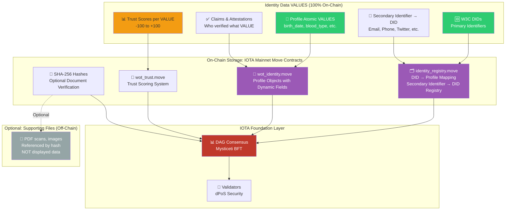
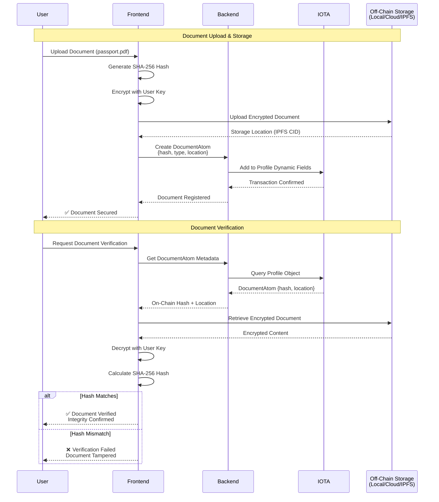

# 09: Data Storage and Asset Management

> **Current Status: 100% On-Chain Data VALUES (December 2025)**
> This document outlines wot.id's data storage architecture. **Currently Operational**: W3C DIDs, email→DID mappings, profile creation, on-chain attestations via wot_trust.move, and Health Section bulk CSV import (Dec 2025). **Future Development**: Additional atomic data types are planned. The foundational identity registry and attestation system are live on IOTA mainnet Protocol 17 with iota-sdk v1.13.1 (Move contracts v1.11.0 are backward compatible).

## 1. Introduction

This document outlines the wot.id project's comprehensive strategy for data storage and digital asset management. The approach is designed to be secure, decentralized, and user-centric, aligning with the core principles of Self-Sovereign Identity (SSI) and absolute user control.

**Core Architecture Principle: 100% On-Chain Data VALUES**

All identity data VALUES—the actual information that defines a person or entity—are stored 100% on-chain on the IOTA Tangle using Move smart contracts. Supporting document FILES (PDFs, images) may optionally be stored off-chain with cryptographic verification, but the data VALUES themselves are always on-chain.

### 1.1. Storage Architecture Overview

The wot.id storage strategy ensures all data VALUES are on-chain for security, immutability, and true decentralization:



**Key Architecture Principles:**

**100% On-Chain (IOTA Tangle):**
- ✅ **All Data VALUES**: Passport number, birth date, blood type, lab results, credentials
- ✅ **Primary Identifiers**: W3C-compliant DIDs (`did:iota:mainnet:...`)
- ✅ **Secondary Identifier Mappings**: Generic (type, value) → DID registry (email, phone, social in identity_registry.move)
- ✅ **Trust Scores**: Each VALUE has its own trust score (-100 to +100)
- ✅ **Claims & Attestations**: Who verified which VALUE, when, and with what credibility
- ✅ **No Traditional Database**: Blockchain is the single source of truth

**Optional Off-Chain (Supporting Files Only):**
- 📄 **Document FILES**: PDF scans (passport.pdf, lab_report.pdf), photos, certificates
- 🔐 **Cryptographic Verification**: SHA-256 hash stored on-chain to verify file integrity
- 💾 **Storage Options**: Local device, user's cloud (encrypted), or IPFS
- ⚠️ **Not for Display**: ME page displays on-chain VALUES, not off-chain files
- ⚠️ **Verification Only**: Files used to prove VALUES, not to store VALUES

## 2. Core Principles for Data and Asset Management

The management of data and digital assets within wot.id is guided by several foundational technical design principles:

*   **100% On-Chain Data VALUES Storage**: All identity data VALUES are stored on the IOTA Tangle as immutable, auditable records. This includes W3C-compliant DIDs, identity attributes, trust scores, claims, and attestations. Supporting document FILES (PDFs, images) may optionally be stored off-chain with cryptographic verification via on-chain SHA-256 hashes.
*   **Atomic Data Structure**: Data, including identity attributes and asset components, is structured as atomic, independently manageable fragments (VALUES). Each atomic VALUE can have its own trust score and attestations. This enhances modularity, auditability, user control, and allows for selective disclosure and recomposition as needed. (As per Technical Design Principle #6, `docs/01_Project_Overview_And_Principles.md`)
*   **Trust Score per VALUE**: Each atomic data VALUE has its own trust score (-100 to +100) based on attestations from trusted entities. For example, a lab result VALUE attested by a certified lab receives a high trust score (+100), while a claim attested by fake accounts receives a low trust score (-100). This is wot.id's core web of trust functionality.
*   **Security and Privacy by Design**: Security and privacy are integral to the storage architecture. This includes robust encryption, access control mechanisms, and data minimization practices. (As per Technical Design Principle #5, `docs/01_Project_Overview_And_Principles.md`)
*   **User Control and Sovereignty**: Users maintain absolute control and ownership over their data and digital assets, deciding what is stored, how it is shared, and with whom.

## 3. On-Chain Storage (IOTA Mainnet with Move)

**Current Implementation Status (January 2026)**:

**✅ OPERATIONAL:**
- W3C DID Core 1.0 compliant identifiers (Ed25519 + BLAKE3)
- Email → DID secondary identifier mappings
- Profile creation with gas sponsorship (hybrid economic model)
- On-chain attestations via wot_trust.move (Nov 19, 2025)
- Identity registry for DID → Profile lookups
- **No traditional database** - blockchain is the single source of truth
- **Health Section** with bulk CSV import (Dec 2025):
  - Wide format support (lab report style with dates as columns)
  - German parameter name translation (Kreatinin → creatinine)
  - Auto-category inference (lipid, cardiac, kidney, etc.)
  - Sequential on-chain storage with trust score +30 (self-declared)
- **Personal Wallets**: Auto-assigned IOTA wallet per user (Dec 2025)
- **Transfer System**: User-funded IOTA/object transfers with QR codes
- **PQC Health Encryption** (Dec 23, 2025):
  - Hybrid X25519 + ML-KEM-768 encryption for health atom values
  - ChaCha20-Poly1305 authenticated encryption
  - On-chain structs: `HybridPublicKey`, `EncryptedDEK`, `EncryptedField`
  - Client-side only - server never sees plaintext health data
  - BIP-39 mnemonic backup/recovery for encryption keys
- **PQC Identity Encryption** (Dec 29, 2025):
  - All identity fields encrypted client-side before saving
  - Complete round-trip: encrypt → save → fetch → decrypt → display
  - On-chain struct: `EncryptedIdentityClaim` with `value_enc` field
  - Stable fieldId pattern: `identity.{fieldName}` for key derivation
  - Backend detects encrypted claims, returns `value_enc` in API responses
  - Frontend `getDecryptedValue()` helper for transparent decryption
- **Wallet Persistence** (Dec 24, 2025):
  - On-chain wallet address storage via dynamic fields
  - Mnemonic recovery for wallet restoration after redeploys
- **Performance Optimizations** (Dec 24, 2025):
  - Batch RPC for health atoms (2+ min → ~2 sec, 60x faster)
  - Batch RPC for attestations (20-50 sec → ~2 sec)
  - Paginated event queries (up to 2000 attestations)

**⏳ PLANNED (Not Yet Implemented):**
- Additional atomic data types (DocumentAtom, AssetAtom, etc.)
- Document verification with SHA-256 hashes
- IPFS integration for off-chain files
- IOTA Kiosk for asset management
- P2P end-to-end encryption (Signal Protocol or PQC)

**⚠️ KNOWN ISSUES:**
- Health Section bulk import: API version mismatch after ~20 transactions (needs IOTA client update)

### 3.1. Identity Registry Architecture (✅ Operational)

*   **Identity Registry Contract** (`identity_registry.move`):
    *   **Deployed**: October 3, 2025
    *   **Package ID**: `0x114f0cd13ec12acc29a49c7a76ffa8dbe809b4d8695e32b2b55f26b535214727`
    *   **Registry Object**: `0xca0566a2c5b0a060ae9c5bb95ff440224d314af74fb46f2ba3b380f03727b4c6` (shared object)
    *   **Purpose**: Maintains decentralized mapping of DID → Profile Object ID
    *   **Storage Pattern**: Uses dynamic fields for efficient key-value lookups
    *   **Decentralization**: Shared object with no single owner - anyone can query

*   **Profile Objects** (`wot_identity.move`):
    *   Each identity profile is a Move object owned by its controller address
    *   Stores: DID, claims, trust algorithm config, timestamps, counters
    *   Uses dynamic fields for flexible claim storage and atomic data

*   **Event-Based Indexing**:
    *   Registry emits `ProfileRegistered` events on each registration
    *   Backend queries events via `iotax_queryEvents` RPC method
    *   Once profile ID found, fetches full object via `iota client object` CLI

### 3.1.1. PQC Encrypted Identity Storage (December 2025)

**Implementation Status**: ✅ **Fully Operational - Smart Contract v6 (December 30, 2025)**

Identity fields are stored encrypted on-chain using post-quantum resistant encryption:

**On-Chain Storage Structure**:
```move
public struct EncryptedIdentityClaim has store, drop {
    claim_type: String,         // "first_name", "date_of_birth", etc.
    value_enc: EncryptedField,  // Encrypted value (never plaintext)
    trust_score: i16,           // -100 to +100
    attestation_count: u32,
    privacy_level: u8,
    attested_by: vector<address>,
    created_at: u64,
    updated_at: u64,
}

public struct EncryptedField has store, drop, copy {
    version: u8,            // Encryption version (1)
    scheme: u8,             // 1=ChaCha20-Poly1305, 2=AES-256-GCM
    nonce: vector<u8>,      // 12-byte nonce
    ciphertext: vector<u8>, // Encrypted data with auth tag
}
```

**Storage Round-Trip**:
```
SAVE PATH:
1. User enters "John" → Frontend encrypts → {v:1, s:1, n:"base64", c:"base64"}
2. POST /api/identity/me → Backend → PTB(update_claim_encrypted) → Chain
3. EncryptedIdentityClaim stored with value_enc field

FETCH PATH:
1. GET /api/identity/me → Backend fetches from chain
2. Backend detects value_enc → Returns {value: null, value_enc: {v,s,n,c}}
3. Frontend decrypts → Displays "John"
```

**Key Storage Properties**:
- ✅ **Zero-Knowledge Storage**: Chain never sees plaintext
- ✅ **Field Isolation**: Each field (`identity.first_name`) has unique key
- ✅ **Backward Compatible**: Plaintext claims still work via fallback
- ✅ **Trust Scores Preserved**: Encrypted claims still have trust_score

**Encrypted Identity Fields**:
| Field | On-Chain Key | Storage Format |
|-------|--------------|----------------|
| First Name | `identity.first_name` | EncryptedIdentityClaim |
| Middle Name | `identity.middle_name` | EncryptedIdentityClaim |
| Family Name | `identity.family_name` | EncryptedIdentityClaim |
| Nickname | `identity.nickname` | EncryptedIdentityClaim |
| Date of Birth | `identity.date_of_birth` | EncryptedIdentityClaim |
| Nationality | `identity.nationality` | EncryptedIdentityClaim |
| Gender | `identity.gender` | EncryptedIdentityClaim |

**Reference**: `docs/2025_Code_Work/25-12-29_Frontend_Data_Decryption_And_Display.md`

### 3.2. What Lives On-Chain (100% of Data VALUES)

**All Identity Data VALUES** (the actual information displayed on ME page):
- **Primary Identifiers**: W3C-compliant DIDs (`did:iota:mainnet:...`)
- **Secondary Identifier Mappings**: Generic (type, value) → DID registry (email first, then phone, Twitter, GitHub, etc.)
- **Atomic Data VALUES**: 
  - Personal: `birth_date: "1990-01-01"`, `blood_type: "O+"`, `email: "user@example.com"`
  - Health: `ldl_cholesterol: "31 mg/dl"`, `hdl_cholesterol: "60 mg/dl"`
  - Identity: `passport_number: "AB123456"`, `driver_license: "DL789012"`
- **Trust Score per VALUE**: Each VALUE has score -100 to +100
- **Claims & Attestations**: Who verified each VALUE, when, and with what authority
- **Profile Metadata**: Controller address, creation timestamp, update history
- **SHA-256 Hashes**: Optional cryptographic links to verify off-chain document FILES

**Move Smart Contracts for Identity Management**:
- `identity_registry::register_profile()`: Register DID and secondary identifier→DID mapping
- `identity_registry::lookup_by_did()`: Query profile ID by DID
- `identity_registry::lookup_by_identifier()`: Query DID by (type, value) - generic for any identifier
- `wot_identity::create_identity()`: Create new profile object with dynamic fields
- `wot_trust::add_attestation()`: Add trust score to a VALUE
- All data secured by IOTA mainnet consensus (Mysticeti BFT)

### 3.3. Atomic Data Structure Architecture

wot.id implements a modular, atomic data structure where identity is composed of independent, manageable fragments:

```mermaid
graph TD
    PROFILE[👤 Identity Profile Object<br/>Core Container on IOTA]
    
    subgraph "Personal Data Atoms"
        CONTACT[📞 ContactAtom<br/>Email, Phone, Address]
        BIO[🧬 BiometricAtom<br/>Fingerprints, Face ID]
        EMO[❤️ EmotionalAtom<br/>Wellbeing, Mental Health]
    end
    
    subgraph "Professional Data Atoms"
        EDU[🎓 EducationAtom<br/>Degrees, Certifications]
        WORK[💼 WorkAtom<br/>Employment History]
        SKILL[🛠️ SkillAtom<br/>Competencies, Expertise]
    end
    
    subgraph "Health Data Atoms"
        HEALTH[⚕️ HealthAtom<br/>Lab Results, Vitals]
        MED[💊 MedicationAtom<br/>Prescriptions, Allergies]
        GENETIC[🧬 GeneticAtom<br/>DNA Data, Ancestry]
    end
    
    subgraph "Asset Data Atoms"
        DOC[📄 DocumentAtom<br/>Passports, IDs]
        ASSET[💎 AssetAtom<br/>Ownership Records]
        ACCOUNT[🏦 AccountAtom<br/>Financial Accounts]
    end
    
    subgraph "Trust Data Atoms"
        ATTEST[✅ AttestationAtom<br/>Verifications, Signatures]
        REP[⭐ ReputationAtom<br/>Trust Scores, Ratings]
        CERT[🏆 CertificationAtom<br/>Professional Licenses]
    end
    
    PROFILE --> CONTACT
    PROFILE --> BIO
    PROFILE --> EMO
    PROFILE --> EDU
    PROFILE --> WORK
    PROFILE --> SKILL
    PROFILE --> HEALTH
    PROFILE --> MED
    PROFILE --> GENETIC
    PROFILE --> DOC
    PROFILE --> ASSET
    PROFILE --> ACCOUNT
    PROFILE --> ATTEST
    PROFILE --> REP
    PROFILE --> CERT
    
    style PROFILE fill:#2ecc71,color:#fff
    style CONTACT fill:#3498db,color:#fff
    style EDU fill:#9b59b6,color:#fff
    style HEALTH fill:#e74c3c,color:#fff
    style DOC fill:#f39c12
    style ATTEST fill:#16a085,color:#fff
```



**Benefits of Atomic Structure:**
- ✅ **Selective Disclosure**: Share only specific atoms (e.g., education, not health)
- ✅ **Granular Privacy**: Field-level access control for each atom type
- ✅ **Independent Updates**: Modify one atom without affecting others
- ✅ **Modular Verification**: Separate attestations for different data types
- ✅ **Scalable Storage**: Add new atom types without schema changes
- ✅ **Context-Specific Sharing**: Different atoms for different use cases
- ✅ **Trust Score per VALUE**: Each atomic VALUE within an atom has its own trust score

**Example: HealthAtom with Trust Scores**
```
HealthAtom {
  ldl_cholesterol: {
    value: "31 mg/dl",
    trust_score: +100.00,  // Attested by certified lab
    attested_by: "did:iota:mainnet:certified_lab_xyz",
    attested_at: "2023-11-09"
  },
  blood_type: {
    value: "O+",
    trust_score: +95.00,  // Attested by hospital + doctor
    attested_by: ["did:iota:mainnet:hospital_abc", "did:iota:mainnet:doctor_123"]
  }
}
```

## 4. Optional Off-Chain Storage: Supporting Document FILES Only

**⚠️ CRITICAL: This section describes OPTIONAL storage for supporting document FILES, not data VALUES.**

All identity data VALUES are 100% on-chain. This section describes an optional mechanism for users to store supporting document FILES (like PDF scans, photos) off-chain while maintaining cryptographic verification via on-chain hashes.

**What This Is:**
- **Optional**: Users can choose to store document FILES or not
- **Verification Only**: These files VERIFY on-chain VALUES, they don't replace them
- **Not Displayed**: ME page displays on-chain VALUES, not these files
- **Examples**: `passport_scan.pdf` verifies on-chain `passport_number: "AB123456"`

**What This Is NOT:**
- ❌ Not a "hybrid" data storage model
- ❌ Not where data VALUES are stored
- ❌ Not required for the system to function
- ❌ Not displayed on the ME page

### 4.1. Document FILES That May Live Off-Chain (Optional)

*   **Supporting Document FILES**: PDF scans, images, videos (e.g., `passport.pdf`, `lab_report.pdf`)
*   **Photo FILES**: Profile photos, ID card scans, certificate images
*   **Media FILES**: Videos, audio files (for verification purposes)
*   **Verifiable Credential FILES**: Full VC document PDFs (on-chain stores the claims as VALUES)

### 4.2. Deterministic Linking Mechanism

**On-Chain Anchor** (stored in identity profile's dynamic fields):
```move
// Document reference stored on-chain
public struct DocumentAtom has store, drop {
    doc_type: String,           // "passport", "degree", "medical_record"
    doc_hash: String,           // SHA-256 hash of document content
    issuer: String,             // DID of document issuer
    issue_date: u64,            // Timestamp
    expiry_date: Option<u64>,   // Optional expiration
    metadata: String,           // IPFS CID or storage location
}
```

**Off-Chain Storage**:
- **Location**: User's local device, encrypted cloud storage, or IPFS
- **Verification**: Document hash on-chain ensures integrity
- **Retrieval**: Metadata field contains storage location (IPFS CID, URL, local path)
- **Privacy**: Documents encrypted before storage, user controls decryption keys

### 4.3. Storage Options

**Local Storage**:
- User device (mobile, desktop)
- Encrypted with user-controlled keys
- Full privacy, no third-party access
- User responsible for backups

**Cloud Storage** (User-Controlled):
- User's own cloud account (Google Drive, Dropbox, iCloud)
- Encrypted before upload using user keys
- Deterministic path: `wot.id/{did}/{doc_hash}.enc`
- On-chain metadata points to cloud location

**IPFS (Decentralized)**:
- Content-addressed storage (CID automatically verifies integrity)
- Censorship-resistant, globally distributed
- On-chain stores IPFS CID for retrieval
- Encrypted content for privacy

### 4.4. Document Verification Flow

The following diagram illustrates the complete flow for storing and verifying documents with cryptographic integrity:



**Security Features:**
- 🔐 **SHA-256 Hashing**: Cryptographic integrity verification
- 🔒 **User-Controlled Encryption**: Only user can decrypt documents
- ⛓️ **Immutable On-Chain Anchor**: Hash stored on IOTA mainnet
- 🌐 **Flexible Storage**: Works with local, cloud, or IPFS
- ✅ **Tamper Detection**: Any modification detected immediately

### 4.5. Access Control and Encryption

*   **User-Controlled Keys**: User generates and manages encryption keys
*   **Selective Disclosure**: Share specific documents by sharing decryption keys
*   **Time-Limited Access**: Temporary keys for medical consultations, verifications
*   **Zero-Knowledge Proofs**: Prove document properties without revealing content

## 5. Digital Asset Management in wot.id

`wot.id` aims to be a versatile platform for the secure creation, management, storage, and peer-to-peer transfer of a wide spectrum of digital and digitized assets. This technical capability is a cornerstone of the project's user adoption strategy. By enabling users to create and control tangible digital property, features like the **IOTA Kiosk** directly enhance the **"Observability"** and **"Trialability"** of the platform, making its benefits visible and easy to experience, as detailed in `docs/11_Onboarding_And_Adoption.md`.

This vision encompasses everything from custom cryptocurrencies and utility tokens to unique digital collectibles (NFTs), representations of real-world assets (RWAs), and in-game items. The platform leverages IOTA mainnet, with its robust Move smart contract capabilities, to provide a flexible and secure environment for diverse asset types.

### 5.0.1. Digital Asset Types Taxonomy

The wot.id platform supports a comprehensive taxonomy of digital asset types:

```mermaid
graph TB
    ROOT[🌐 wot.id Digital Assets]
    
    ROOT --> FUNGIBLE[💰 Fungible Assets]
    ROOT --> NFT[🎨 Non-Fungible Assets]
    ROOT --> RWA[🏢 Real-World Assets]
    ROOT --> IDENTITY[🆔 Identity Assets]
    ROOT --> GAMING[🎮 Gaming Assets]
    
    FUNGIBLE --> IOTA[💎 IOTA Coins<br/>Native Currency]
    FUNGIBLE --> CUSTOM_TOKEN[🪙 Custom Tokens<br/>ERC-20 Equivalent]
    FUNGIBLE --> UTILITY[🎫 Utility Tokens<br/>Platform Services]
    FUNGIBLE --> GOV[🗳️ Governance Tokens<br/>DAO Voting]
    FUNGIBLE --> CLOSED[🔒 Closed-Loop Tokens<br/>Restricted Transfer]
    
    NFT --> ART[🖼️ Digital Art<br/>Unique Collectibles]
    NFT --> MUSIC[🎵 Music NFTs<br/>Audio Ownership]
    NFT --> CERT_NFT[🏆 Certificates<br/>Achievement Proof]
    NFT --> LAND[🗺️ Virtual Land<br/>Metaverse Property]
    NFT --> DOMAIN[🌐 Domain Names<br/>Web3 Identifiers]
    
    RWA --> PROPERTY[🏠 Real Estate<br/>Tokenized Buildings]
    RWA --> SECURITY[📈 Securities<br/>Stocks, Bonds]
    RWA --> COMMODITY[⚡ Commodities<br/>Gold, Energy]
    RWA --> VEHICLE[🚗 Vehicles<br/>Cars, Boats]
    RWA --> IP[💡 Intellectual Property<br/>Patents, Trademarks]
    
    IDENTITY --> DID[🆔 Decentralized IDs<br/>W3C DIDs]
    IDENTITY --> VC[📜 Verifiable Credentials<br/>Attestations]
    IDENTITY --> ATTEST[✅ Attestations<br/>Trust Signatures]
    IDENTITY --> LICENSE[📋 Professional Licenses<br/>Certifications]
    IDENTITY --> REPUTATION[⭐ Reputation Scores<br/>Trust Metrics]
    
    GAMING --> CHARACTER[🦸 Characters<br/>Player Avatars]
    GAMING --> WEAPON[⚔️ Weapons & Armor<br/>Equipment]
    GAMING --> CURRENCY[💰 In-Game Currency<br/>Virtual Gold]
    GAMING --> SKIN[🎨 Skins & Cosmetics<br/>Visual Items]
    GAMING --> ACHIEVEMENT[🏅 Achievements<br/>Game Progress]
    
    style ROOT fill:#2ecc71,color:#fff
    style FUNGIBLE fill:#f39c12
    style NFT fill:#9b59b6,color:#fff
    style RWA fill:#e74c3c,color:#fff
    style IDENTITY fill:#3498db,color:#fff
    style GAMING fill:#16a085,color:#fff
```



**Asset Implementation:**
- 🏗️ **Move Smart Contracts**: All asset logic on IOTA mainnet
- 🔐 **Ownership**: Tied to user DIDs for self-sovereign control
- 🔄 **Transferability**: P2P transfers via Programmable Transaction Blocks
- 📊 **Core Metadata On-Chain**: Asset type, owner DID, attributes, trust scores
- 📄 **Optional Rich Media Off-Chain**: Large images/videos with on-chain hash verification
- 🎯 **Standards**: IOTA Coin Standard, Custom NFT structs, Kiosk pattern

### 5.1. Core Technologies and Standards

The foundation for asset management within `wot.id` relies on:

*   **IOTA Mainnet Move Smart Contracts**: All asset logic, including definition, ownership, and transfer rules, is implemented using Move smart contracts on IOTA mainnet, benefiting from Move's safety and expressiveness.
*   **Programmable Transaction Blocks (PTBs)**: All on-chain asset operations (creation, transfer, updates, burning) are executed atomically within PTBs, ensuring consistency and preventing partial state changes.
*   **Decentralized Identifiers (DIDs)**: User DIDs (as detailed in `docs/04_Backend_And_Identity_Service.md` and `docs/05_Move_Smart_Contracts.md`) are central to asset ownership, providing a secure and self-sovereign anchor for controlling digital property.
*   **Verifiable Credentials (VCs)**: VCs can be used to attest to asset properties, provenance, or associated rights, enhancing trust and enabling complex interactions (see `docs/07_Trust_Architecture_And_Management.md`).

### 5.2. Fungible Assets (Tokens)

`wot.id` supports various types of fungible tokens through standardized IOTA Move modules:

*   **IOTA Coin Standard ([`iota::coin`](https://docs.iota.org/smart-contracts/guide/token_standards/iota_coin))**:
    *   **Purpose**: This module provides an ERC-20 equivalent standard for creating general-purpose fungible tokens on IOTA mainnet.
    *   **Capabilities**: It supports core functionalities such as defining a token (name, symbol, decimals), minting new tokens, burning existing tokens, transferring tokens between addresses or objects, and querying balances.
    *   **Use Cases**: Custom cryptocurrencies, utility tokens for accessing platform services, governance tokens for DAOs, community currencies, and more.
*   **Regulated and Specialized Tokens**:
    *   **`CoinManager` Standard**: For tokens requiring more sophisticated supply management or metadata controls, the `CoinManager` standard offers enhanced functionalities.
    *   **Closed-Loop Token Standard ([`iota::token`](https://docs.iota.org/smart-contracts/guide/token_standards/closed_loop_token))**: This standard is designed for tokens with restricted functionalities, where actions like transfers or conversions are subject to specific policies defined within the smart contract. This is ideal for loyalty points, in-game currencies that should not leave the game ecosystem, or other specific-purpose tokens.
*   **Bridged Assets**: While requiring further specific implementation for cross-chain communication and security, the `wot.id` architecture, combined with IOTA's interoperability features, can be extended to represent and manage assets bridged from other blockchain networks. This would involve locking assets on one chain and minting corresponding "wrapped" tokens on IOTA mainnet.

### 5.3. Non-Fungible Assets (NFTs)

`wot.id` provides robust support for Non-Fungible Tokens, allowing for unique digital asset representation:

*   **Custom NFT Implementation**: NFTs are typically defined as custom Move structs possessing the `key` and `store` abilities. Each NFT object has a unique `id: UID` and can include various fields for attributes and metadata.
*   **Metadata Management**:
    *   **On-Chain Core Metadata** (100%): Name, symbol, attributes, owner DID, creation timestamp, trust scores
    *   **Optional Off-Chain Rich Media FILES**: Large image/video files can optionally be stored on IPFS or user's cloud
    *   **Cryptographic Verification**: If rich media is used, on-chain stores SHA-256 hash or IPFS CID for verification
    *   **Display Priority**: UI displays on-chain metadata first; rich media is optional supplementary content
*   **Use Cases**:
    *   Digital art and collectibles.
    *   Certificates of authenticity or ownership.
    *   Licenses and intellectual property rights.
    *   Unique identifiers for tokenized Real-World Assets (RWAs).
    *   In-game items with unique properties.
*   **IOTA NFT Standards (e.g., IRC27)**: While IRC27 primarily defines L1 native NFTs, its principles (like collection identity and metadata structure) can inspire and guide the design of L2 Move-based NFT implementations for consistency and interoperability within the broader IOTA ecosystem.

### 5.4. Representing Real-World Assets (RWAs)

`wot.id` can facilitate the tokenization of Real-World Assets, bridging the gap between physical/traditional assets and the digital realm:

*   **Tokenization Model**: RWAs can be represented as NFTs (for unique assets like real estate or art) or potentially as fungible tokens (for fractional ownership of an asset). The specific Move contract will define the link to the RWA and the rights of the token holder.
*   **Role of Verifiable Credentials**: VCs play a crucial role in RWA tokenization by providing verifiable attestations about the asset's existence, condition, provenance, legal ownership, and compliance with regulations. These VCs can be issued by trusted third parties (custodians, legal entities, auditors).
*   **Oracles and Legal Integration**: Secure integration with oracles may be necessary to bring external data about RWAs (e.g., market prices, status updates) on-chain. Furthermore, the legal enforceability of RWA token rights depends on the underlying legal frameworks, which must be considered in the design. Any disputes arising from RWA management fall under the project's high-level governance model, detailed in `docs/10_Governance_And_Conflict_Resolution.md`.

### 5.5. Gaming Assets

The platform is well-suited for managing diverse in-game assets:

*   **Unique Items as NFTs**: Weapons, armor, characters, land plots, and other unique in-game items can be represented as NFTs, giving players true ownership and the ability to trade them securely.
*   **In-Game Currencies**: Fungible tokens, created using `iota::coin` (for open economies) or `iota::token` (for closed-loop game economies), can serve as in-game currency.
*   **Interoperability**: While game-specific, `wot.id`'s common infrastructure can foster interoperability of assets across different games or metaverses built on or integrated with the platform, if desired by game developers.

### 5.6. Asset Lifecycle Management (Common Operations)

Regardless of the asset type, common lifecycle operations are managed through Move smart contracts. The **`Backend API`** constructs and submits PTBs via **IOTA CLI** (not SDK) to execute these on-chain actions:

*   **Creation (Minting)**: Assets are brought into existence by invoking specific functions (e.g., `mint`, `create`) on their respective Move contracts. This can be controlled by authorized minters or follow predefined rules.
*   **Ownership and Control**: Ownership is typically tied to a user's DID or a Move object they control (like a Kiosk). Advanced ownership models like multi-signature control or contract-based ownership (e.g., for DAOs) are possible.
*   **Transfer**: Peer-to-peer transfers are executed via PTBs. This can involve calling the standard `iota::transfer::public_transfer` function for objects with `store` or custom transfer functions defined in the asset's contract to enforce specific rules (e.g., royalties, transfer restrictions).
*   **Updates/Modification**: For assets with mutable properties or metadata, dedicated contract functions allow authorized updates.
*   **Burning**: Assets can be permanently removed from circulation by invoking burn functions, which destroy the asset object.

### 5.7. Advanced Asset Interactions with the IOTA Kiosk Pattern

To provide a richer user experience for managing a diverse portfolio of assets, `wot.id` can leverage the **[IOTA Kiosk](https://docs.iota.org/smart-contracts/guide/token_standards/kiosk)** standard:

*   **Concept**: A Kiosk is a user-owned Move object that acts as a personal, on-chain "shop" or "vault." It can securely hold various types of assets (both fungible tokens and NFTs) owned by the user.
*   **Functionality**:
    *   **Aggregated Asset Management**: Users can see and manage all their different assets through their Kiosk.
    *   **Direct Sales & Trading**: Kiosks can facilitate peer-to-peer sales of assets. A user can list an asset for sale in their Kiosk, and another user can purchase it directly by interacting with the Kiosk contract.
    *   **Offers and Auctions**: The Kiosk pattern can be extended (often via Kiosk Apps) to support offer systems, auctions, or other sophisticated trading mechanisms.
    *   **Lending/Borrowing (Potential)**: With appropriate Kiosk App extensions, assets held in a Kiosk could potentially be used in lending or collateralization protocols.
*   **Extensibility with Kiosk Apps**: The IOTA Kiosk standard allows for "Kiosk Apps," which are separate Move modules that can extend the functionality of a Kiosk without modifying its core code or moving the assets. This enables features like custom marketplaces, royalty enforcements, or unique trading rules.

By integrating the Kiosk pattern, `wot.id` can offer users a powerful and unified interface for interacting with the full spectrum of their digital assets.

#### 5.7.1. IOTA Kiosk Architecture Visualization

```mermaid
graph TB
    subgraph "User Identity"
        USER[👤 User DID<br/>Self-Sovereign Identity]
    end
    
    subgraph "Personal Kiosk: User's On-Chain Vault"
        KIOSK[🏪 IOTA Kiosk Object<br/>Personal Asset Manager]
        
        subgraph "Fungible Assets"
            IOTA_TOKEN[💰 IOTA Coins]
            CUSTOM[🪙 Custom Tokens]
            UTILITY[🎫 Utility Tokens]
        end
        
        subgraph "Non-Fungible Assets"
            NFT_ART[🖼️ Digital Art NFTs]
            NFT_CERT[🏆 Certificates]
            NFT_ITEM[⚔️ Gaming Items]
        end
        
        subgraph "Real-World Assets"
            RWA_PROPERTY[🏠 Tokenized Real Estate]
            RWA_SECURITY[📈 Securities]
            RWA_COMMODITY[⚡ Commodities]
        end
        
        subgraph "Identity Assets"
            VC[📜 Verifiable Credentials]
            ATTEST[✅ Attestations]
            LICENSES[📋 Professional Licenses]
        end
    end
    
    subgraph "Kiosk Operations"
        LIST[📢 List for Sale]
        TRADE[🔄 P2P Trading]
        OFFER[💵 Accept Offers]
        LEND[🤝 Lending/Borrowing]
    end
    
    subgraph "Kiosk Apps: Extended Functionality"
        MARKET[🛒 Marketplace Integration]
        ROYAL[👑 Royalty Enforcement]
        AUCTION[🔨 Auction System]
        CUSTOM_RULES[⚙️ Custom Trading Rules]
    end
    
    USER --> KIOSK
    
    KIOSK --> IOTA_TOKEN
    KIOSK --> CUSTOM
    KIOSK --> UTILITY
    KIOSK --> NFT_ART
    KIOSK --> NFT_CERT
    KIOSK --> NFT_ITEM
    KIOSK --> RWA_PROPERTY
    KIOSK --> RWA_SECURITY
    KIOSK --> RWA_COMMODITY
    KIOSK --> VC
    KIOSK --> ATTEST
    KIOSK --> LICENSES
    
    KIOSK --> LIST
    KIOSK --> TRADE
    KIOSK --> OFFER
    KIOSK --> LEND
    
    LIST --> MARKET
    TRADE --> ROYAL
    OFFER --> AUCTION
    LEND --> CUSTOM_RULES
    
    style USER fill:#2ecc71,color:#fff
    style KIOSK fill:#3498db,color:#fff
    style IOTA_TOKEN fill:#f39c12
    style NFT_ART fill:#9b59b6,color:#fff
    style RWA_PROPERTY fill:#e74c3c,color:#fff
    style VC fill:#16a085,color:#fff
```



**Kiosk Benefits:**
- 🎯 **Unified Management**: All assets in one on-chain location
- 🔒 **Secure Storage**: Move object ownership model
- 💱 **Direct P2P Trading**: No intermediary marketplaces required
- 🔧 **Extensible**: Kiosk Apps add functionality without moving assets
- 🌐 **Interoperable**: Standard pattern across IOTA ecosystem

### 5.8. Security and Access Control for Assets

Security is paramount in asset management:

*   **Move's Safety Features**: The Move language's strong type system, ownership model, and resource safety prevent many common smart contract vulnerabilities.
*   **Capability-Based Access**: Contract functions are often protected using the capability pattern, ensuring that only entities holding the correct "capability" object (e.g., an `AdminCap`, `MintCap`) can perform sensitive operations.
*   **DID and VC Integration**: DIDs secure ownership, and VCs can be used to gate access to certain asset operations or prove eligibility for specific interactions.

### 5.9. Phase 2: Asset Governance and On-Chain Anchoring

**Democratic Asset Governance**:
Critical asset operations can be managed through proposal-based governance:

- **Asset Update Proposals**: Community-driven proposals for asset metadata or property changes
- **Transfer Governance**: Multi-signature or community approval for high-value asset transfers
- **Minting Governance**: Democratic control over asset creation and supply management
- **Burn Proposals**: Community decisions on asset destruction or retirement

**On-Chain Anchoring for Asset Provenance**:
Asset authenticity and provenance are natively anchored via wot.id's attestation system:

- **Creation Attestation**: On-chain SHA3-256 hash + timestamp for asset creation events
- **Transfer Attestation**: Immutable proof of ownership transfers with attester DID
- **Provenance Tracking**: Complete audit trail via attestation chain on IOTA mainnet
- **Authenticity Verification**: Independent verification via IOTA Explorer + attester trust scores

> **Note**: wot.id's attestation system provides notarization functionality natively—no separate
> IOTA Notarization SDK needed. See `docs/2026_Code_Work/26-01-03_IOTA_Notarization_vs_wotid.md`

**Governance Integration**:
```move
public struct AssetGovernanceProposal has key, store {
    id: UID,
    asset_id: address,
    proposal_type: String,
    proposed_changes: String,
    required_votes: u64,
    current_votes: u64,
    expires_at: u64,
}
```

This ensures transparent, democratic, and verifiable asset management.

## 6. Data Fragmentation and Recomposition

Consistent with the "Atomic Data Structure" principle:

*   Digital assets and associated data can be composed of smaller, independent fragments.
*   For example, a complex digital asset might have its core definition on-chain, while associated media or detailed documentation is stored off-chain as separate fragments, linked via identifiers.
*   Users can selectively disclose or share specific fragments of their assets or data, enhancing privacy and control.

**Example - Health Data Fragmentation:**
```
Profile Object (On-Chain)
├── HealthAtom: Lab Results
│   ├── Timestamp: 2025-10-01
│   ├── Hash: 975a54ffcf0ef9db
│   └── Privacy: Private
├── HealthAtom: Vitals
│   ├── Timestamp: 2025-10-05
│   ├── Hash: 2454c225a3a7f45f
│   └── Privacy: Shared with Doctor
└── DocumentAtom: Lab Report PDF
    ├── Hash: 70f5dde9f737ac38
    ├── Location: ipfs://Qm...
    └── Privacy: Private
```

## 7. Security and Privacy Considerations for Storage

*   **Data Minimization**: Only essential data required for the functioning and verification of assets and transactions is stored on-chain. Sensitive details are kept off-chain or managed through privacy-preserving techniques.
*   **Encryption**:
    *   **Off-Chain Data**: Strong encryption should be applied to sensitive off-chain data before it is stored, with users managing their encryption keys.
    *   **On-Chain Data**: While on-chain data is public, sensitive elements within on-chain structs could potentially be encrypted if the use case demands and Move's capabilities allow for practical on-chain decryption or zero-knowledge proofs for verification. (ZKPs mentioned in `docs/07_Trust_Architecture_And_Management.md`)
*   **Integrity and Verifiability**: Cryptographic hashes stored on-chain ensure the integrity of off-chain data. Any tampering with off-chain data would result in a hash mismatch.
*   **Access Control**: Robust access control mechanisms must be implemented for both on-chain contract interactions (e.g., using Move's capabilities pattern) and off-chain data stores.

## 8. Future Considerations

*   Exploration of advanced privacy-preserving storage techniques.
*   Integration with emerging decentralized storage networks and protocols.

---

## 📚 Data Storage Architecture Evolution

**September 2025**: Atomic data storage architecture validated with real health data  
**October 2025**: Enhanced with identity registry, same storage capabilities retained

### **✅ Current Data Storage Architecture (as of October 2025)**:

**Current Package**: `0x114f0cd13ec12acc29a49c7a76ffa8dbe809b4d8695e32b2b55f26b535214727` (October 2025)  
**Legacy Package**: `0x29ed9cc6400786c00b1e0a1a0c10238d18c2ba049a379a5ffa5f69c3e87e3c9f` (September 2025 - superseded)

#### **Atomic Data Structure Successfully Implemented**:

The atomic data structure principle has been proven with real-world health data:

**16 Atomic Data Types Operational**:
- HealthAtom, DocumentAtom, AssetAtom, ContactAtom, AccountAtom
- EducationAtom, WorkAtom, BiometricAtom, BehavioralAtom, CreativeAtom  
- LegalAtom, TravelAtom, ConsumptionAtom, SpiritualAtom, EmotionalAtom, CommunicationAtom

**Real Health Data Successfully Stored** (9 critical parameters):
1. **CK (Creatine Kinase)**: 77 U/l - Cryptographic hash: `975a54ffcf0ef9db`
2. **Troponin T**: 9.0 ng/ml - Cryptographic hash: `2454c225a3a7f45f`
3. **HbA1c**: 5.2% - Cryptographic hash: `70f5dde9f737ac38`
4. **LDL Cholesterol**: 31 mg/dl - Cryptographic hash: `3b9d58a7ad168222`
5. **HDL Cholesterol**: 60 mg/dl - Cryptographic hash: `52bf556e8c658257`
6. **CRP (Inflammation)**: <0.6 mg/l - Cryptographic hash: `33776934ce93e7ff`
7. **TSH (Thyroid)**: 2.43 mU/l - Cryptographic hash: `bc2861229d83cab0`
8. **Hemoglobin**: 14.6 g/dl - Cryptographic hash: `18641d40707c1b21`
9. **White Blood Cells**: 4.2 g/l - Cryptographic hash: `52bf556e8c658257`

#### **100% On-Chain Data VALUES Storage Proven**:

**All Health Data VALUES Stored On-Chain (IOTA L2)**:
- **Parameter VALUES**: `ldl_cholesterol: "31 mg/dl"`, `hdl_cholesterol: "60 mg/dl"`, etc.
- **Reference Ranges**: Normal ranges for each biomarker
- **Timestamps**: Test dates and update history
- **Trust Scores per VALUE**: Each lab result has its own trust score based on attestations
- **Cryptographic Proofs**: SHA256 hashes for optional PDF lab report FILES (off-chain)
- **Access Control Records**: Privacy levels and selective disclosure permissions
- **Medical Attestations**: Links to verifying doctor/lab DIDs

**Dynamic Fields for Health Collections**:
- **Temporal Indexing**: Multi-year health data with timestamp-based keys
- **Parameter Grouping**: Lab results organized by medical categories (cardiovascular, metabolic, etc.)
- **Privacy Hierarchies**: Field-level access control for selective disclosure
- **Trust Integration**: Each VALUE has attestation links for medical professional verification

**Optional Off-Chain**: Only PDF lab report FILES may be stored off-chain with on-chain hash verification. The actual data VALUES (31 mg/dl, 60 mg/dl, etc.) are 100% on-chain.

#### **Security and Privacy by Design Validated**:

- ✅ **Cryptographic Integrity**: All health data secured with blockchain immutability
- ✅ **Field-Level Privacy**: Granular access control for individual biomarkers
- ✅ **Selective Disclosure**: Choose specific health parameters to share with doctors
- ✅ **Time-Limited Access**: Temporary grants for medical consultations
- ✅ **Contextual Sharing**: Different access levels for emergency vs routine care

#### **Revolutionary Data Management Capabilities**:

1. **Personal Health Data Sovereignty**:
   - Complete individual ownership of medical data with cryptographic proof
   - Independence from healthcare institutions and data silos
   - Global accessibility without intermediaries

2. **Time-Series Health Analytics**:
   - Multi-year longitudinal health tracking (2021-2023 data processed)
   - Temporal trend analysis with cryptographic integrity
   - Anomaly detection and reference range compliance

3. **Privacy-Preserving Medical Sharing**:
   - QR code generation for instant secure sharing of specific lab values
   - Selective disclosure controls for doctor consultations
   - Cross-provider interoperability without data breaches

4. **Healthcare System Integration**:
   - Medical tourism with verified health records
   - Emergency care with instant critical health data access
   - Research participation with privacy preservation
   - Insurance verification with transparent health metrics

#### **Production Asset Management Validated**:

- ✅ **Real Medical Assets**: 9 health parameters as atomic digital assets on IOTA mainnet
- ✅ **Ownership Transfer**: Complete user control over health data sharing
- ✅ **Asset Lifecycle**: Creation, verification, and selective disclosure operational
- ✅ **Trust Integration**: Medical attestation system ready for doctor DIDs

**Data Storage Status**: ✅ **PRODUCTION VALIDATED** - Successfully managing world's first comprehensive health data sovereignty system on IOTA mainnet

