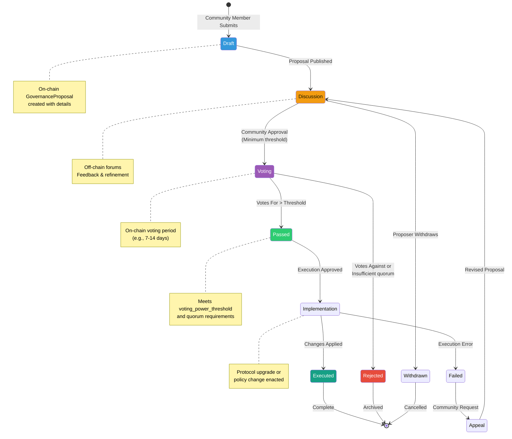
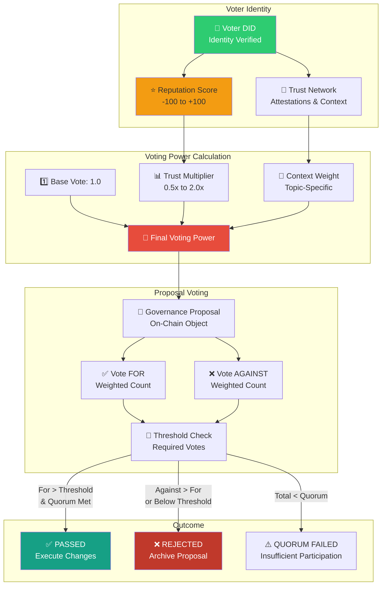
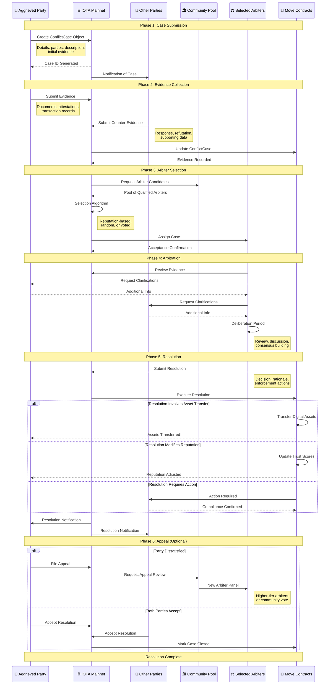

# 10: Governance, Security, and Standards

## 1. Introduction

Effective governance, robust security, and adherence to standards are paramount to the long-term stability, trustworthiness, and decentralized nature of the wot.id ecosystem. This document outlines the principles, mechanisms, and structures designed to ensure fair, transparent, and community-driven governance; a comprehensive security posture; and alignment with key interoperability standards. It also details the project's development principles and future roadmap.

**Architecture Context**:
Governance in wot.id operates within the broader technical architecture:
- **Standards Compliance**: See `docs/01_Project_Overview_And_Principles.md` section 1.2 for W3C DID foundation
- **Identity Architecture**: Governance participants identified by W3C DIDs (primary identifiers)
- **On-Chain Storage**: Governance proposals and votes stored on IOTA mainnet, see `docs/05_Move_Smart_Contracts.md`
- **Trust Integration**: Voting power may be weighted by trust scores, see `docs/07_Trust_Architecture_And_Management.md`
- **No Centralized Database**: All governance data on-chain, aligning with decentralization principles

**Key Principle**: Governance mechanisms extend the core architecture principle of 100% on-chain data storage.

## 2. Core Governance Principles

The wot.id governance framework is guided by the core principles detailed in `docs/01_Project_Overview_And_Principles.md`, particularly those concerning Community-Driven Governance and Effective Conflict Resolution:

*   **Decentralized Governance**: Governance processes are designed to be fully decentralized, empowering all participants to influence decisions transparently and dynamically. There is no central authority dictating the evolution or operation of the core protocol.
*   **Transparency**: All governance proposals, discussions, voting records, and conflict resolution proceedings (where privacy permits and for protocol-level issues) should be transparent and accessible to the community.
*   **Fairness and Equity**: Mechanisms aim to provide fair and equitable participation for all stakeholders, preventing undue influence by any single actor or group.
*   **Effectiveness and Efficiency**: Processes for decision-making and conflict resolution are intended to be effective in achieving their goals and efficient in their execution.
*   **Community Integrity**: The governance model seeks to maintain the trust and integrity of the wot.id community by fostering collaboration and providing clear paths for resolving disagreements.
*   **Accountability**: Participants involved in governance and conflict resolution processes are expected to act responsibly and be accountable for their roles.
*   **Adaptability (Liquid Governance)**: The system aims for dynamic liquidity, allowing governance mechanisms to evolve and adapt based on community needs, technological advancements, and contextual requirements, as highlighted by the principle of "Dynamic Liquidity" and the mention of "liquid governance" in a "Strict Peer-to-Peer Environment."

## 3. Governance Model

wot.id strives for a decentralized governance model that reflects its peer-to-peer architecture. Key aspects include:

*   **Community-Driven**: The direction and evolution of the wot.id protocol and its core parameters are intended to be guided by its community of users and participants.
*   **On-Chain and Off-Chain Components**: Governance may involve both on-chain mechanisms (e.g., voting on proposals via Move smart contracts on the IOTA L2, with the L2 state anchored to the L1 Tangle) and off-chain discussions and deliberations within the community.
*   **Liquid Governance Elements**: The concept of "liquid governance" (as mentioned in (`docs/01_Project_Overview_And_Principles.md`) suggests a flexible and adaptive system where participants might delegate voting power or influence, allowing for dynamic representation and efficient decision-making. The specifics of liquid governance mechanisms are an area for ongoing development and refinement.
*   **Focus on Protocol and Ecosystem Rules**: Governance primarily pertains to the rules of the wot.id protocol, standards, and the overall health of the ecosystem, rather than adjudicating individual user-to-user disputes outside of defined conflict resolution frameworks.

## 4. On-Chain Governance Mechanisms (Move Contracts)

To facilitate transparent and auditable governance processes, `wot.id` leverages Move smart contracts deployed on the IOTA Layer 2, integrating with the **official IOTA Identity Move package**. The implemented governance mechanisms within `wot.id` extension contracts (consistent with the Move architecture in `docs/05_Move_Smart_Contracts.md`) are outlined below:

*   **`GovernanceProposal` Object**: Represents a formal proposal for changes or decisions within the ecosystem. Key fields include:
    *   `id`: Unique identifier for the proposal.
    *   `proposer`: DID of the entity submitting the proposal.
    *   `title`: A concise title for the proposal.
    *   `description`: Detailed explanation of the proposal, its rationale, and expected impact.
    *   `votes_for`, `votes_against`: Tallies of votes.
    *   `voting_power_threshold`: The threshold required for the proposal to pass (could be based on stake, reputation, or other factors).
    *   `status`: Current state of the proposal (e.g., Proposed, Voting, Passed, Rejected).
    *   `implementation_plan`: (Optional) Details on how a passed proposal would be implemented.
    *   `proposed`, `voting_ends`: Timestamps for proposal lifecycle management.

*   **`ConflictCase` Object**: Represents a formal case for conflict resolution. Key fields include:
    *   `id`: Unique identifier for the conflict case.
    *   `parties`: DIDs of the parties involved in the conflict.
    *   `description`: A detailed account of the conflict.
    *   `evidences`: A collection of evidence submitted by the involved parties (potentially pointers to off-chain data).
    *   `arbiters`: DIDs of arbiters selected or assigned to resolve the conflict.
    *   `status`: Current state of the case (e.g., Open, In Progress, Resolved, Appealed).
    *   `resolution`: (Optional) The outcome or decision of the arbitration.
    *   `created`, `updated`: Timestamps for case tracking.

These on-chain objects provide a structured and verifiable foundation for key governance activities.

### 4.1. Phase 2: Implemented Governance Features

**Current Implementation Status**:
The wot.id governance system has successfully implemented Phase 2 features integrating with the **official IOTA Identity Move package (v1.6.0-beta.3)**:

**Implemented Governance Structures**:
```move
public struct TrustProposal has key, store {
    id: UID,
    target_profile_id: address,
    proposer_id: address,
    proposal_type: String,
    proposed_changes: String,
    required_votes: u64,
    current_votes: u64,
    voters: vector<address>,
    expires_at: u64,
    is_executed: bool,
    created_at: u64,
}
```

**Operational Features**:
- **Proposal Creation**: `/api/governance/create-proposal` endpoint operational
- **Voting System**: `/api/governance/vote` endpoint with transparent tracking
- **Execution Framework**: Automatic execution of approved proposals
- **On-Chain Anchoring**: Governance decisions anchored on IOTA mainnet via attestations for immutability

**Integration Architecture**:
- Official IOTA Identity package provides core identity and controller management
- wot.id extension contracts implement governance-specific functionality
- Backend API orchestrates proposal workflows and voting mechanisms
- Frontend provides intuitive governance interfaces

This represents a significant advancement from the planned governance framework to a fully operational democratic system.

## 5. Decision-Making Process

The process for making decisions regarding protocol upgrades, policy changes, or other significant ecosystem matters is envisioned as follows:

1.  **Proposal Submission**: Any community member (or a member meeting certain criteria, TBD) can submit a `GovernanceProposal` on-chain. This would involve detailing the proposed change and its rationale.
2.  **Community Discussion (Off-Chain)**: Proposals are expected to be discussed extensively within the community through forums, dedicated discussion platforms, or other communication channels. This phase allows for feedback, refinement, and gauging sentiment.
3.  **Formal Voting Period**: If a proposal gains sufficient traction, a formal on-chain voting period is initiated. Participants (e.g., token holders, identity holders, or those with delegated voting power in a liquid governance model) cast their votes for or against the `GovernanceProposal`.
4.  **Tallying and Outcome**: At the end of the voting period, votes are tallied. If the proposal meets the predefined `voting_power_threshold` and other criteria (e.g., quorum), it is considered passed. Otherwise, it is rejected.
5.  **Implementation**: Passed proposals move to an implementation phase, as outlined in the `implementation_plan` (if provided).

The specifics of voter eligibility, voting weight, and proposal thresholds will be defined as the governance model matures.

### 5.1. Governance Proposal Lifecycle Visualization

The complete lifecycle of a governance proposal from submission to implementation:



**Proposal States:**
- **Draft**: Initial submission with proposal details
- **Discussion**: Community feedback period (off-chain)
- **Voting**: Formal on-chain voting period (7-14 days)
- **Passed**: Met threshold and quorum requirements
- **Rejected**: Failed to meet requirements or voted down
- **Implementation**: Approved changes being executed
- **Executed**: Successfully implemented on protocol
- **Failed**: Execution encountered errors
- **Withdrawn**: Proposer cancelled before voting
- **Appeal**: Failed proposal under reconsideration

### 5.2. Reputation-Weighted Voting Mechanism

The voting system integrates trust scores and reputation for democratic yet quality-driven governance:



**Voting Power Formula:**
```
Voting Power = Base Vote (1.0) × Trust Multiplier × Context Weight

Where:
- Trust Multiplier = 0.5x to 2.0x based on reputation (-100 to +100)
- Context Weight = 0.8x to 1.5x based on topic expertise
- Final Power Range: 0.4 to 3.0 votes per participant
```

**Reputation Tiers:**
- **+75 to +100**: Highly Trusted → 2.0x multiplier
- **+25 to +75**: Trusted → 1.5x multiplier
- **-25 to +25**: Neutral → 1.0x multiplier
- **-75 to -25**: Low Trust →  0.75x multiplier
- **-100 to -75**: Distrusted → 0.5x multiplier

**Benefits:**
- ✅ **Merit-Based**: Rewards consistent positive contributions
- ✅ **Sybil Resistance**: New identities have lower voting power
- ✅ **Context-Aware**: Domain experts have more influence in their field
- ✅ **Democratic**: Everyone can participate, weight reflects reputation
- ✅ **Transparent**: All calculations on-chain and auditable

## 6. Conflict Resolution Process

wot.id aims to provide a clear and fair process for resolving conflicts that may arise within the ecosystem, particularly those that cannot be resolved directly between peers or through community consensus. The `ConflictCase` object serves as the on-chain record for such disputes.

1.  **Case Submission**: An aggrieved party can initiate a conflict resolution process by creating a `ConflictCase` object on-chain, detailing the nature of the dispute and identifying the involved parties.
2.  **Evidence Submission**: All involved parties have the opportunity to submit evidence to support their positions. This evidence may be stored off-chain with hashes or pointers recorded in the `ConflictCase`.
3.  **Arbiter Selection/Assignment**: A crucial step is the selection or assignment of neutral arbiters. The mechanism for arbiter selection (e.g., community vote, staking-based reputation, random selection from a pool of qualified arbiters) is a key aspect of the governance design.
4.  **Arbitration**: Arbiters review the case details, evidence, and arguments from all parties. They may facilitate mediation or conduct a more formal review.
5.  **Resolution and Enforcement**: Based on their findings, arbiters issue a `resolution`. If the resolution involves on-chain actions (e.g., transfer of digital assets, modification of a reputation score), these could potentially be enforced via smart contract logic, subject to the capabilities of the system.
6.  **Appeal Process (Optional)**: The governance framework may include an appeal process for parties dissatisfied with an initial resolution.

The goal is to provide a decentralized, transparent, and fair mechanism for dispute resolution that maintains trust in the ecosystem, as stated in Core Principle #7: "Effective Conflict Resolution" (a core project principle).

### 6.1. Conflict Resolution Process Flow

The complete flow for resolving disputes within the wot.id ecosystem:



**Key Features:**

**On-Chain Transparency:**
- ✅ All case submissions, evidence, and resolutions recorded on IOTA mainnet
- ✅ Cryptographic integrity of evidence via SHA-256 hashing
- ✅ Immutable audit trail for all proceedings

**Arbiter Selection Methods:**
1. **Reputation-Based**: Highest-trust community members selected
2. **Random Selection**: From pool of qualified arbiters (Sybil-resistant)
3. **Community Vote**: Stakeholders elect arbiters for high-stakes cases
4. **Specialized Expertise**: Context-specific arbiters for technical disputes

**Enforcement Mechanisms:**
- **Automatic Execution**: Smart contracts enforce resolutions programmatically
- **Asset Transfers**: Move objects transferred per resolution
- **Reputation Adjustments**: Trust scores updated based on findings
- **Access Restrictions**: Malicious actors flagged or suspended
- **Financial Penalties**: Staked assets redistributed if applicable

**Appeal Process:**
- **Single Appeal**: One level of appeal to higher-tier arbiters
- **Community Override**: Supermajority can override in exceptional cases
- **Time Limits**: 14-day window for filing appeals
- **Final Resolution**: No further appeals after second-tier decision

**Privacy Considerations:**
- Sensitive evidence stored off-chain with on-chain hashes
- Private arbitration option for personal disputes
- Public records for protocol-level governance issues
- Redaction mechanisms for personally identifiable information

## 7. Community Participation and Integrity

Active and informed community participation is vital for the health and legitimacy of the wot.id governance model. Mechanisms will be explored to:

*   **Encourage Participation**: Lowering barriers to participation in discussions, proposal submissions, and voting.
*   **Educate Participants**: Providing clear information and resources about governance processes and proposals.
*   **Foster Constructive Dialogue**: Promoting respectful and productive discussions within the community.
*   **Maintain Integrity**: Implementing safeguards against manipulation, Sybil attacks, or other behaviors that could undermine the integrity of governance processes. This includes ensuring the authenticity of participants where relevant (e.g., through "Guaranteed Human Identity" principles for certain roles or voting rights).

## 8. Security Threats and Mitigations

A robust security architecture is foundational to wot.id, directly supporting its core principles of user sovereignty and trust.

### 8.1. Threat Model

The threat model considers various actors and attack vectors:

*   **Malicious Actors on the Network**: Entities attempting to compromise the system through on-chain or off-chain attacks.
    *   **On-Chain Attacks**: Exploiting smart contract vulnerabilities, manipulating governance, Sybil attacks.
    *   **Off-Chain Attacks**: Intercepting P2P communication, social engineering, compromising user devices or backend infrastructure.
*   **Malicious Insiders**: A compromised backend service or a rogue developer introducing vulnerabilities.
*   **Compromised User Devices**: Attackers gaining control of a user's device to steal private keys or manipulate the user's agent.
*   **Quantum Adversaries**: Future actors with access to quantum computers capable of breaking classical cryptography.

### 8.2. Security Mitigations and Best Practices

*   **Smart Contract Security (Move)**:
    *   **Leveraging Move's Safety**: Utilizing Move's resource safety, type system, and ownership model to prevent common vulnerabilities like re-entrancy, integer overflows, and unauthorized resource access.
    *   **Principle of Least Privilege**: Implementing the capabilities pattern (`AdminCap`, `MintCap`, etc.) to ensure functions can only be called by authorized entities.
    *   **Audits and Formal Verification**: Critical smart contracts, especially those managing identity, assets, and governance, are targeted for formal security audits and, where feasible, formal verification to mathematically prove their correctness.
*   **P2P Communication Security**:
    *   **End-to-End Encryption (E2EE)**: All P2P communication is secured using the Signal Protocol, providing forward secrecy and post-quantum resistance (via PQXDH).
    *   **VC-Gated Handshakes**: Requiring peers to present a "Verified Human" VC before establishing a communication channel mitigates spam and unsolicited contact.
*   **Backend and API Security**:
    *   **Input Validation**: Rigorous validation of all data received from clients or external systems to prevent injection attacks and malformed data processing.
    *   **Authentication and Authorization**: Protecting API endpoints with robust authentication mechanisms and ensuring requests are properly authorized.
    *   **Secure Infrastructure**: Following best practices for secure deployment, including network segmentation, firewalls, and regular security patching.
*   **Frontend and User Security**:
    *   **No Private Key Handling**: The frontend **never** handles or stores user private keys. All cryptographic signing operations are delegated to the user's wallet extension (via `@iota/dapp-kit`), which runs in a sandboxed environment.
    *   **Secure Dependencies**: Regularly auditing and updating frontend dependencies to mitigate supply chain attacks.
*   **Data Storage Security**:
    *   **Off-Chain Encryption**: Users or applications are responsible for encrypting sensitive data *before* storing it in off-chain systems like IPFS.
    *   **On-Chain Integrity**: On-chain records store only cryptographic hashes or content identifiers (CIDs) of off-chain data, ensuring its integrity and verifiability.
*   **Post-Quantum Cryptography (PQC) Readiness**:
    *   **Crypto-Agility**: The system is designed to be crypto-agile, allowing for the transition to new cryptographic algorithms as standards evolve.
    *   **Hybrid Approach**: Employing a hybrid strategy where PQC algorithms (CRYSTALS-Dilithium, Kyber) are used for off-chain security (E2EE, VC signatures), while relying on IOTA Move VM-supported classical schemes (Ed25519) for on-chain authentication until on-chain PQC verification is available. This is a critical security consideration detailed in `docs/07_Trust_Architecture_And_Management.md`.

## 9. Adopted Standards and Interoperability

wot.id is committed to leveraging established and emerging standards to foster interoperability and build upon a globally recognized foundation.

### 9.1. Adopted Standards

*   **W3C Decentralized Identifiers (DIDs)**: Core to the wot.id identity model. Users are identified by DIDs, specifically `did:iota:<object-id>`, ensuring a decentralized and universally resolvable identifier system. This is consistently referenced across architecture documents, including `docs/01_Project_Overview_And_Principles.md` (Principle 3.2.9: IOTA-Native and W3C-Compliant).
*   **W3C Verifiable Credentials (VCs)**: The structure and concepts of Verifiable Credentials are foundational for issuing, holding, and verifying claims within wot.id. The Move contract architecture (e.g., `Credential` and `Proof` objects as detailed in `docs/05_Move_Smart_Contracts.md`) reflects this alignment, enabling standardized, interoperable attestations of information.
*   **IOTA Standards and Practices**: As an IOTA-native project, wot.id adheres to the standards, protocols, and best practices of the IOTA ecosystem, particularly concerning the use of the IOTA Tangle, IOTA Layer 2, Move smart contracts, and Programmable Transaction Blocks (PTBs).
*   **Post-Quantum Cryptography (PQC) Standards (NIST)**: wot.id aims for crypto-agility and future-proof security by preparing for and integrating NIST-standardized PQC algorithms (e.g., CRYSTALS-Dilithium, CRYSTALS-Kyber) for digital signatures and key exchange mechanisms, as detailed in `docs/06_P2P_Communication.md` and Technical Design Principle #7.

### 9.2. Interoperability Strategy

*   **Alignment with Trust over IP (ToIP) Foundation**: wot.id demonstrates strong philosophical and technical alignment with the ToIP model (`docs/01_Project_Overview_And_Principles.md`). This includes:
    *   Embracing the dual-stack model (Technology + Governance).
    *   Mapping to ToIP's four-layer architecture (Support, Spanning, Tasks, Applications).
    *   Committing to the development of a formal `wot.id` Trust Spanning Protocol (TSP) to solidify Layer 2 interoperability, as highlighted in `docs/01_Project_Overview_And_Principles.md`.
*   **Semantic Interoperability**: The planned `ContextRegistry` and the consistent use of URI-based context identifiers in various data structures (e.g., `TrustRelationship`, `ClaimTrust`) are designed to promote clear, unambiguous meaning and semantic interoperability across different systems and applications.
*   **Modular Design**: The architecture's modularity, with clear separation of concerns (e.g., `identity`, `credentials`, `governance` modules in Move), facilitates easier integration with other ToIP-compliant systems and components.
*   **Standardized Data Formats**: Adherence to W3C VC data models and other relevant standards ensures that data exchanged by wot.id can be understood and processed by other compliant systems.

## 10. Development Principles and Best Practices

The development of wot.id is guided by a set of core principles and best practices to ensure a high-quality, secure, and maintainable system:

*   **Core Software Engineering Principles**:
    *   **Modularity and Composability**: Designing components that are independent, reusable, and can be combined to build complex functionalities (Ref: Technical Design Principle #6: Atomic Data Structure & Modularity).
    *   **Readability and Maintainability**: Writing clear, well-documented code that is easy to understand, modify, and debug.
    *   **Testability**: Ensuring code is structured to facilitate comprehensive unit, integration, and end-to-end testing.
    *   **Scalability and Performance**: Designing the system to handle growth in users and data efficiently (aligns with Technical Design Principle #3: Real-Time, Low-Cost Transactions).
    *   **Reusability**: Creating components and libraries that can be leveraged across different parts of the system or in future projects.
    *   **Clean UI Asset Management**: When incorporating or migrating UI assets (e.g., CSS/SCSS from previous project iterations or external sources), a "clean slate" approach is mandatory. This involves:
        *   Identifying and migrating only atomic, modular UI fragments (e.g., specific CSS/SCSS files or components).
        *   Manually reviewing each asset to ensure no legacy selectors, outdated dependencies, or non-compliant logic is carried forward.
        *   Strictly prohibiting the porting of legacy JavaScript/TypeScript logic, or remnants from unrelated technology stacks (e.g., EVM, AppKit, Ceramic), unless it is 100% compliant with current wot.id principles and thoroughly reviewed.
        *   Utilizing linters and static analysis tools to verify that migrated or new frontend assets do not contain legacy imports or deprecated patterns.
        *   Documenting the rationale and source for any migrated UI assets, potentially within a dedicated `styles/README.md` or equivalent.
*   **Security and Privacy by Design**: Integrating security and privacy considerations into every stage of the development lifecycle, from architecture design to implementation and deployment (Ref: Technical Design Principle #5). This includes threat modeling, secure coding practices, and data minimization.
*   **User-Centricity**: Prioritizing the needs and experience of the end-user in all design and development decisions, aiming for intuitive and empowering interactions (Ref: `docs/08_Frontend_And_User_Experience.md`).
*   **Comprehensive Testing**: Implementing a robust testing strategy that includes unit tests, integration tests, end-to-end tests, and security testing to ensure reliability and correctness.
*   **Thorough Documentation**: Maintaining up-to-date and comprehensive documentation for all aspects of the system, including architecture, APIs, and user guides.
*   **Tech Stack Specific Practices**:
    *   **Move**: Adhering to idiomatic Move development patterns, leveraging Move's resource safety features, and aiming for formal verification of critical smart contracts where feasible (as detailed in `docs/05_Move_Smart_Contracts.md`).
    *   **Rust**: Utilizing idiomatic Rust, focusing on safety through ownership and borrowing, robust error handling, and performance optimization where necessary (as detailed in `docs/04_Backend_And_Identity_Service.md`).
    *   **Next.js**: Employing component-based architecture, effective state management strategies, and leveraging Next.js features like Server-Side Rendering (SSR) or Static Site Generation (SSG) for optimal performance and UX (Ref: `docs/08_Frontend_And_User_Experience.md`).

## 11. Technical Design Principles Enforcement

The wot.id project actively enforces its core Technical Design Principles throughout its lifecycle:

1.  **Modularity and Composability**: Achieved through microservices (e.g., Identity Service), distinct Move modules, and a component-based frontend.
2.  **Security and Privacy by Design**: Implemented via E2EE, PQC considerations, secure key management, input validation, and privacy-preserving techniques where applicable.
3.  **Decentralization and User Sovereignty**: Core to the architecture, with users controlling their DIDs, data, and participation in governance.
4.  **Interoperability and Standardization**: Pursued through adherence to W3C DIDs/VCs, ToIP alignment, and a planned Trust Spanning Protocol.
5.  **Resilience and Fault Tolerance**: Addressed via robust error handling, process isolation (e.g., Identity Service), and design for distributed systems.
6.  **Rigorous Testing and Validation**: Enforced through a multi-layered testing strategy and planned security audits.
7.  **Crypto-Agility and Future-Proofing**: Addressed by planning for PQC algorithm transitions and designing for adaptable cryptographic components.
8.  **Simplicity and Clarity**: Striving for understandable code, clear APIs, and well-defined system boundaries.
9.  **Comprehensive Documentation**: Evidenced by the ongoing effort to create a definitive set of documentation in the `docs/` directory.
10. **Performance and Scalability**: Considered in choices of technology (Rust, IOTA L2) and architectural patterns.
11. **Ethical Considerations and Responsible Innovation**: Guiding decisions on data handling, algorithmic bias, and the potential impact of the technology, as detailed in `docs/07_Trust_Architecture_And_Management.md` (Section 8).

## 12. Project Roadmap and Future Considerations

This roadmap outlines the planned phases for the wot.id project, integrating future considerations for governance. It is a living document and may evolve based on research, development progress, and community feedback.

### 12.1. Project Roadmap and Milestones

*   **Phase 1: Foundation (✅ COMPLETED)**
    *   Establishment of core project principles and technical design guidelines.
    *   Development of foundational Move smart contracts for DIDs, VCs, and basic trust objects.
    *   Implementation of the core backend services and Identity Service.
    *   Initial prototype of the frontend user interface.
    *   Consolidation and creation of comprehensive project documentation.
    *   Basic governance and conflict resolution framework design.
*   **Phase 2: Expansion & Protocol Solidification (✅ COMPLETED)**
    *   ✅ Official IOTA Identity Move package integration (v1.6.0-beta.3)
    *   ✅ Advanced governance mechanisms implemented and operational
    *   ✅ On-chain attestation anchoring for governance decisions
    *   ✅ Democratic proposal-based governance with voting and execution
    *   Full implementation and testing of the `wot.id` Trust Spanning Protocol (TSP).
    *   Creation of community tools and SDKs for developers.
    *   Pilot programs and focused community testing initiatives.
    *   Refinement of UX/UI based on user feedback and testing.
    *   Expansion and operationalization of the Context Registry.
    *   Commencement of formal security audits for critical components.
*   **Phase 3: Ecosystem Growth and Maturation (Future)**
    *   Broader community engagement and efforts towards wider adoption.
    *   Integration with other digital trust ecosystems and ToIP-compliant solutions.
    *   Development of advanced Layer 4 trust applications built on wot.id.
    *   Establishment of a formal wot.id foundation or Decentralized Autonomous Organization (DAO) for long-term stewardship.
    *   Ongoing research and integration of advanced privacy-preserving technologies (e.g., expanded use of Zero-Knowledge Proofs).
    *   Continuous improvement of the platform based on community needs, technological advancements, and evolving standards.

### 12.2. Future Governance Considerations

The wot.id governance model is expected to evolve over time. Areas for future consideration and development include:

*   **Refinement of Liquid Governance Mechanisms**: Detailing the specific mechanics of vote delegation, proxy voting, or other liquid governance features.
*   **Reputation Systems in Governance**: Exploring how on-chain reputation (derived from trustworthy behavior and contributions) could influence voting power or eligibility for governance roles.
*   **Treasury Management**: If a community treasury or development fund is established, defining governance processes for its allocation and use.
*   **Scalability of Governance**: Ensuring that governance processes can scale effectively as the wot.id network and community grow.
*   **Cross-Chain Governance Interactions**: If wot.id interoperates with other networks, considering how governance decisions might be coordinated or recognized across different ecosystems.

Continuous community feedback and adaptation will be essential to ensure the governance model remains effective, fair, and aligned with the core principles of wot.id.