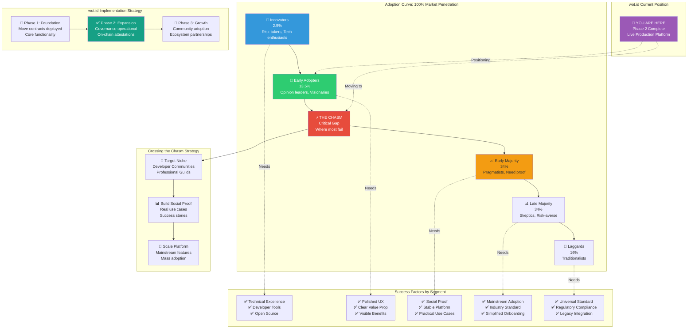
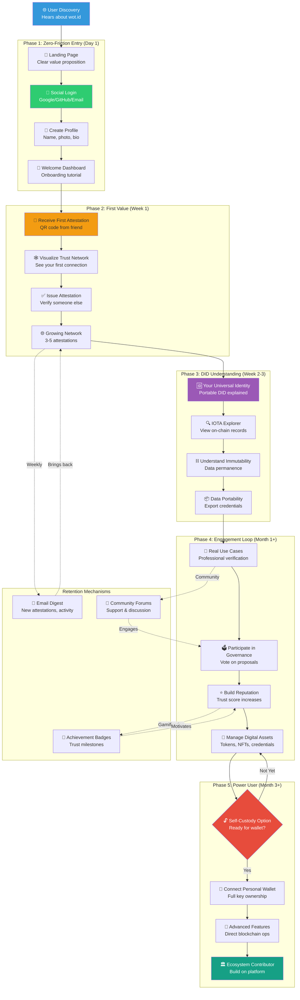

# 11: Onboarding and Adoption: A Diffusion of Innovations Strategy

## 1. Introduction: The Innovation and its Diffusion

This document outlines the strategic approach for the adoption of `wot.id`. It is grounded in Everett M. Rogers' seminal "Diffusion of Innovations" theory, using the recent market entry of Meta's Threads as a practical case study to inform our strategy and avoid common pitfalls in launching network-based technologies.

- **The Innovation:** `wot.id` is not merely a new application; it is a fundamental innovation in digital trust and identity. It offers a shift from centralized, platform-controlled identity to a decentralized, user-sovereign model built on the IOTA Tangle. Its success depends not just on its technical merits, but on how effectively it diffuses through social systems.

- **The Mission:** To strategically manage the diffusion of this innovation to achieve widespread, sustainable adoption. Our goal is to move beyond initial hype and successfully "cross the chasm" from niche technical enthusiasts to mainstream users.

### 1.1. Current Implementation Status

**wot.id Architecture Foundation Complete**:
The innovation described in this document has a solid technical foundation:

**Technical Infrastructure**:
- ✅ **W3C DID Compliance**: Via identity.rs SDK (IOTA's official W3C DID implementation)
- ✅ **Identity Registry Deployed**: Decentralized DID→Profile lookups on IOTA mainnet
- ✅ **100% On-Chain Data**: All identity VALUES stored on blockchain with trust scores
- ✅ **Gas Station Pattern**: Users create profiles without owning IOTA tokens
- ✅ **CLI-Based Backend**: Stateless backend queries blockchain via IOTA CLI
- ✅ **OAuth Integration**: Google sign-in for familiar user experience

**Current Architecture Principles**:
- **Primary Identifier**: W3C DID (`did:iota:mainnet:...`) - immutable, cryptographic
- **Secondary Identifiers**: Email, phone, social handles - mutable, generic registry maps to DID
- **Data Storage**: 100% on-chain VALUES with per-VALUE trust scores
- **Trust Extension**: wot.id extends W3C DIDs with trust network capabilities
- **No Database**: Blockchain is single source of truth

**Adoption Strategy Alignment**:
- **Relative Advantage**: True data ownership, portable identity, trust scores
- **Compatibility**: Familiar OAuth login (secondary identifier→DID mapping behind scenes)
- **Trialability**: Gas-sponsored profile creation enables zero-cost experimentation
- **Observability**: Trust scores visible on ME page, attestations verifiable on-chain
- **Complexity Management**: Progressive disclosure (start simple, reveal complexity as needed)

**Key References for Technical Foundation**:
- W3C DID Core v1.0: https://www.w3.org/TR/did-core/
- IOTA identity.rs: https://github.com/iotaledger/identity.rs
- See: `docs/01_Project_Overview_And_Principles.md` for architecture details

This positions wot.id with a solid, standards-compliant foundation ready for adoption among Innovators and Early Adopters.

## 2. Perceived Attributes of the Innovation (Why People Adopt)

According to Rogers, the rate of adoption is determined by five perceived attributes. Our strategy must optimize for each.

### 2.1. Relative Advantage
*(Is it better than what it replaces?)*

- **The `wot.id` Advantage:** Superior security (user-held keys), economic empowerment (feeless micro-attestations), and censorship resistance. The advantage is user control and the creation of a portable, universal identity.
- **Lesson from Threads:** Threads' initial advantage was a cleaner UI and fewer bots than Twitter/X. However, this was insufficient because it lacked core features at launch. **Strategy:** We must ensure our core value proposition is functional and obvious from day one. The ability to issue and verify a credential must be a seamless experience that is demonstrably better than current alternatives.

### 2.2. Compatibility
*(How well does it fit with existing values, experiences, and needs?)*

- **The `wot.id` Approach:** Compatibility is our primary vector for reaching the mainstream. The onboarding journeys outlined in `docs/08_Frontend_And_User_Experience.md`—especially the social/email login path—are designed to align with the mental models of everyday internet users.
- **Lesson from Threads:** Threads' masterstroke was its seamless integration with Instagram, which eliminated the friction of starting a new social graph. This drove its record-breaking initial sign-ups. **Strategy:** We will prioritize the "familiar login" path as our bridge to the Early and Late Majority. Users will be onboarded into a system they understand, with the complexities of decentralization abstracted away initially.

### 2.3. Complexity
*(How difficult is it to understand and use?)*

- **The `wot.id` Challenge:** The underlying concepts (DIDs, VCs, Tangle) are inherently complex. Direct exposure would halt diffusion immediately.
- **Lesson from Threads:** Threads was praised for its simplicity. However, its lack of depth and features ultimately contributed to its user retention crisis. **Strategy:** Our core strategy is **"Progressive Decentralization."** Users start in a simple, managed environment. We introduce concepts like self-custody and key management only when the user is ready and motivated, turning complexity into an opt-in path for empowerment rather than a mandatory entry barrier.

### 2.4. Trialability
*(Can it be experimented with on a limited basis?)*

- **The `wot.id` Plan:** Users must be able to experience the value of `wot.id` with minimal risk or commitment.
- **Lesson from Threads:** Threads was free and easy to try, which was crucial for its initial explosion. **Strategy:** We will offer a frictionless trial experience. This could include a sandboxed demo environment, a first DID subsidized by the project, or clear, low-stakes use cases that users can test immediately after signing up.

### 2.5. Observability
*(Are the results of the innovation visible to others?)*

- **The `wot.id` Opportunity:** The results of `wot.id` are the credentials and trust networks people build.
- **Lesson from Threads:** Threads' observability was high initially due to influencer posts, but the *value* was not observable, leading to a perception of low activity. **Strategy:** The UI must make the benefits visible. This includes visualizing the user's growing web of trust, showcasing credentials they've collected, and creating shareable attestations (with user consent) that can act as social proof and a driver for further adoption.

### 2.6. Phase 2 Innovation Attributes

**Democratic Governance as Adoption Driver**:
- **Relative Advantage**: Users can participate in platform governance through transparent proposal voting
- **Observability**: Governance decisions are visible on-chain via IOTA mainnet attestations
- **Trialability**: Users can immediately participate in governance proposals

**On-Chain Attestations as Trust Anchor**:
- **Relative Advantage**: Cryptographic proof of attestation authenticity via IOTA mainnet
- **Compatibility**: Familiar verification patterns (QR codes, IOTA Explorer links) for mainstream users
- **Observability**: Immutable verification records with attester DID + trust scores provide visible trust building

These Phase 2 features significantly enhance the innovation's perceived attributes and adoption potential.

## 3. Adopter Segmentation and Phased Rollout

We will tailor our strategy to Rogers' adopter categories, recognizing that each group has different motivations.

- **Innovators (Crypto-Natives):** They will be our first users, attracted by the technical novelty. We engage them through technical documentation, GitHub, and Discord. They are our alpha testers.
- **Early Adopters (Web3-Curious, Opinion Leaders):** This group is the crucial bridge. They are less interested in the raw technology and more in the polished product and its vision. A smooth UX and clear value proposition are non-negotiable to win them over.
- **Crossing the Chasm:** The gap between Early Adopters and the Early Majority is where most innovations fail. **The critical lesson from Threads is not to mistake initial hype for a successful crossing.** Threads captured the Innovators and Early Adopters but failed to convince the Early Majority because the product wasn't ready and its value wasn't clear.
- **Early Majority (The Pragmatists):** This large, deliberate group adopts only when an innovation is proven and provides practical benefits. Our social/email login and progressive decentralization strategy are designed specifically for them. They require social proof, stability, and a clear use case.
- **Late Majority & Laggards:** These groups will follow only when `wot.id` has become an established standard.

### 3.1. Rogers' Diffusion of Innovation Curve with wot.id Positioning

The following diagram illustrates the diffusion curve and where wot.id is positioned in its adoption journey:



**Critical Insights:**

**Current Status**:
- ✅ Successfully engaging **Innovators** (2.5%) with technical documentation and open-source code
- ✅ Attracting **Early Adopters** (13.5%) with operational governance and live platform
- 🎯 Preparing to **Cross the Chasm** to reach Early Majority (34%)

**The Chasm Challenge**:
- **What It Is**: The gap between visionaries (Early Adopters) and pragmatists (Early Majority)
- **Why It's Dangerous**: Different groups have incompatible needs and expectations
- **Common Failure**: Mistaking initial hype for successful crossing (Threads case study)

**wot.id Crossing Strategy**:
1. **Niche Focus**: Target specific professional communities (developers, medical, legal)
2. **Proof Building**: Create undeniable success stories and social proof
3. **Platform Stability**: Ensure core features are complete and reliable
4. **Mainstream UX**: Social/email login abstracts blockchain complexity

### 3.2. Progressive Decentralization Timeline

The gradual introduction of decentralized concepts to users:

```mermaid
timeline
    title Progressive Decentralization Journey: From Web2 Familiarity to Web3 Sovereignty
    
    section Month 1: Familiar Entry
        Week 1 : Social Login (Google, GitHub) : Email-based account : Familiar UI/UX patterns : ✅ Zero crypto knowledge required
        Week 2 : Profile Creation : Add personal information : Upload documents : ✅ Traditional web experience
        Week 3 : Trust Building : Receive attestations via QR : Build reputation score : ✅ Gamified, intuitive
        Week 4 : Observability : View trust network graph : See credential collection : ✅ Visual progress feedback
    
    section Month 2: Gentle Introduction
        Week 5 : DID Awareness : "Your Universal Identity" : Portable across platforms : 🔒 First blockchain concept
        Week 6 : Backend Keys : System manages your keys : Gas fees sponsored : 🔒 Security without complexity
        Week 7 : Attestation Value : Request verifications : Issue attestations : 🔒 P2P trust demonstrated
        Week 8 : On-Chain Records : View on IOTA Explorer : Understand immutability : 🔒 Blockchain benefits shown
    
    section Month 3: Optional Control
        Week 9 : Key Education : What are private keys? : Why self-custody matters : 🔓 Education phase
        Week 10 : Wallet Introduction : Optional wallet setup : Export your DID keys : 🔓 User choice offered
        Week 11 : Self-Custody Option : Transition to personal wallet : Full key ownership : 🔓 Progressive empowerment
        Week 12 : Advanced Features : Smart contract interactions : Direct IOTA operations : 🔓 Power user unlocked
    
    section Month 4+: Full Sovereignty
        Ongoing : Complete Control : Self-custody by default : Personal IOTA wallet : 🏆 True decentralization
        Ongoing : Asset Management : Manage tokens, NFTs, RWAs : IOTA Kiosk integration : 🏆 Digital sovereignty
        Ongoing : Governance : Participate in proposals : Vote with reputation weight : 🏆 Democratic participation
        Ongoing : Ecosystem : Build on wot.id : Create applications : 🏆 Platform contributor
```

**Design Philosophy:**

**Start Familiar** (Month 1):
- ✅ No blockchain terminology exposed
- ✅ Social login patterns ("Sign in with Google")
- ✅ Traditional profile management UX
- ✅ Gamified trust building (scores, badges)
- ✅ Backend handles all complexity

**Introduce Gradually** (Month 2):
- 🔒 DID explained as "Your Universal Identity"
- 🔒 Blockchain benefits shown through IOTA Explorer
- 🔒 Gas sponsorship abstracts transaction costs
- 🔒 P2P attestations demonstrate decentralization value

**Offer Choice** (Month 3):
- 🔓 Education about self-custody benefits
- 🔓 Optional wallet setup (not forced)
- 🔓 Key export for those who want control
- 🔓 Advanced features for power users

**Enable Sovereignty** (Month 4+):
- 🏆 Full self-custody by default for committed users
- 🏆 Complete control over keys and assets
- 🏆 Governance participation with reputation weight
- 🏆 Ecosystem contribution and development

**Key Success Metrics:**
- **Retention**: Users stay through Month 3 introduction phase
- **Conversion**: 30%+ of users opt into self-custody by Month 4
- **Engagement**: Weekly active users issue/verify attestations
- **Satisfaction**: NPS score >50 throughout journey

## 4. Key Lessons from the Threads Case Study

The Threads launch provides several critical, actionable lessons for `wot.id`.

1.  **Feature Completeness is Non-Negotiable:** Threads launched without essential features (search, hashtags, web version), which alienated the core user base it was trying to attract. **Lesson:** Our Minimum Viable Product (MVP) must be *viable*. The core loop of creating an identity, issuing a credential, and verifying it must be complete and functional.

2.  **Don't Mistake Initial Scale for Lasting Adoption:** Threads achieved 100 million sign-ups but failed to retain users. This is a classic failure to cross the chasm. **Lesson:** We must focus on engagement and retention metrics (e.g., weekly active users, credentials issued) over vanity metrics like total sign-ups.

3.  **A Clear, Unique Identity is Crucial:** Threads struggled because it was primarily defined as "not Twitter." It lacked a unique culture or purpose. **Lesson:** `wot.id` must clearly articulate its own identity. It is not just "decentralized login"; it is a platform for verifiable trust and user empowerment.

4.  **Community Before Scale:** Threads relied on macro-influencers but failed to cultivate the niche, passionate subcultures that give platforms like Twitter and Reddit their resilience. **Lesson:** Our strategy should involve seeding specific, high-value communities (e.g., developers, professional guilds, academic groups) who can become evangelists before we pursue mass-market growth.

5.  **Reinvention Must Be Proactive, Not Reactive:** Threads began adding key features *after* its retention crisis began, when momentum was already lost. **Lesson:** We must have a clear roadmap and be prepared to iterate and add value *before* users lose interest. The innovation must feel alive and responsive.

## 5. Strategic Recommendations for `wot.id`

Based on this analysis, our adoption strategy is as follows:

1.  **Leverage the Operational "Golden Path":** The social/OAuth login and DID creation process (via secondary identifier→DID registry) is now operational and seamless, providing a strong foundation for Early Majority adoption. This ensures **Compatibility** and manages **Complexity** for the Early Majority.

2.  **Build for Observability:** Design the UI to make the **Relative Advantage** of `wot.id` visible. Users should see their trust network grow and feel the value of the credentials they hold.

3.  **Focus on a Niche to Cross the Chasm:** Instead of a broad launch, we will initially target a specific professional or developer community. By solving a real problem for a focused group, we can build a stable base of **Early Majority** users who can provide the social proof needed for wider expansion.

4.  **Develop a Retention-Focused Roadmap:** Our development priorities must be guided by creating long-term value and habit loops (the "Confirmation" stage of Rogers' model). This means building out the ecosystem, enabling more use cases for credentials, and fostering a genuine sense of community and investment in the platform.

### 5.1. User Journey: Web2 to Web3 Onboarding Visualization

The complete user experience from first contact to full platform engagement:



**Journey Metrics & Success Indicators:**

**Phase 1 - Zero-Friction Entry (Day 1)**:
- ✅ **Goal**: Complete profile creation
- 📊 **Metric**: 80%+ signup completion rate
- ⏱️ **Time**: <5 minutes from discovery to active profile
- 🎯 **Key**: No blockchain terminology, familiar social login

**Phase 2 - First Value (Week 1)**:
- ✅ **Goal**: Receive and issue first attestations
- 📊 **Metric**: 50%+ users complete first attestation exchange
- ⏱️ **Time**: Within 7 days of signup
- 🎯 **Key**: QR code simplicity, instant gratification

**Phase 3 - DID Understanding (Week 2-3)**:
- ✅ **Goal**: Comprehend value of decentralized identity
- 📊 **Metric**: 70%+ users view their IOTA Explorer records
- ⏱️ **Time**: By day 14-21
- 🎯 **Key**: Visual blockchain benefits, not technical complexity

**Phase 4 - Engagement Loop (Month 1+)**:
- ✅ **Goal**: Regular platform usage and governance participation
- 📊 **Metric**: 30%+ weekly active users
- ⏱️ **Time**: Ongoing from Month 1
- 🎯 **Key**: Real use cases, community involvement, reputation building

**Phase 5 - Power User (Month 3+)**:
- ✅ **Goal**: Transition to self-custody and advanced features
- 📊 **Metric**: 20%+ users set up personal wallets
- ⏱️ **Time**: After Month 3 of consistent usage
- 🎯 **Key**: Optional empowerment, not forced complexity

**Retention Mechanisms:**
- **Email Digests**: Weekly summaries of network activity
- **Push Notifications**: New attestations, governance proposals
- **Achievement System**: Badges for trust milestones, contribution
- **Community Forums**: Support, discussion, feature requests
- **Reputation Leaderboards**: Gamified trust score comparison
- **Exclusive Features**: Advanced tools for high-reputation users

**Critical Success Factors:**
1. **Day 1 Value**: Users must see benefit immediately (first attestation)
2. **Week 1 Habit**: Create routine of checking attestations/trust network
3. **Month 1 Community**: Foster sense of belonging and investment
4. **Month 3 Choice**: Offer but don't force self-custody transition
5. **Ongoing Evolution**: Continuous feature adds and community engagement
